# Africa

---

## Algeria [&#10159;](algeria.sqlite)

### Allgemeine Informationen

|Eigenschaft|Wert|
|-|-:|
Dateiname|[algeria.sqlite](algeria.sqlite)|
Zeitstempel|09.09.2019 18:33|
Dateigr&ouml;&szlig;e|9.68 Mb|
|||
Gesamtanzahl Nodes|203945|
|MinLat|18.928737|
|MaxLat|38.018304|
|MinLon|-8.704895|
|MaxLon|12.035975|

### Top 5 Tags

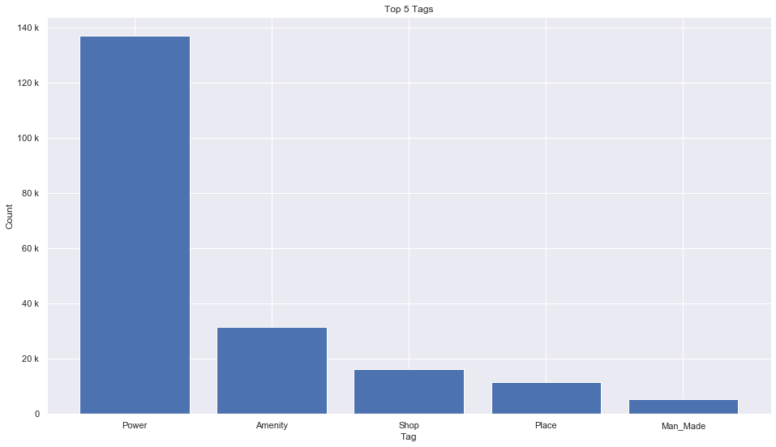

|Tag|Count|
|-|-:|
|Power|136986|
|Amenity|31621|
|Shop|16301|
|Place|11549|
|Man_Made|5405|

### &Uuml;bersicht Ortsangaben

|Place|Count|
|-|-:|
|Village|5313|
|Hamlet|3275|
|Town|587|
|Isolated_Dwelling|123|
|City|52|

### Die 5 gr&ouml;&szlig;ten bewohnte Gebiete

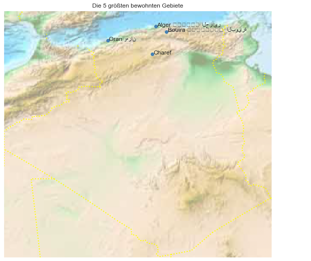

|Name|Lat|Lon|Type|Population|
|----|--:|--:|:--:|---------:|
|Alger ⴷⵣⴰⵢⴻⵔ الجزائر|36.7753606|3.0601882|City|3415811|
|طرابلس|32.896672|13.1777923|City|2127000|
|Oran وهران|35.7032751|-0.6492976|City|852576|
|Bouira ⵝⵓⵠⵉⵔⴻⵙⵜ  البويرة|36.3739012|3.9007007|Town|695585|
|Charef|34.6270918|2.8059171|Town|600000|

---

## Angola [&#10159;](angola.sqlite)

### Allgemeine Informationen

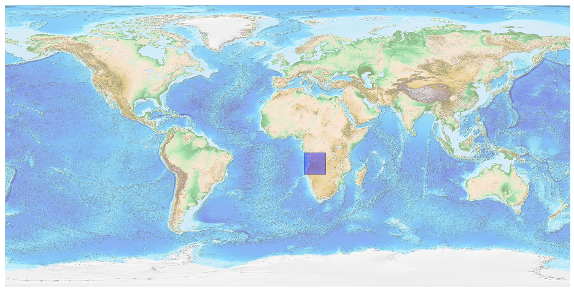

|Eigenschaft|Wert|
|-|-:|
Dateiname|[angola.sqlite](angola.sqlite)|
Zeitstempel|09.09.2019 18:29|
Dateigr&ouml;&szlig;e|1.71 Mb|
|||
Gesamtanzahl Nodes|36213|
|MinLat|-18.065085|
|MaxLat|-4.356853|
|MinLon|10.53848|
|MaxLon|24.12712|

### Top 5 Tags

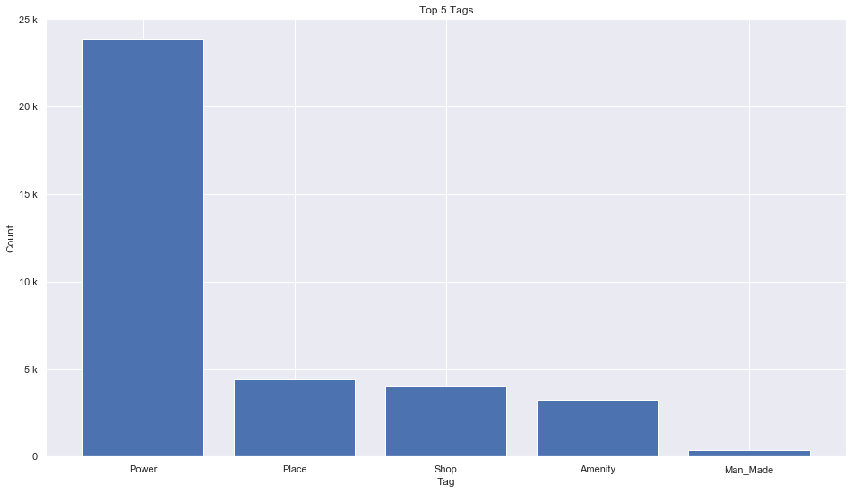

|Tag|Count|
|-|-:|
|Power|23830|
|Place|4418|
|Shop|4075|
|Amenity|3241|
|Man_Made|366|

### &Uuml;bersicht Ortsangaben

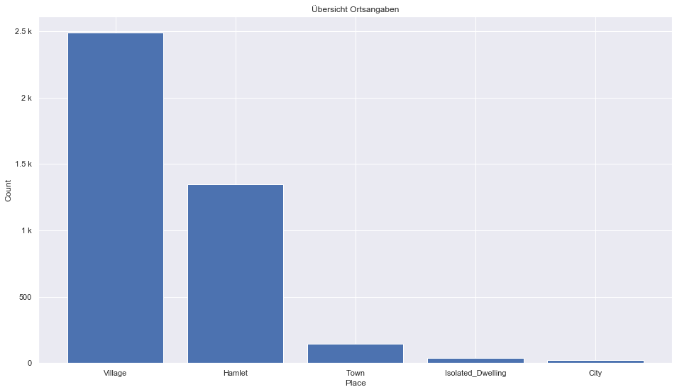

|Place|Count|
|-|-:|
|Village|2488|
|Hamlet|1349|
|Town|144|
|Isolated_Dwelling|41|
|City|21|

### Die 5 gr&ouml;&szlig;ten bewohnte Gebiete

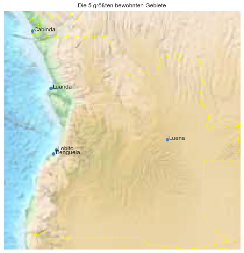

|Name|Lat|Lon|Type|Population|
|----|--:|--:|:--:|---------:|
|Luanda|-8.8272699|13.2439512|City|5172900|
|Lobito|-12.3506867|13.5464318|City|805000|
|Benguela|-12.5790048|13.4037117|City|513000|
|Luena|-11.7790355|19.9122676|City|456000|
|Cabinda|-5.5576435|12.1919468|City|377931|

---

## Benin [&#10159;](benin.sqlite)

### Allgemeine Informationen

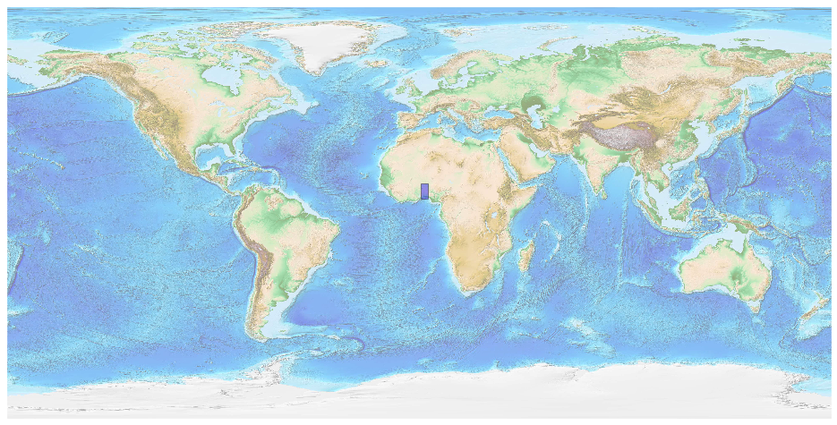

|Eigenschaft|Wert|
|-|-:|
Dateiname|[benin.sqlite](benin.sqlite)|
Zeitstempel|09.09.2019 18:30|
Dateigr&ouml;&szlig;e|796.00 Kb|
|||
Gesamtanzahl Nodes|14871|
|MinLat|5.984817|
|MaxLat|12.46393|
|MinLon|0.727133|
|MaxLon|3.897705|

### Top 5 Tags

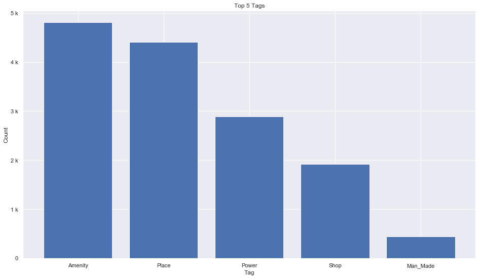

|Tag|Count|
|-|-:|
|Amenity|4807|
|Place|4411|
|Power|2889|
|Shop|1924|
|Man_Made|444|

### &Uuml;bersicht Ortsangaben

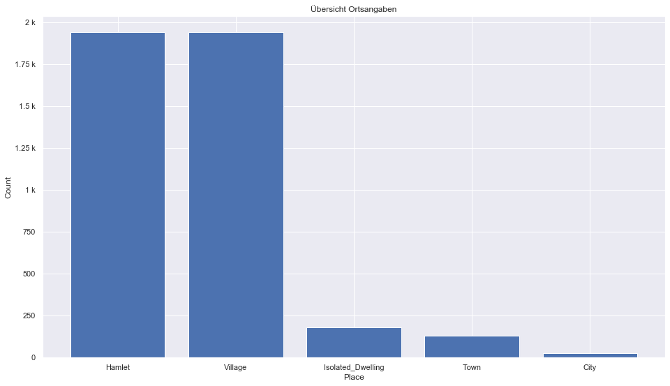

|Place|Count|
|-|-:|
|Hamlet|1939|
|Village|1939|
|Isolated_Dwelling|178|
|Town|128|
|City|26|

### Die 5 gr&ouml;&szlig;ten bewohnte Gebiete

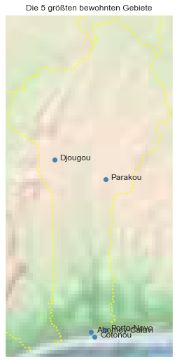

|Name|Lat|Lon|Type|Population|
|----|--:|--:|:--:|---------:|
|Cotonou|6.3676953|2.4252507|City|780000|
|Abomey-Calavi|6.4538637|2.354245|City|650000|
|Porto-Novo|6.4990718|2.6253361|City|265500|
|Djougou|9.7106683|1.6651614|City|260000|
|Parakou|9.3400159|2.6278258|City|250000|

---

## Botswana [&#10159;](botswana.sqlite)

### Allgemeine Informationen

|Eigenschaft|Wert|
|-|-:|
Dateiname|[botswana.sqlite](botswana.sqlite)|
Zeitstempel|09.09.2019 18:31|
Dateigr&ouml;&szlig;e|720.00 Kb|
|||
Gesamtanzahl Nodes|14971|
|MinLat|-26.91539|
|MaxLat|-17.76871|
|MinLon|19.98745|
|MaxLon|29.38549|

### Top 5 Tags

|Tag|Count|
|-|-:|
|Power|11624|
|Amenity|1479|
|Place|752|
|Shop|733|
|Man_Made|217|

### &Uuml;bersicht Ortsangaben

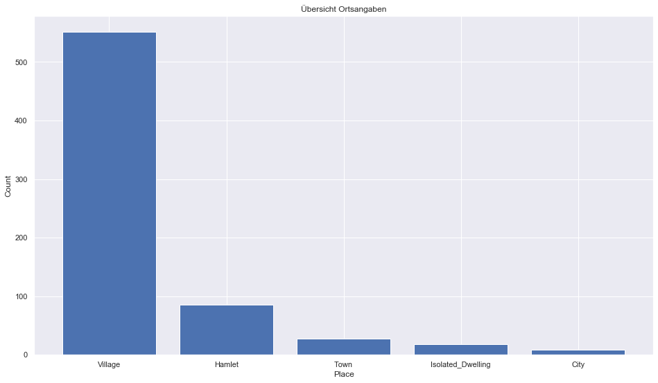

|Place|Count|
|-|-:|
|Village|551|
|Hamlet|86|
|Town|28|
|Isolated_Dwelling|18|
|City|8|

### Die 5 gr&ouml;&szlig;ten bewohnte Gebiete

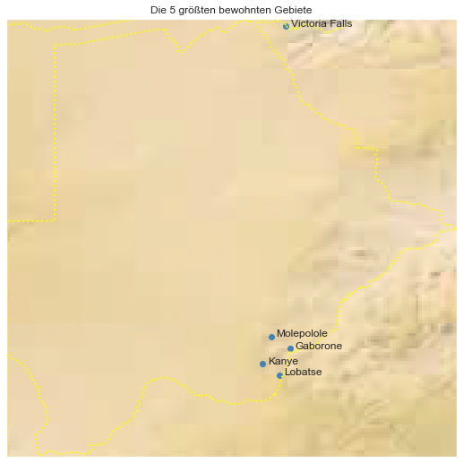

|Name|Lat|Lon|Type|Population|
|----|--:|--:|:--:|---------:|
|Gaborone|-24.6581357|25.9088474|City|231626|
|Molepolole|-24.4058025|25.5151645|Town|67598|
|Kanye|-24.9766112|25.3358859|City|45196|
|Victoria Falls|-17.9349458|25.8252767|Town|33060|
|Lobatse|-25.2100604|25.6819594|Town|29700|

---

## Burkina Faso [&#10159;](burkina-faso.sqlite)

### Allgemeine Informationen

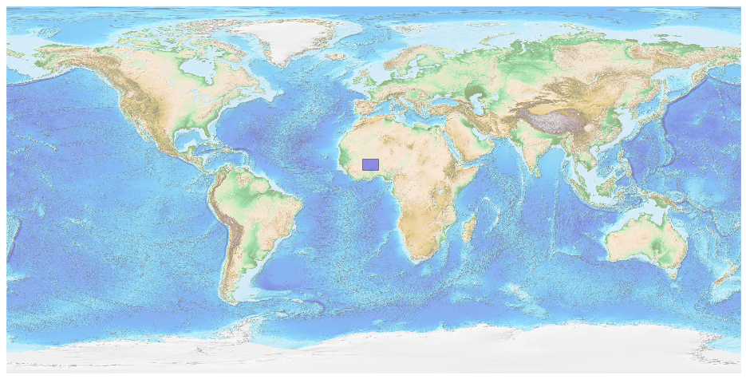

|Eigenschaft|Wert|
|-|-:|
Dateiname|[burkina-faso.sqlite](burkina-faso.sqlite)|
Zeitstempel|09.09.2019 18:32|
Dateigr&ouml;&szlig;e|1.15 Mb|
|||
Gesamtanzahl Nodes|22981|
|MinLat|9.384107|
|MaxLat|15.09271|
|MinLon|-5.527409|
|MaxLon|2.412483|

### Top 5 Tags

|Tag|Count|
|-|-:|
|Place|9202|
|Amenity|5579|
|Power|4655|
|Man_Made|2241|
|Shop|1101|

### &Uuml;bersicht Ortsangaben

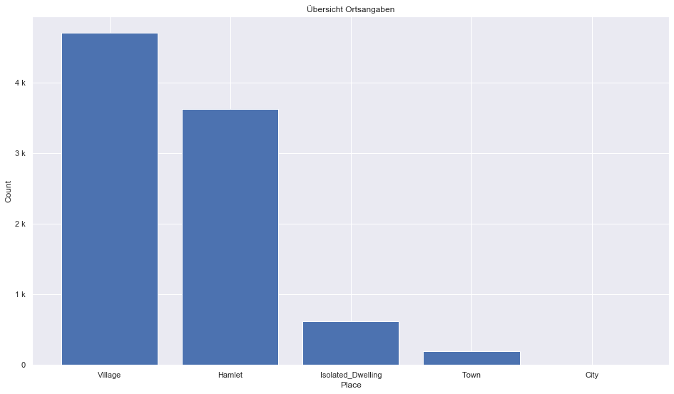

|Place|Count|
|-|-:|
|Village|4704|
|Hamlet|3627|
|Isolated_Dwelling|621|
|Town|191|
|City|3|

### Die 5 gr&ouml;&szlig;ten bewohnte Gebiete

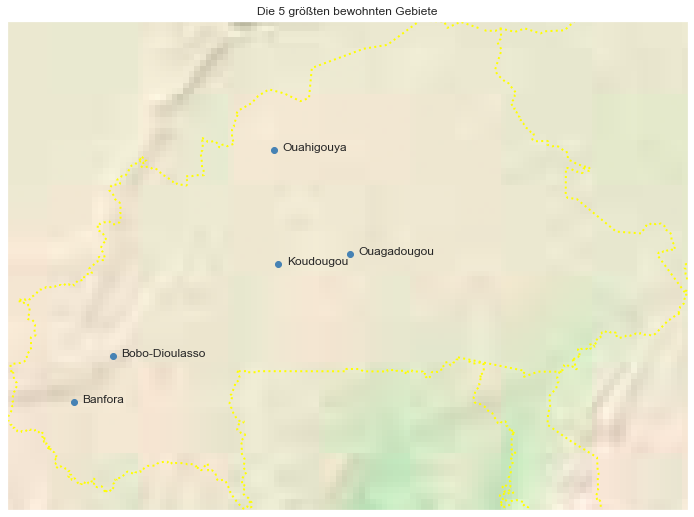

|Name|Lat|Lon|Type|Population|
|----|--:|--:|:--:|---------:|
|Ouagadougou|12.368148|-1.527085|City|1915102|
|Bobo-Dioulasso|11.1757783|-4.2957591|City|724971|
|Koudougou|12.2503992|-2.3657338|Town|91981|
|Banfora|10.642703|-4.752639|City|75917|
|Ouahigouya|13.580982|-2.417699|Town|73153|

---

## Burundi [&#10159;](burundi.sqlite)

### Allgemeine Informationen

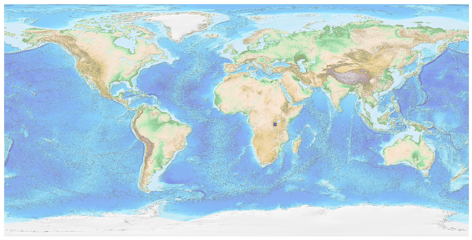

|Eigenschaft|Wert|
|-|-:|
Dateiname|[burundi.sqlite](burundi.sqlite)|
Zeitstempel|09.09.2019 18:32|
Dateigr&ouml;&szlig;e|280.00 Kb|
|||
Gesamtanzahl Nodes|4842|
|MinLat|-4.481328|
|MaxLat|-2.307893|
|MinLon|29.000181|
|MaxLon|30.851147|

### Top 5 Tags

|Tag|Count|
|-|-:|
|Amenity|2702|
|Place|903|
|Power|880|
|Shop|274|
|Man_Made|46|

### &Uuml;bersicht Ortsangaben

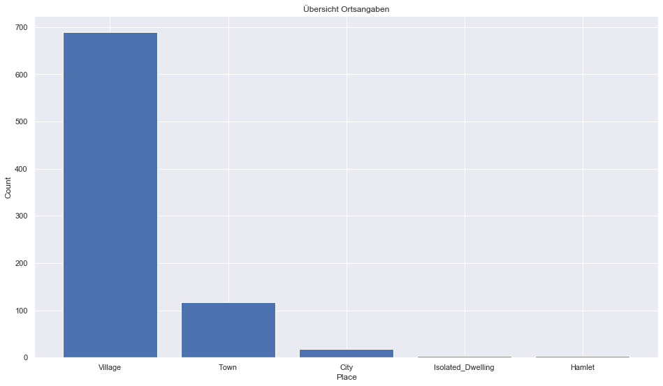

|Place|Count|
|-|-:|
|Village|689|
|Town|117|
|City|18|
|Isolated_Dwelling|4|
|Hamlet|3|

### Die 5 gr&ouml;&szlig;ten bewohnte Gebiete

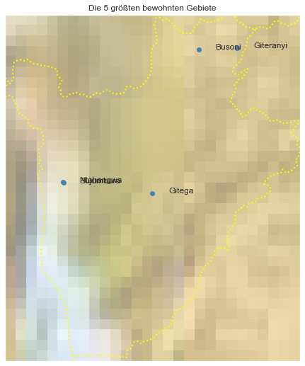

|Name|Lat|Lon|Type|Population|
|----|--:|--:|:--:|---------:|
|Bujumbura|-3.3638125|29.3675028|City|658859|
|Ntahangwa|-3.3590416|29.3656716|Town|248915|
|Gitega|-3.4284953|29.9249718|City|155005|
|Giteranyi|-2.5172828|30.458614|Town|151230|
|Busoni|-2.5261969|30.2170754|Town|145424|

---

## Cameroon [&#10159;](cameroon.sqlite)

### Allgemeine Informationen

|Eigenschaft|Wert|
|-|-:|
Dateiname|[cameroon.sqlite](cameroon.sqlite)|
Zeitstempel|09.09.2019 18:36|
Dateigr&ouml;&szlig;e|3.57 Mb|
|||
Gesamtanzahl Nodes|75589|
|MinLat|1.648733|
|MaxLat|13.09278|
|MinLon|8.33|
|MaxLon|16.20305|

### Top 5 Tags

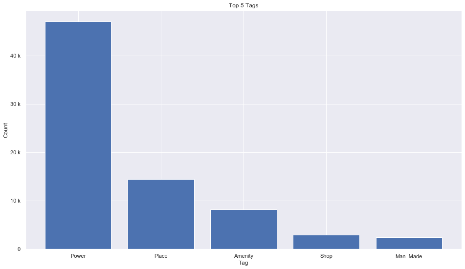

|Tag|Count|
|-|-:|
|Power|46988|
|Place|14420|
|Amenity|8231|
|Shop|2927|
|Man_Made|2442|

### &Uuml;bersicht Ortsangaben

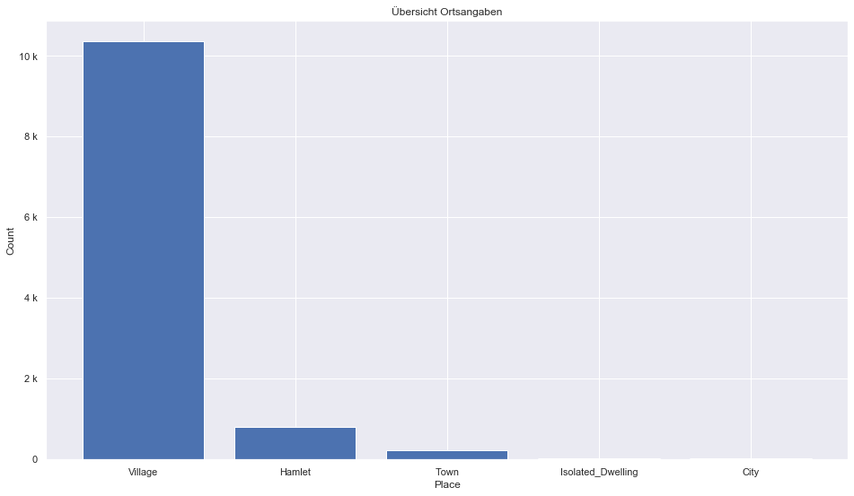

|Place|Count|
|-|-:|
|Village|10358|
|Hamlet|810|
|Town|238|
|Isolated_Dwelling|30|
|City|25|

### Die 5 gr&ouml;&szlig;ten bewohnte Gebiete

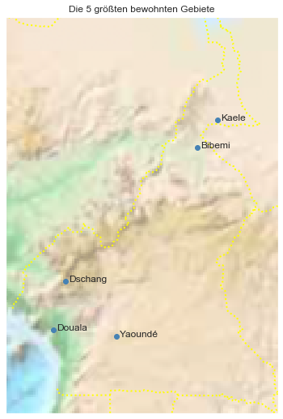

|Name|Lat|Lon|Type|Population|
|----|--:|--:|:--:|---------:|
|Douala|4.0429408|9.706203|City|2000000|
|Yaoundé|3.8689867|11.5213344|City|1817524|
|Dschang|5.4469923|10.053309|Town|200000|
|Kaele|10.1095738|14.446062|City|141431|
|Bibemi|9.312913|13.870952|Town|133191|

---

## Canary Islands [&#10159;](canary-islands.sqlite)

### Allgemeine Informationen

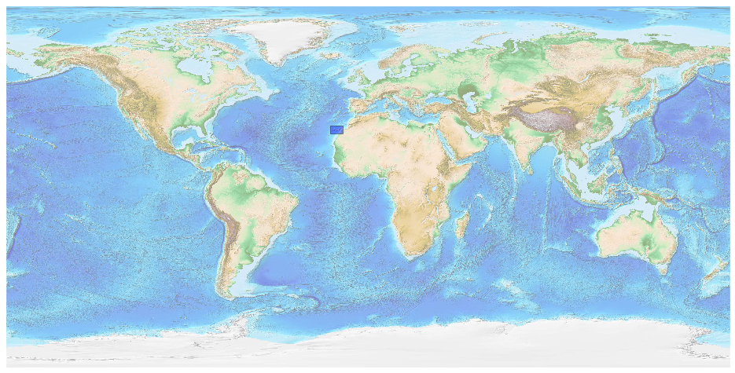

|Eigenschaft|Wert|
|-|-:|
Dateiname|[canary-islands.sqlite](canary-islands.sqlite)|
Zeitstempel|09.09.2019 18:35|
Dateigr&ouml;&szlig;e|2.53 Mb|
|||
Gesamtanzahl Nodes|50154|
|MinLat|26.361175|
|MaxLat|30.256481|
|MinLon|-18.92352|
|MaxLon|-12.478753|

### Top 5 Tags

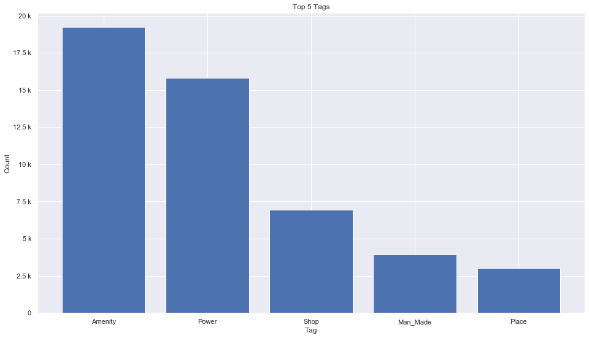

|Tag|Count|
|-|-:|
|Amenity|19225|
|Power|15821|
|Shop|6932|
|Man_Made|3945|
|Place|3028|

### &Uuml;bersicht Ortsangaben

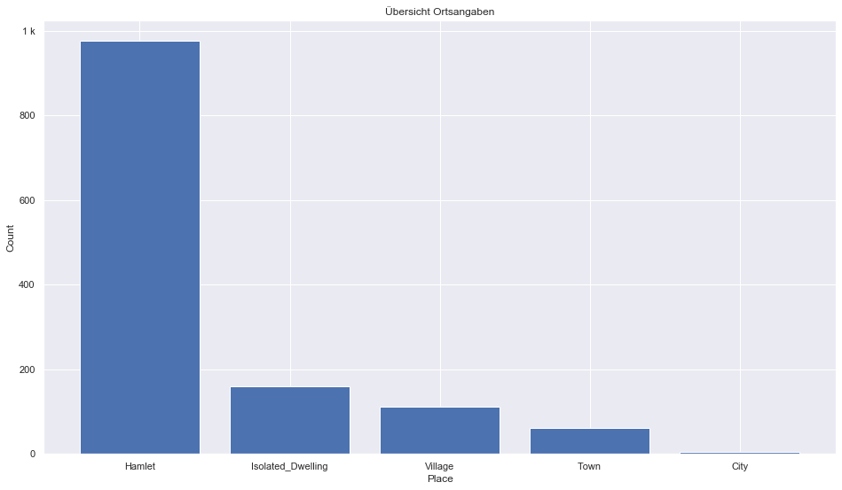

|Place|Count|
|-|-:|
|Hamlet|976|
|Isolated_Dwelling|159|
|Village|112|
|Town|61|
|City|4|

### Die 5 gr&ouml;&szlig;ten bewohnte Gebiete

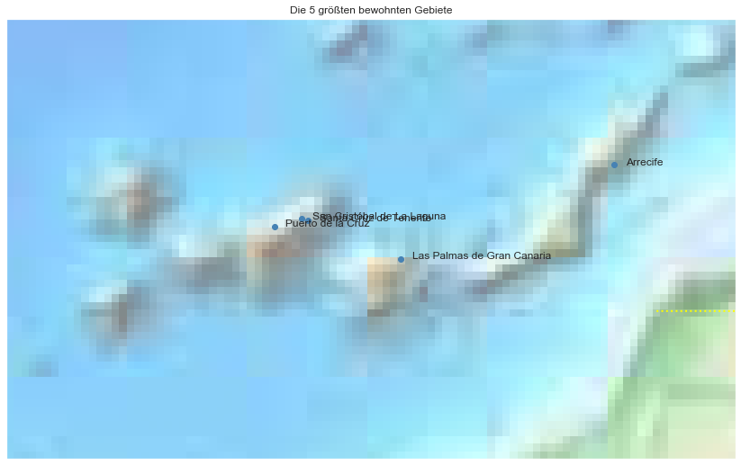

|Name|Lat|Lon|Type|Population|
|----|--:|--:|:--:|---------:|
|Las Palmas de Gran Canaria|28.128874|-15.4349448|City|377203|
|Santa Cruz de Tenerife|28.469648|-16.2540884|City|144518|
|Arrecife|28.9639681|-13.5499014|Town|55673|
|Puerto de la Cruz|28.4159024|-16.5532956|Town|32571|
|San Cristóbal de La Laguna|28.4857715|-16.3159422|City|31337|

---

## Cape Verde [&#10159;](cape-verde.sqlite)

### Allgemeine Informationen

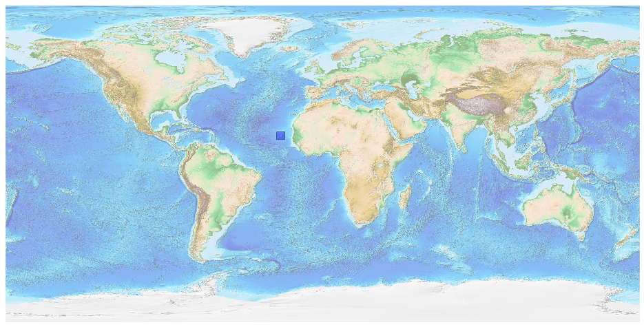

|Eigenschaft|Wert|
|-|-:|
Dateiname|[cape-verde.sqlite](cape-verde.sqlite)|
Zeitstempel|09.09.2019 18:35|
Dateigr&ouml;&szlig;e|152.00 Kb|
|||
Gesamtanzahl Nodes|2568|
|MinLat|14.004855|
|MaxLat|18.004998|
|MinLon|-26.323786|
|MaxLon|-21.390957|

### Top 5 Tags

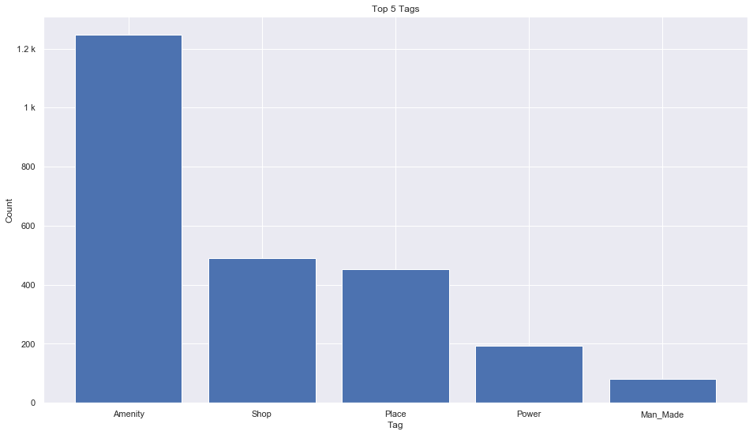

|Tag|Count|
|-|-:|
|Amenity|1246|
|Shop|490|
|Place|453|
|Power|194|
|Man_Made|80|

### &Uuml;bersicht Ortsangaben

|Place|Count|
|-|-:|
|Village|155|
|Hamlet|101|
|Town|19|
|Isolated_Dwelling|11|
|City|6|

### Die 5 gr&ouml;&szlig;ten bewohnte Gebiete

|Name|Lat|Lon|Type|Population|
|----|--:|--:|:--:|---------:|
|Praia|14.9160169|-23.5096132|City|127832|
|São Filipe|14.8952963|-24.4969361|City|94000|
|Mindelo|16.8874145|-24.9863842|City|70000|
|Ribeira Brava|16.6156821|-24.298231|City|5550|
|Ponta do Sol|17.2020504|-25.0922664|Town|4575|

---

## Central African Republic [&#10159;](central-african-republic.sqlite)

### Allgemeine Informationen

|Eigenschaft|Wert|
|-|-:|
Dateiname|[central-african-republic.sqlite](central-african-republic.sqlite)|
Zeitstempel|09.09.2019 18:36|
Dateigr&ouml;&szlig;e|588.00 Kb|
|||
Gesamtanzahl Nodes|11084|
|MinLat|2.127879|
|MaxLat|11.032637|
|MinLon|14.389621|
|MaxLon|27.549417|

### Top 5 Tags

|Tag|Count|
|-|-:|
|Place|6826|
|Man_Made|1975|
|Amenity|1888|
|Power|325|
|Aeroway|38|

### &Uuml;bersicht Ortsangaben

|Place|Count|
|-|-:|
|Village|4223|
|Hamlet|2156|
|Town|141|
|Isolated_Dwelling|122|
|City|21|

### Die 5 gr&ouml;&szlig;ten bewohnte Gebiete

|Name|Lat|Lon|Type|Population|
|----|--:|--:|:--:|---------:|
|Bangî - Bangui|4.3907153|18.5509126|City|734350|
|Bimbo|4.3325548|18.5250512|City|124176|
|Berbérati|4.2593379|15.7877826|City|76918|
|Bocaranga|6.995897|15.638835|City|61000|
|Carnot|4.9421173|15.8690967|Town|45421|

---

## Chad [&#10159;](chad.sqlite)

### Allgemeine Informationen

|Eigenschaft|Wert|
|-|-:|
Dateiname|[chad.sqlite](chad.sqlite)|
Zeitstempel|09.09.2019 18:38|
Dateigr&ouml;&szlig;e|1.55 Mb|
|||
Gesamtanzahl Nodes|29502|
|MinLat|7.404683|
|MaxLat|23.537926|
|MinLon|13.40129|
|MaxLon|24.0654|

### Top 5 Tags

|Tag|Count|
|-|-:|
|Place|23253|
|Man_Made|2397|
|Amenity|2274|
|Power|1133|
|Shop|372|

### &Uuml;bersicht Ortsangaben

|Place|Count|
|-|-:|
|Village|12446|
|Hamlet|9247|
|Isolated_Dwelling|590|
|Town|103|
|City|31|

### Die 5 gr&ouml;&szlig;ten bewohnte Gebiete

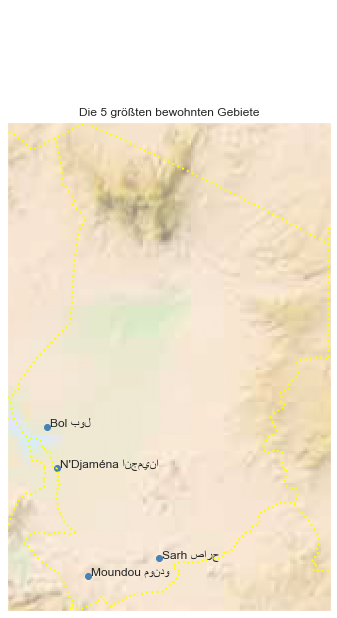

|Name|Lat|Lon|Type|Population|
|----|--:|--:|:--:|---------:|
|N'Djaména انجمينا|12.1191543|15.0502758|City|1092066|
|سبها‎|27.0331541|14.4316929|City|138231|
|Moundou موندو|8.5654637|16.073831|City|137929|
|Sarh صارح|9.1406471|18.3937969|City|113000|
|Bol بول|13.4676491|14.714412|City|112490|

---

## Comores [&#10159;](comores.sqlite)

### Allgemeine Informationen

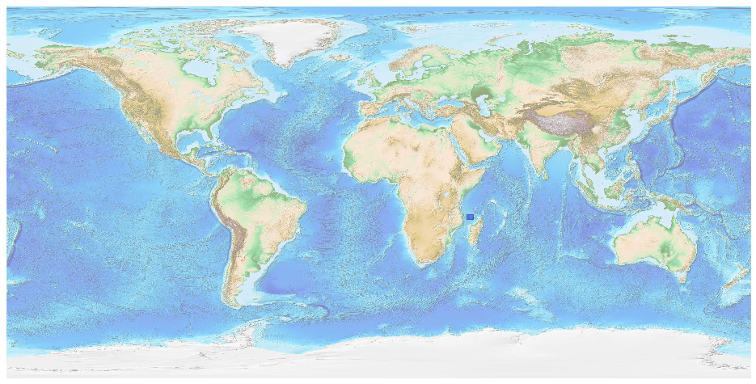

|Eigenschaft|Wert|
|-|-:|
Dateiname|[comores.sqlite](comores.sqlite)|
Zeitstempel|09.09.2019 18:36|
Dateigr&ouml;&szlig;e|48.00 Kb|
|||
Gesamtanzahl Nodes|603|
|MinLat|-12.968996|
|MaxLat|-10.741812|
|MinLon|42.749809|
|MaxLon|45.596611|

### Top 5 Tags

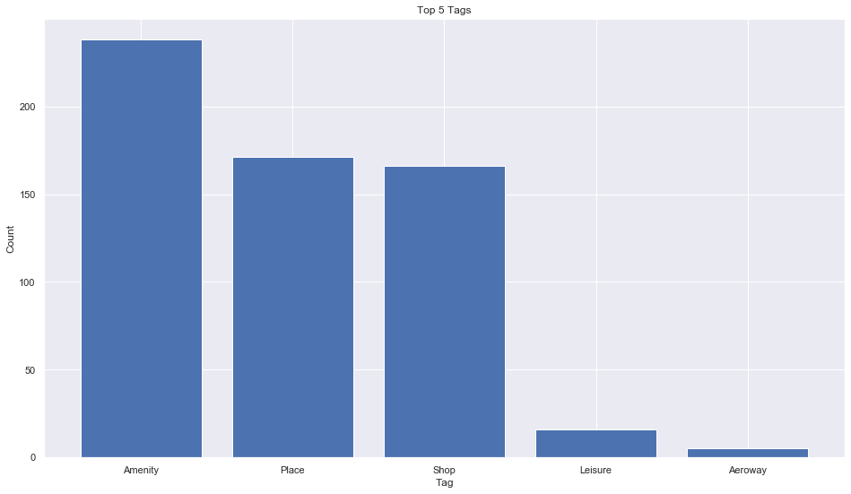

|Tag|Count|
|-|-:|
|Amenity|238|
|Place|171|
|Shop|166|
|Leisure|16|
|Aeroway|5|

### &Uuml;bersicht Ortsangaben

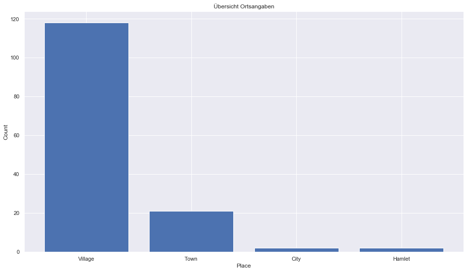

|Place|Count|
|-|-:|
|Village|118|
|Town|21|
|City|2|
|Hamlet|2|

### Die 5 gr&ouml;&szlig;ten bewohnte Gebiete

|Name|Lat|Lon|Type|Population|
|----|--:|--:|:--:|---------:|
|Moroni موروني|-11.6931255|43.2543044|City|111329|
|Mutsamudu موتسامودو|-12.168846|44.3942831|City|30000|
|Seleani|-11.5035445|43.3984576|Village|8000|
|Hahaia هاهايا|-11.5644457|43.2713158|Town|2638|

---

## Congo Brazzaville [&#10159;](congo-brazzaville.sqlite)

### Allgemeine Informationen

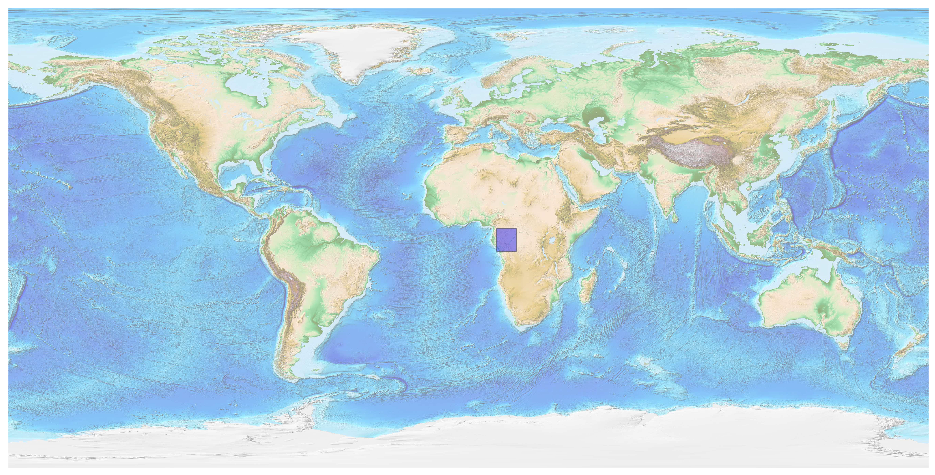

|Eigenschaft|Wert|
|-|-:|
Dateiname|[congo-brazzaville.sqlite](congo-brazzaville.sqlite)|
Zeitstempel|09.09.2019 18:37|
Dateigr&ouml;&szlig;e|480.00 Kb|
|||
Gesamtanzahl Nodes|9208|
|MinLat|-5.195885|
|MaxLat|3.775194|
|MinLon|10.944174|
|MaxLon|18.701642|

### Top 5 Tags

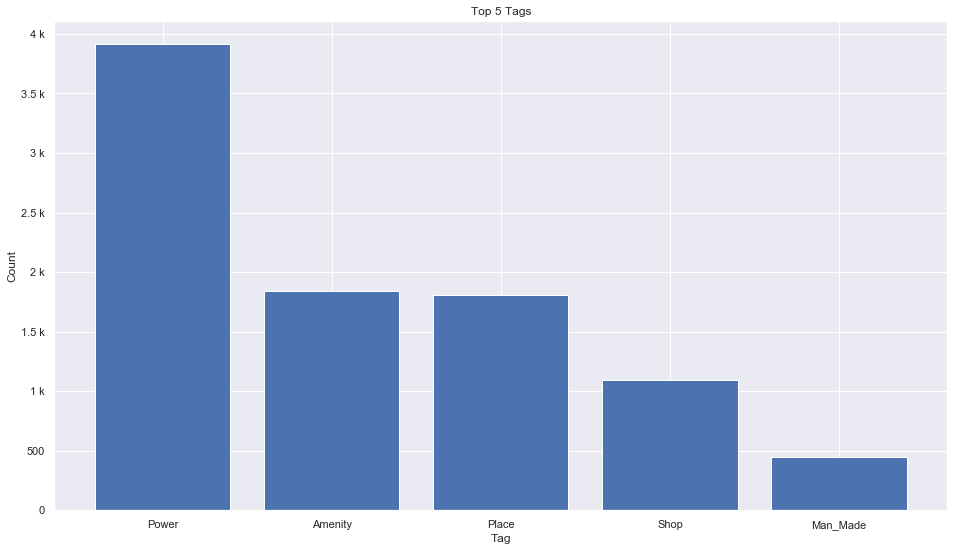

|Tag|Count|
|-|-:|
|Power|3913|
|Amenity|1840|
|Place|1811|
|Shop|1093|
|Man_Made|449|

### &Uuml;bersicht Ortsangaben

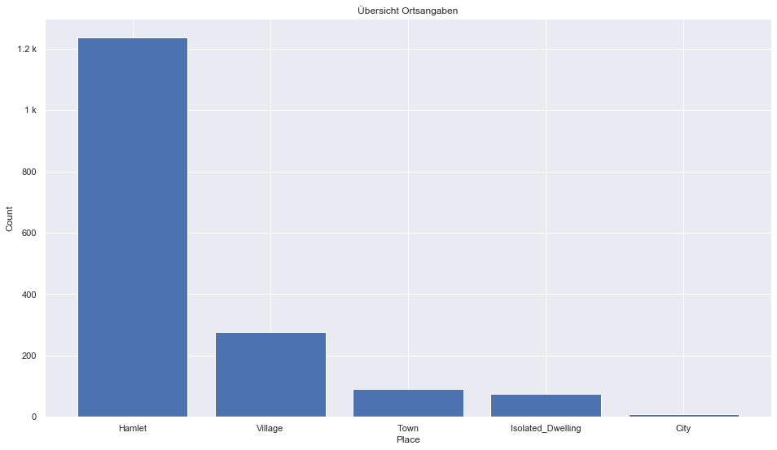

|Place|Count|
|-|-:|
|Hamlet|1236|
|Village|276|
|Town|90|
|Isolated_Dwelling|74|
|City|9|

### Die 5 gr&ouml;&szlig;ten bewohnte Gebiete

|Name|Lat|Lon|Type|Population|
|----|--:|--:|:--:|---------:|
|Pointe-Noire|-4.7975373|11.8503297|City|1100000|
|Brazzaville|-4.2694407|15.2712256|City|1018541|
|Dolisie|-4.2005398|12.6791573|City|80000|
|Nkayi|-4.1840962|13.2883675|Town|71620|
|Impfondo|1.6187416|18.0623499|City|40000|

---

## Congo Democratic Republic [&#10159;](congo-democratic-republic.sqlite)

### Allgemeine Informationen

|Eigenschaft|Wert|
|-|-:|
Dateiname|[congo-democratic-republic.sqlite](congo-democratic-republic.sqlite)|
Zeitstempel|09.09.2019 18:42|
Dateigr&ouml;&szlig;e|2.59 Mb|
|||
Gesamtanzahl Nodes|51751|
|MinLat|-13.5006|
|MaxLat|5.401396|
|MinLon|11.883432|
|MaxLon|31.335694|

### Top 5 Tags

|Tag|Count|
|-|-:|
|Place|20841|
|Power|15913|
|Amenity|12054|
|Shop|1413|
|Man_Made|812|

### &Uuml;bersicht Ortsangaben

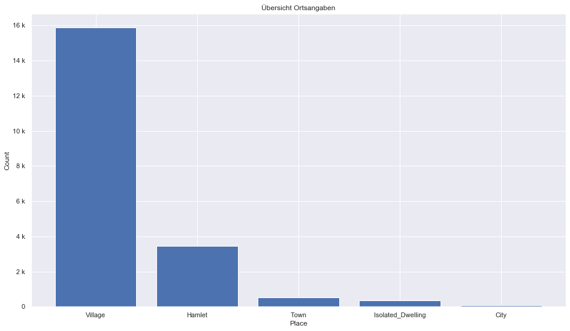

|Place|Count|
|-|-:|
|Village|15862|
|Hamlet|3440|
|Town|523|
|Isolated_Dwelling|351|
|City|60|

### Die 5 gr&ouml;&szlig;ten bewohnte Gebiete

|Name|Lat|Lon|Type|Population|
|----|--:|--:|:--:|---------:|
|Kinshasa|-4.3217055|15.3125974|City|9046000|
|Mbuji-Mayi|-6.1258942|23.5998111|City|1680991|
|Lubumbashi|-11.6642316|27.4826264|City|1139064|
|Kolwezi|-10.7169952|25.4669918|City|453147|
|Bunia|1.5620529|30.2478844|City|366126|

---

## Djibouti [&#10159;](djibouti.sqlite)

### Allgemeine Informationen

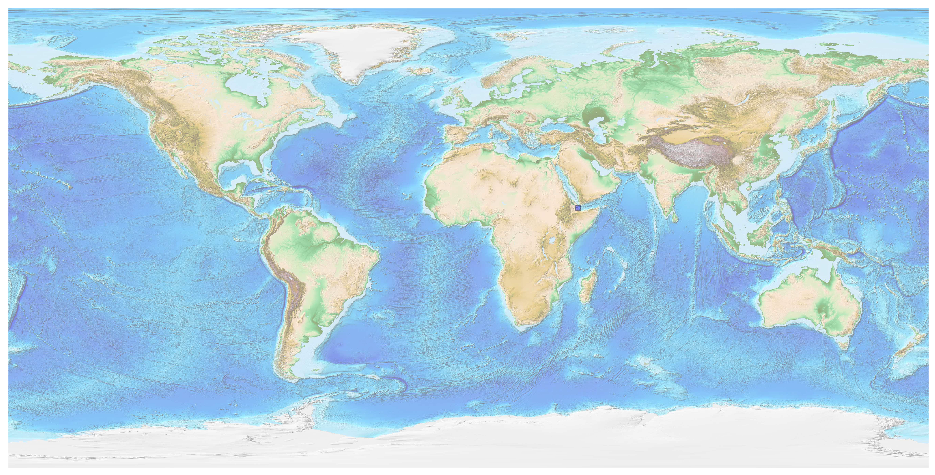

|Eigenschaft|Wert|
|-|-:|
Dateiname|[djibouti.sqlite](djibouti.sqlite)|
Zeitstempel|09.09.2019 18:38|
Dateigr&ouml;&szlig;e|108.00 Kb|
|||
Gesamtanzahl Nodes|1790|
|MinLat|10.888238|
|MaxLat|12.826145|
|MinLon|41.761773|
|MaxLon|43.896251|

### Top 5 Tags

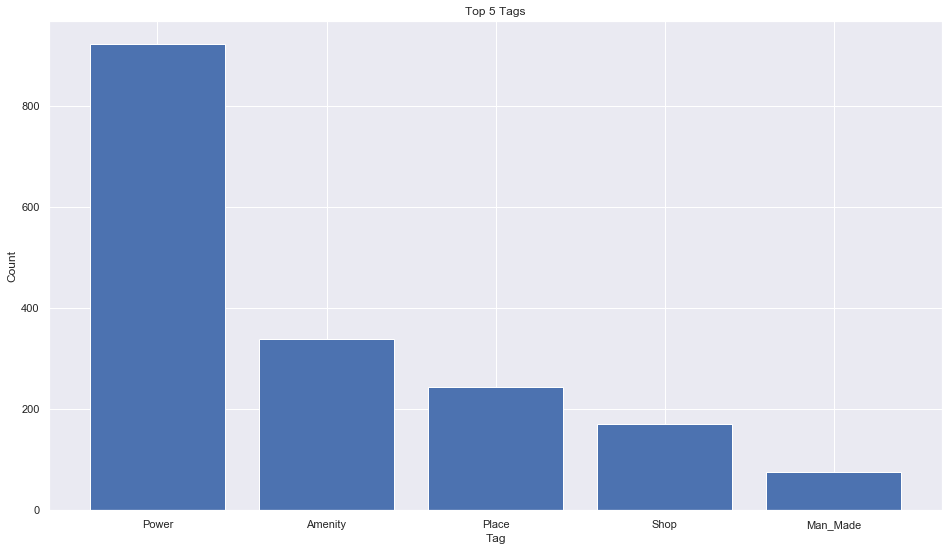

|Tag|Count|
|-|-:|
|Power|921|
|Amenity|338|
|Place|243|
|Shop|171|
|Man_Made|76|

### &Uuml;bersicht Ortsangaben

|Place|Count|
|-|-:|
|Village|81|
|Hamlet|26|
|Town|11|
|City|1|

### Die 5 gr&ouml;&szlig;ten bewohnte Gebiete

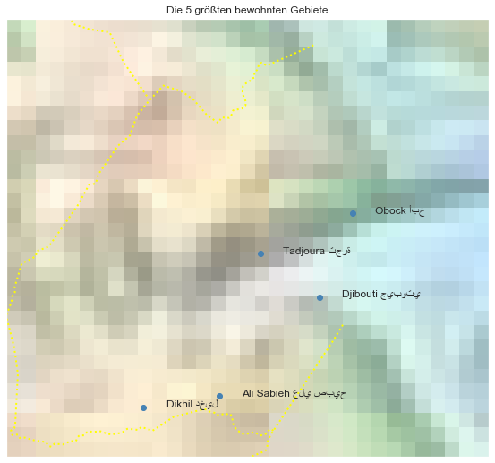

|Name|Lat|Lon|Type|Population|
|----|--:|--:|:--:|---------:|
|Djibouti جيبوتي|11.5936903|43.1472724|City|475332|
|Ali Sabieh علي صبيح|11.1560462|42.7045067|Town|71230|
|Dikhil دخيل|11.1071149|42.3687433|Town|35000|
|Tadjoura تجرة|11.7851745|42.8846919|Town|25000|
|Obock أبخ|11.9640149|43.292228|Town|8500|

---

## Egypt [&#10159;](egypt.sqlite)

### Allgemeine Informationen

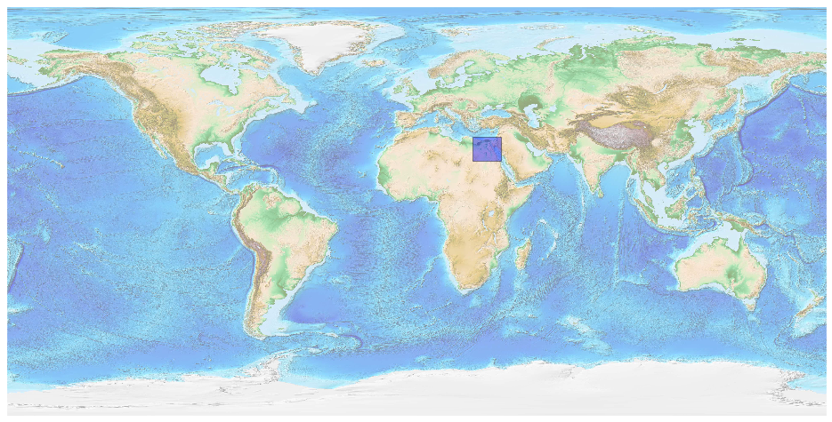

|Eigenschaft|Wert|
|-|-:|
Dateiname|[egypt.sqlite](egypt.sqlite)|
Zeitstempel|09.09.2019 18:42|
Dateigr&ouml;&szlig;e|5.37 Mb|
|||
Gesamtanzahl Nodes|108696|
|MinLat|21.983803|
|MaxLat|32.52518|
|MinLon|24.626276|
|MaxLon|37.162628|

### Top 5 Tags

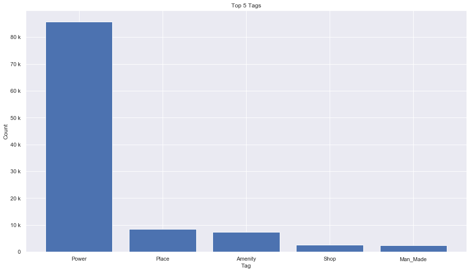

|Tag|Count|
|-|-:|
|Power|85684|
|Place|8452|
|Amenity|7456|
|Shop|2593|
|Man_Made|2502|

### &Uuml;bersicht Ortsangaben

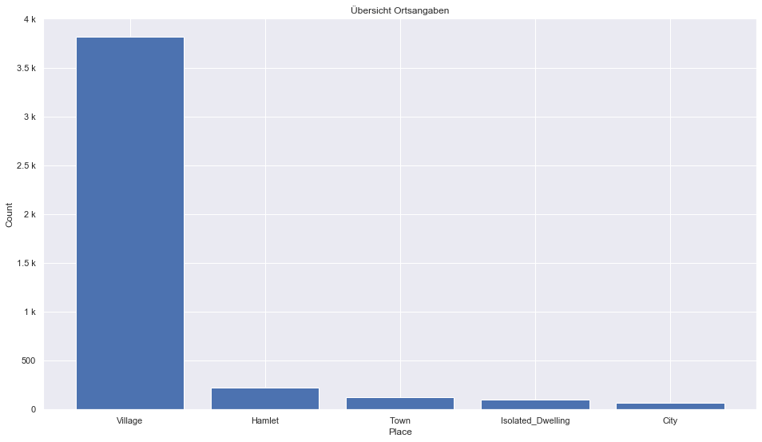

|Place|Count|
|-|-:|
|Village|3813|
|Hamlet|226|
|Town|128|
|Isolated_Dwelling|104|
|City|70|

### Die 5 gr&ouml;&szlig;ten bewohnte Gebiete

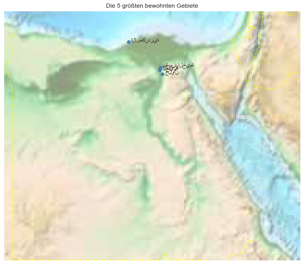

|Name|Lat|Lon|Type|Population|
|----|--:|--:|:--:|---------:|
|القاهرة|30.048819|31.243666|City|9120350|
|الإسكندرية|31.199004|29.894378|City|4546231|
|الجيزة|30.0170059|31.2134513|City|2681863|
|شبرا الخيمة|30.128611|31.242222|City|1016722|
|حلوان|29.8500001|31.333333|Town|643327|

---

## Equatorial Guinea [&#10159;](equatorial-guinea.sqlite)

### Allgemeine Informationen

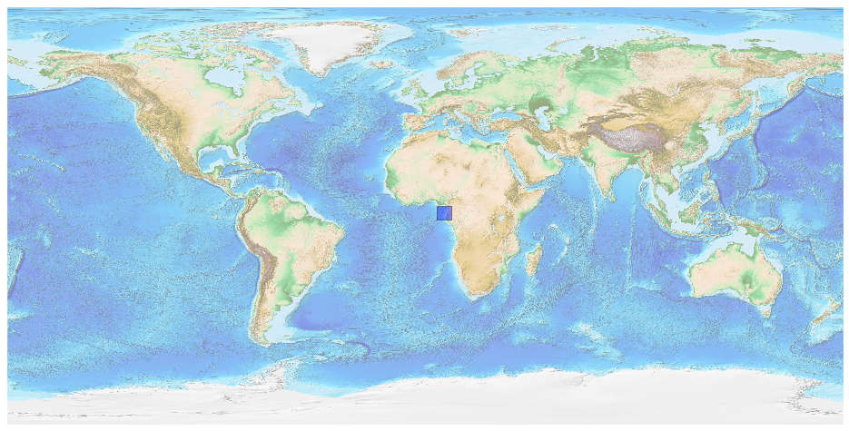

|Eigenschaft|Wert|
|-|-:|
Dateiname|[equatorial-guinea.sqlite](equatorial-guinea.sqlite)|
Zeitstempel|09.09.2019 18:42|
Dateigr&ouml;&szlig;e|160.00 Kb|
|||
Gesamtanzahl Nodes|3118|
|MinLat|-1.792669|
|MaxLat|4.147134|
|MinLon|5.165631|
|MaxLon|11.361901|

### Top 5 Tags

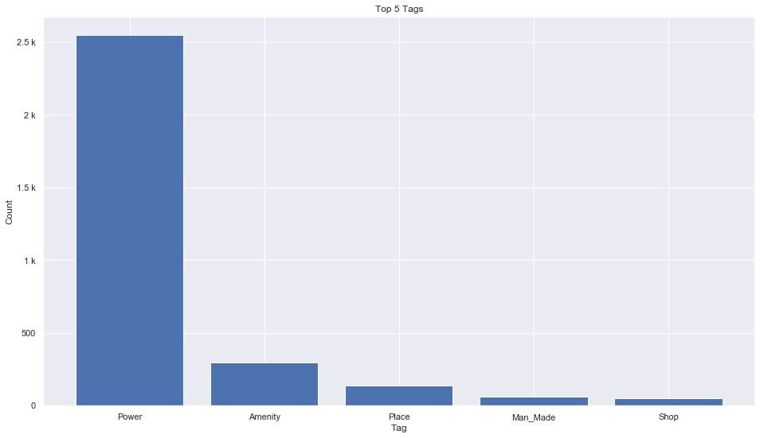

|Tag|Count|
|-|-:|
|Power|2547|
|Amenity|297|
|Place|136|
|Man_Made|64|
|Shop|52|

### &Uuml;bersicht Ortsangaben

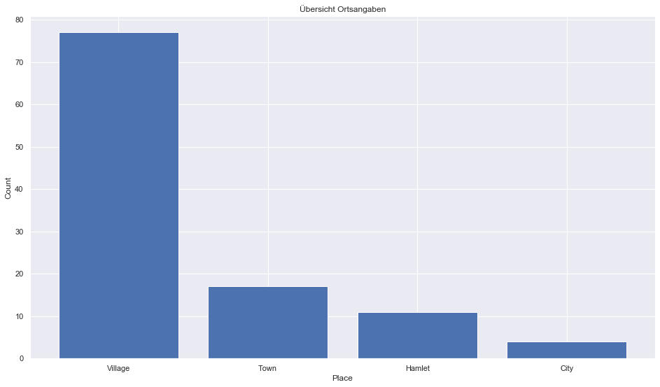

|Place|Count|
|-|-:|
|Village|77|
|Town|17|
|Hamlet|11|
|City|4|

### Die 5 gr&ouml;&szlig;ten bewohnte Gebiete

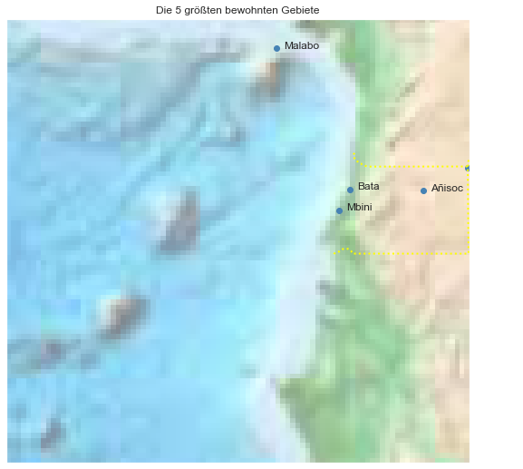

|Name|Lat|Lon|Type|Population|
|----|--:|--:|:--:|---------:|
|Bata|1.8650897|9.768665|City|230282|
|Malabo|3.752828|8.780061|City|187302|
|Ebebiyín|2.1537363|11.3370815|City|36565|
|Añisoc|1.844383|10.747593|Town|16626|
|Mbini|1.58369|9.616028|Town|14034|

---

## Eritrea [&#10159;](eritrea.sqlite)

### Allgemeine Informationen

|Eigenschaft|Wert|
|-|-:|
Dateiname|[eritrea.sqlite](eritrea.sqlite)|
Zeitstempel|09.09.2019 18:42|
Dateigr&ouml;&szlig;e|92.00 Kb|
|||
Gesamtanzahl Nodes|1346|
|MinLat|12.343852|
|MaxLat|18.329616|
|MinLon|36.420705|
|MaxLon|43.346016|

### Top 5 Tags

|Tag|Count|
|-|-:|
|Place|490|
|Power|377|
|Amenity|370|
|Shop|69|
|Man_Made|23|

### &Uuml;bersicht Ortsangaben

|Place|Count|
|-|-:|
|Village|199|
|Isolated_Dwelling|50|
|Town|39|
|Hamlet|27|
|City|3|

### Die 5 gr&ouml;&szlig;ten bewohnte Gebiete

|Name|Lat|Lon|Type|Population|
|----|--:|--:|:--:|---------:|
|ኣስመራ|15.3389667|38.9326763|City|579000|
|ከረን كرن Keren|15.780477|38.453606|City|86438|
|Assab عصب|13.0091289|42.7444596|City|74405|
|ምጽዋ مصوع Massawa|15.604286|39.4651496|Town|45975|
|مندفرا መንደፈራ Mendefera|14.884126|38.81331|Town|30000|

---

## Ethiopia [&#10159;](ethiopia.sqlite)

### Allgemeine Informationen

|Eigenschaft|Wert|
|-|-:|
Dateiname|[ethiopia.sqlite](ethiopia.sqlite)|
Zeitstempel|09.09.2019 18:44|
Dateigr&ouml;&szlig;e|3.32 Mb|
|||
Gesamtanzahl Nodes|65852|
|MinLat|3.378665|
|MaxLat|14.92381|
|MinLon|32.93807|
|MaxLon|48.02163|

### Top 5 Tags

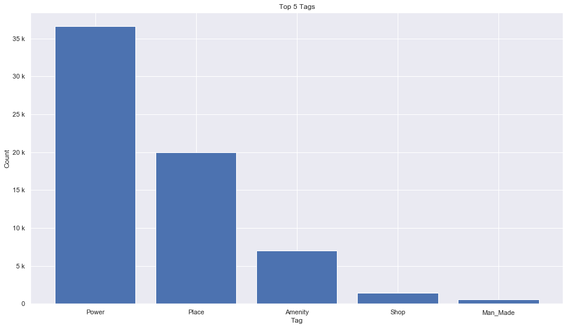

|Tag|Count|
|-|-:|
|Power|36587|
|Place|19960|
|Amenity|6993|
|Shop|1449|
|Man_Made|574|

### &Uuml;bersicht Ortsangaben

|Place|Count|
|-|-:|
|Village|1913|
|Hamlet|701|
|Town|616|
|Isolated_Dwelling|236|
|City|31|

### Die 5 gr&ouml;&szlig;ten bewohnte Gebiete

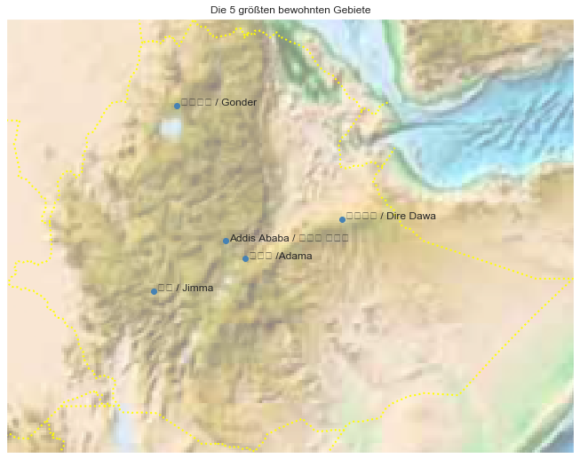

|Name|Lat|Lon|Type|Population|
|----|--:|--:|:--:|---------:|
|Addis Ababa / አዲስ አበባ|9.0107934|38.7612525|City|3500000|
|ድሬዳዋ / Dire Dawa|9.5913193|41.8566373|City|398000|
|ኣዳማ /Adama|8.5410261|39.2705461|City|228623|
|ጎንደር / Gonder|12.610368|37.466766|City|213434|
|ጂማ / Jimma|7.6741372|36.8392841|City|207573|

---

## Gabon [&#10159;](gabon.sqlite)

### Allgemeine Informationen

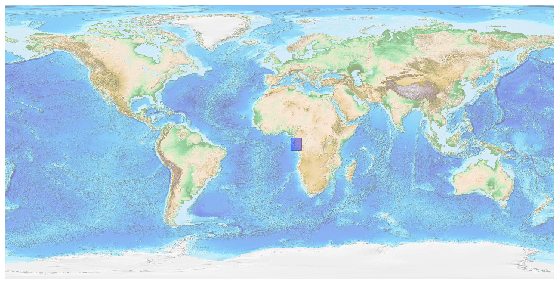

|Eigenschaft|Wert|
|-|-:|
Dateiname|[gabon.sqlite](gabon.sqlite)|
Zeitstempel|09.09.2019 18:42|
Dateigr&ouml;&szlig;e|160.00 Kb|
|||
Gesamtanzahl Nodes|2910|
|MinLat|-5.756775|
|MaxLat|2.336986|
|MinLon|7.389727|
|MaxLon|14.602758|

### Top 5 Tags

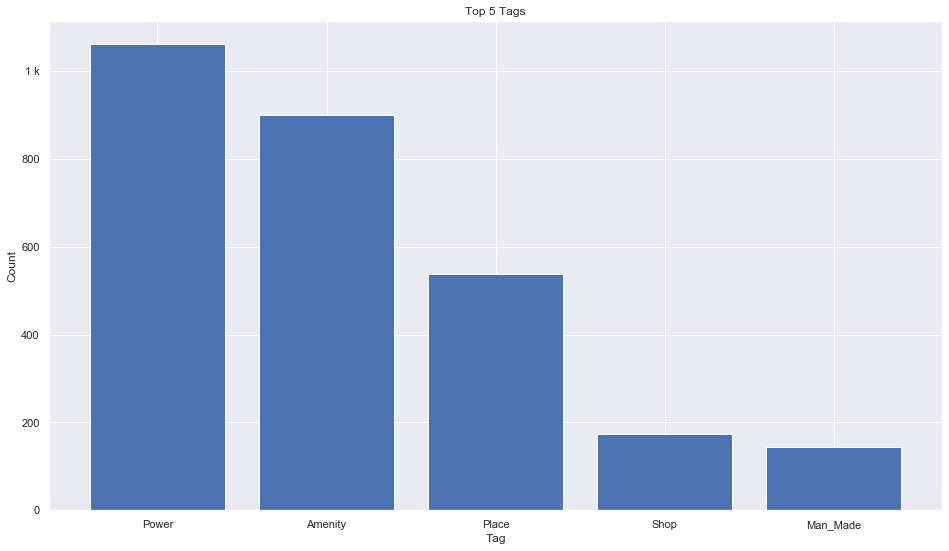

|Tag|Count|
|-|-:|
|Power|1061|
|Amenity|899|
|Place|539|
|Shop|174|
|Man_Made|143|

### &Uuml;bersicht Ortsangaben

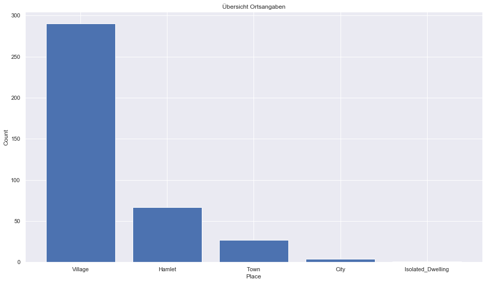

|Place|Count|
|-|-:|
|Village|290|
|Hamlet|67|
|Town|27|
|City|4|
|Isolated_Dwelling|1|

### Die 5 gr&ouml;&szlig;ten bewohnte Gebiete

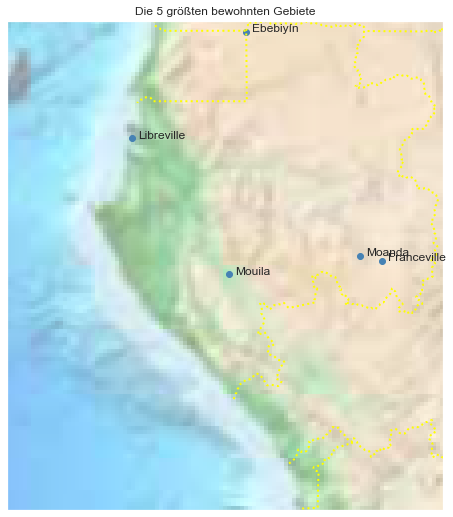

|Name|Lat|Lon|Type|Population|
|----|--:|--:|:--:|---------:|
|Libreville|0.390002|9.454001|City|850000|
|Franceville|-1.634363|13.589513|City|56000|
|Moanda|-1.554004|13.220574|Town|39300|
|Ebebiyín|2.1537363|11.3370815|City|36565|
|Mouila|-1.8628064|11.0588096|Town|22469|

---

## Ghana [&#10159;](ghana.sqlite)

### Allgemeine Informationen

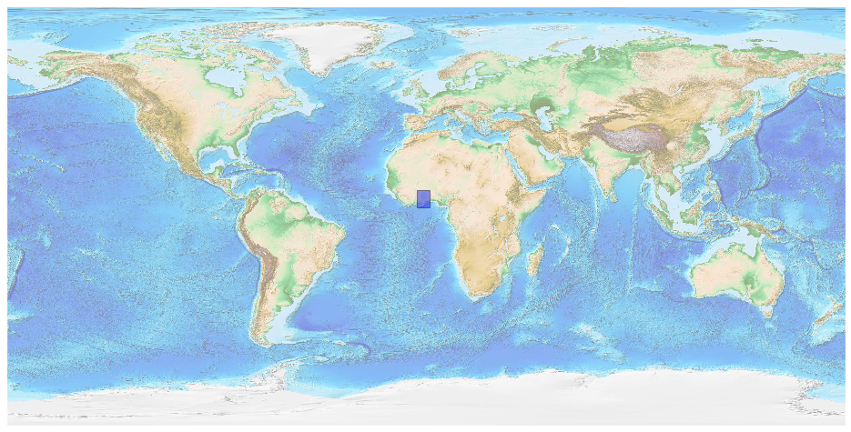

|Eigenschaft|Wert|
|-|-:|
Dateiname|[ghana.sqlite](ghana.sqlite)|
Zeitstempel|09.09.2019 18:44|
Dateigr&ouml;&szlig;e|1.69 Mb|
|||
Gesamtanzahl Nodes|34204|
|MinLat|3.704056|
|MaxLat|11.177723|
|MinLon|-3.807399|
|MaxLon|1.394038|

### Top 5 Tags

|Tag|Count|
|-|-:|
|Power|11643|
|Amenity|10632|
|Place|7282|
|Shop|3284|
|Man_Made|1010|

### &Uuml;bersicht Ortsangaben

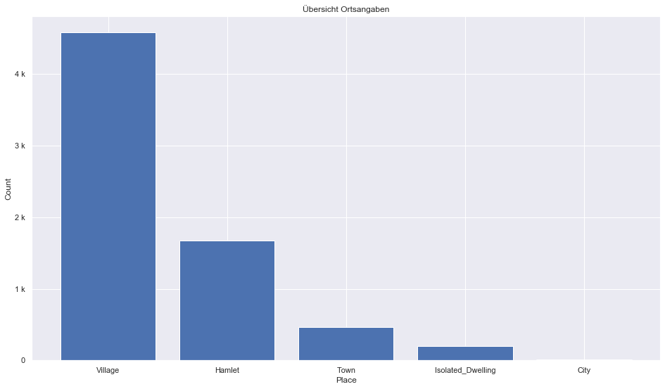

|Place|Count|
|-|-:|
|Village|4581|
|Hamlet|1671|
|Town|464|
|Isolated_Dwelling|196|
|City|14|

### Die 5 gr&ouml;&szlig;ten bewohnte Gebiete

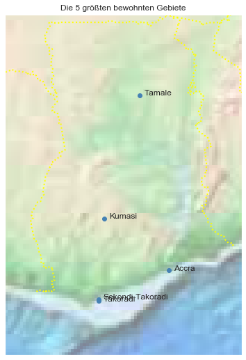

|Name|Lat|Lon|Type|Population|
|----|--:|--:|:--:|---------:|
|Accra|5.5600141|-0.2057437|City|2388000|
|Kumasi|6.698081|-1.6230404|City|1517000|
|Tamale|9.4043366|-0.8430289|City|950124|
|Takoradi|4.887401|-1.7519316|City|539548|
|Sekondi-Takoradi|4.927456|-1.7490216|City|445000|

---

## Guinea Bissau [&#10159;](guinea-bissau.sqlite)

### Allgemeine Informationen

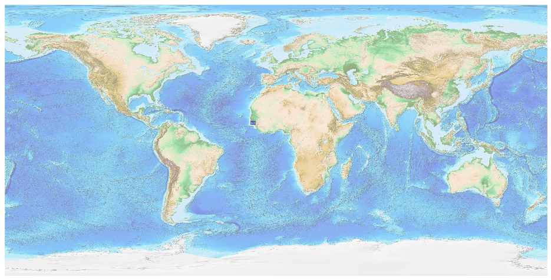

|Eigenschaft|Wert|
|-|-:|
Dateiname|[guinea-bissau.sqlite](guinea-bissau.sqlite)|
Zeitstempel|09.09.2019 18:44|
Dateigr&ouml;&szlig;e|100.00 Kb|
|||
Gesamtanzahl Nodes|1728|
|MinLat|10.14494|
|MaxLat|12.68248|
|MinLon|-16.8237999|
|MaxLon|-13.64192|

### Top 5 Tags

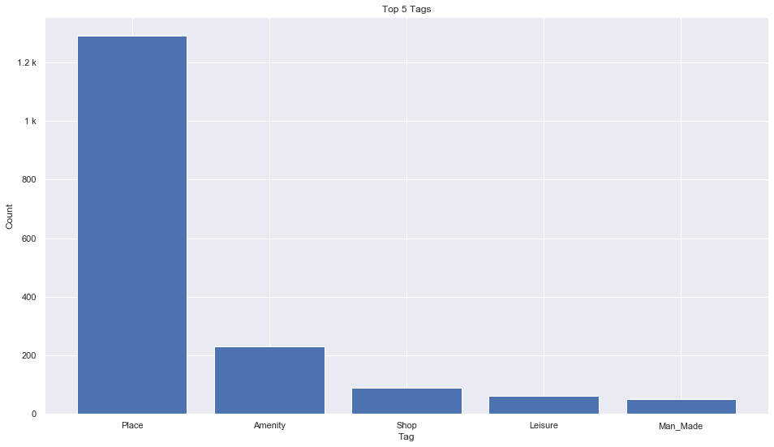

|Tag|Count|
|-|-:|
|Place|1290|
|Amenity|230|
|Shop|90|
|Leisure|62|
|Man_Made|50|

### &Uuml;bersicht Ortsangaben

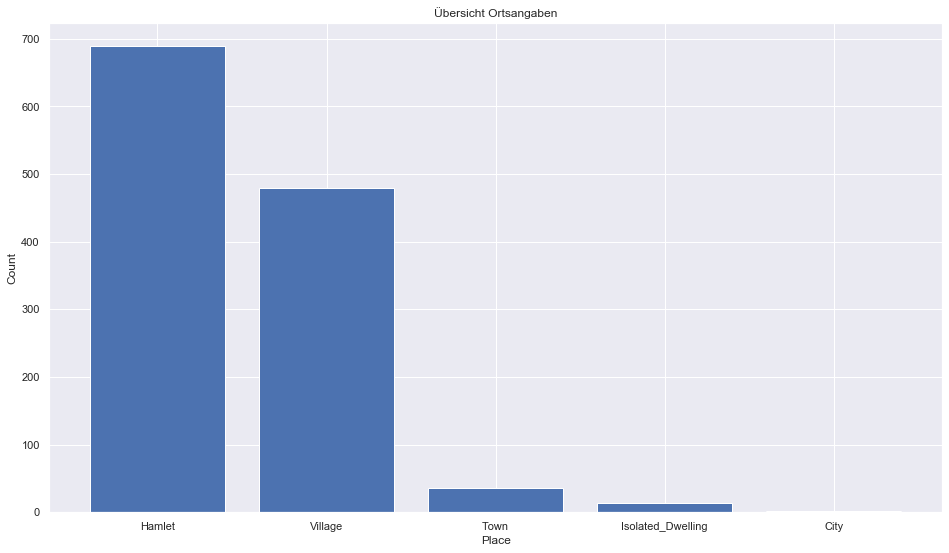

|Place|Count|
|-|-:|
|Hamlet|689|
|Village|479|
|Town|36|
|Isolated_Dwelling|13|
|City|2|

### Die 5 gr&ouml;&szlig;ten bewohnte Gebiete

|Name|Lat|Lon|Type|Population|
|----|--:|--:|:--:|---------:|
|Bissau|11.861324|-15.583055|City|395954|
|Bissorã|12.2235221|-15.4507416|Town|50774|
|Bafatá|12.1723403|-14.6555027|Town|34760|
|Farim|12.4823646|-15.2196439|Town|6405|
|Bubaque|11.2984224|-15.8321387|Village|3500|

---

## Guinea [&#10159;](guinea.sqlite)

### Allgemeine Informationen

|Eigenschaft|Wert|
|-|-:|
Dateiname|[guinea.sqlite](guinea.sqlite)|
Zeitstempel|09.09.2019 18:46|
Dateigr&ouml;&szlig;e|1.73 Mb|
|||
Gesamtanzahl Nodes|33101|
|MinLat|7.13926|
|MaxLat|12.713005|
|MinLon|-16.857083|
|MaxLon|-7.587571|

### Top 5 Tags

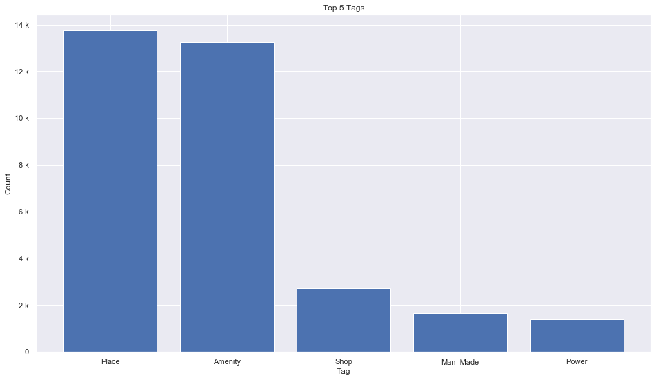

|Tag|Count|
|-|-:|
|Place|13746|
|Amenity|13250|
|Shop|2708|
|Man_Made|1661|
|Power|1394|

### &Uuml;bersicht Ortsangaben

|Place|Count|
|-|-:|
|Hamlet|9532|
|Village|3316|
|Isolated_Dwelling|385|
|Town|208|
|City|15|

### Die 5 gr&ouml;&szlig;ten bewohnte Gebiete

|Name|Lat|Lon|Type|Population|
|----|--:|--:|:--:|---------:|
|Konakry|9.5170602|-13.6998434|City|1660973|
|Kankan|10.3835169|-9.3069354|City|473359|
|Guéckédou|8.5616492|-10.1328278|Town|290611|
|Kissidougou|9.192389|-10.098269|City|283778|
|N'Zérékoré|7.7574322|-8.8174807|City|280256|

---

## Ivory Coast [&#10159;](ivory-coast.sqlite)

### Allgemeine Informationen

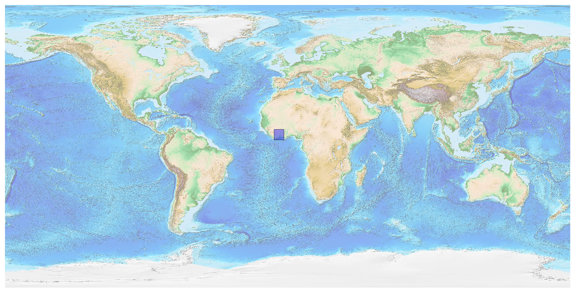

|Eigenschaft|Wert|
|-|-:|
Dateiname|[ivory-coast.sqlite](ivory-coast.sqlite)|
Zeitstempel|09.09.2019 18:46|
Dateigr&ouml;&szlig;e|3.42 Mb|
|||
Gesamtanzahl Nodes|66889|
|MinLat|4.141916|
|MaxLat|10.74769|
|MinLon|-8.665129|
|MaxLon|-2.476215|

### Top 5 Tags

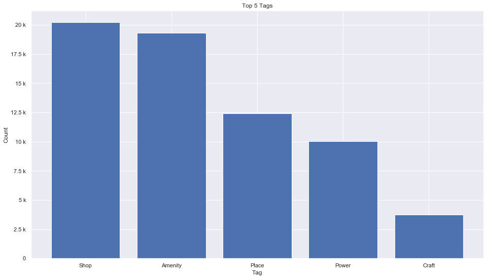

|Tag|Count|
|-|-:|
|Shop|20212|
|Amenity|19294|
|Place|12427|
|Power|10027|
|Craft|3752|

### &Uuml;bersicht Ortsangaben

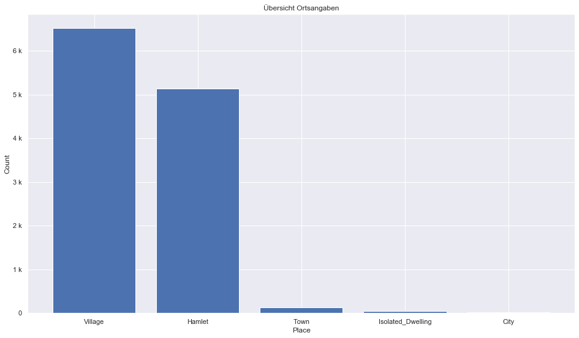

|Place|Count|
|-|-:|
|Village|6514|
|Hamlet|5136|
|Town|128|
|Isolated_Dwelling|49|
|City|24|

### Die 5 gr&ouml;&szlig;ten bewohnte Gebiete

|Name|Lat|Lon|Type|Population|
|----|--:|--:|:--:|---------:|
|Abidjan|5.320357|-4.016107|City|7567409|
|Abobo|5.435487|-4.029007|City|1500000|
|Yopougon|5.335194|-4.075756|City|1375020|
|Bouaké|7.6906058|-5.0298408|City|659223|
|Cocody|5.357367|-3.994934|City|450000|

---

## Kenya [&#10159;](kenya.sqlite)

### Allgemeine Informationen

|Eigenschaft|Wert|
|-|-:|
Dateiname|[kenya.sqlite](kenya.sqlite)|
Zeitstempel|09.09.2019 18:51|
Dateigr&ouml;&szlig;e|3.00 Mb|
|||
Gesamtanzahl Nodes|59070|
|MinLat|-4.816276|
|MaxLat|4.629931|
|MinLon|33.8679|
|MaxLon|41.97685|

### Top 5 Tags

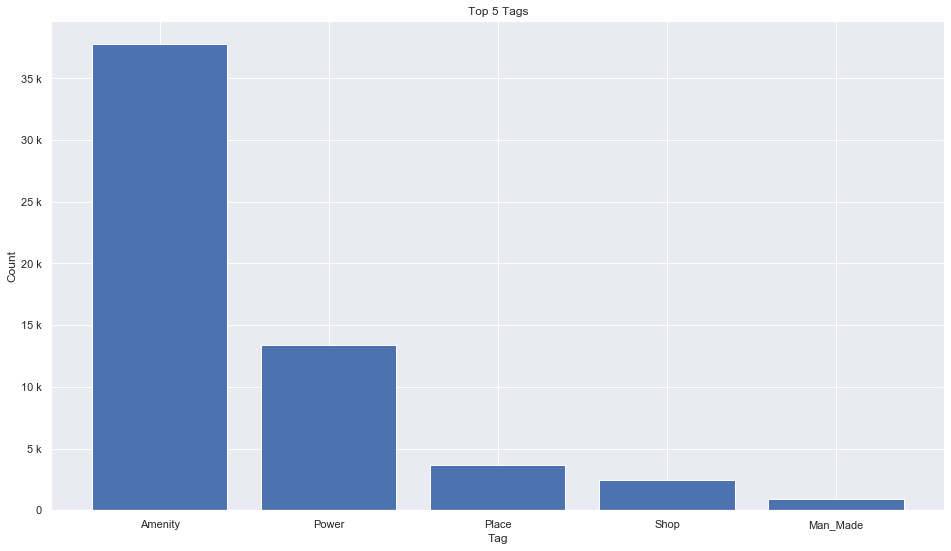

|Tag|Count|
|-|-:|
|Amenity|37758|
|Power|13376|
|Place|3706|
|Shop|2485|
|Man_Made|933|

### &Uuml;bersicht Ortsangaben

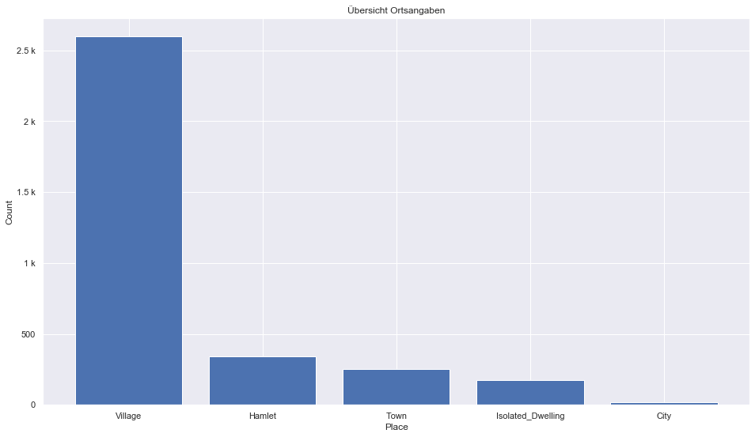

|Place|Count|
|-|-:|
|Village|2597|
|Hamlet|340|
|Town|251|
|Isolated_Dwelling|176|
|City|18|

### Die 5 gr&ouml;&szlig;ten bewohnte Gebiete

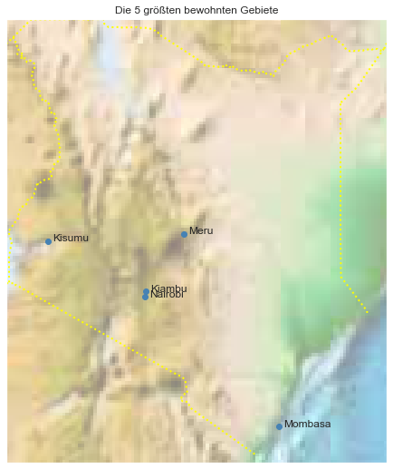

|Name|Lat|Lon|Type|Population|
|----|--:|--:|:--:|---------:|
|Nairobi|-1.2832533|36.8172449|City|3138295|
|Meru|0.0499786|37.6500063|City|1833000|
|Mombasa|-4.05052|39.667169|City|1300000|
|Kiambu|-1.1712839|36.8290321|City|1214500|
|Kisumu|-0.1029109|34.7541761|City|409928|

---

## Lesotho [&#10159;](lesotho.sqlite)

### Allgemeine Informationen

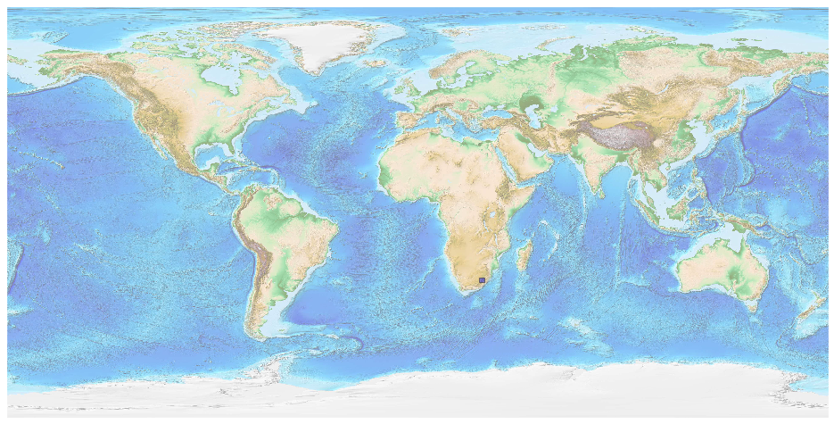

|Eigenschaft|Wert|
|-|-:|
Dateiname|[lesotho.sqlite](lesotho.sqlite)|
Zeitstempel|09.09.2019 18:49|
Dateigr&ouml;&szlig;e|484.00 Kb|
|||
Gesamtanzahl Nodes|9949|
|MinLat|-30.68144|
|MaxLat|-28.56213|
|MinLon|27.00561|
|MaxLon|29.46393|

### Top 5 Tags

|Tag|Count|
|-|-:|
|Power|5368|
|Amenity|2499|
|Place|1297|
|Shop|346|
|Leisure|234|

### &Uuml;bersicht Ortsangaben

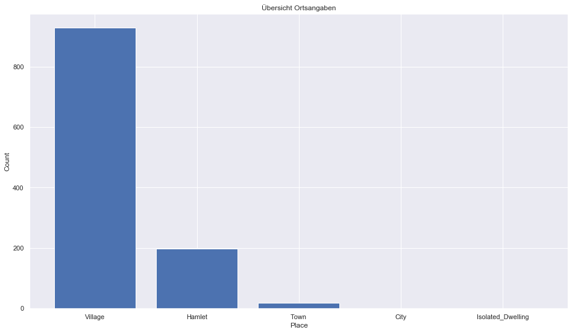

|Place|Count|
|-|-:|
|Village|928|
|Hamlet|197|
|Town|18|
|City|1|
|Isolated_Dwelling|1|

### Die 5 gr&ouml;&szlig;ten bewohnte Gebiete

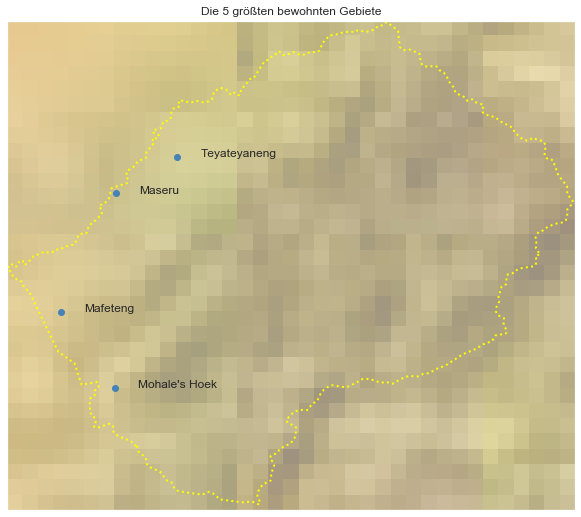

|Name|Lat|Lon|Type|Population|
|----|--:|--:|:--:|---------:|
|Maseru|-29.310054|27.478222|City|227880|
|Teyateyaneng|-29.1519737|27.7427554|Town|75115|
|Mafeteng|-29.8224468|27.2388281|Town|57059|
|Mohale's Hoek|-30.151983|27.471376|Town|24992|

---

## Liberia [&#10159;](liberia.sqlite)

### Allgemeine Informationen

|Eigenschaft|Wert|
|-|-:|
Dateiname|[liberia.sqlite](liberia.sqlite)|
Zeitstempel|09.09.2019 18:51|
Dateigr&ouml;&szlig;e|2.52 Mb|
|||
Gesamtanzahl Nodes|47276|
|MinLat|-0.681003|
|MaxLat|8.60446|
|MinLon|-14.95454|
|MaxLon|-7.24572|

### Top 5 Tags

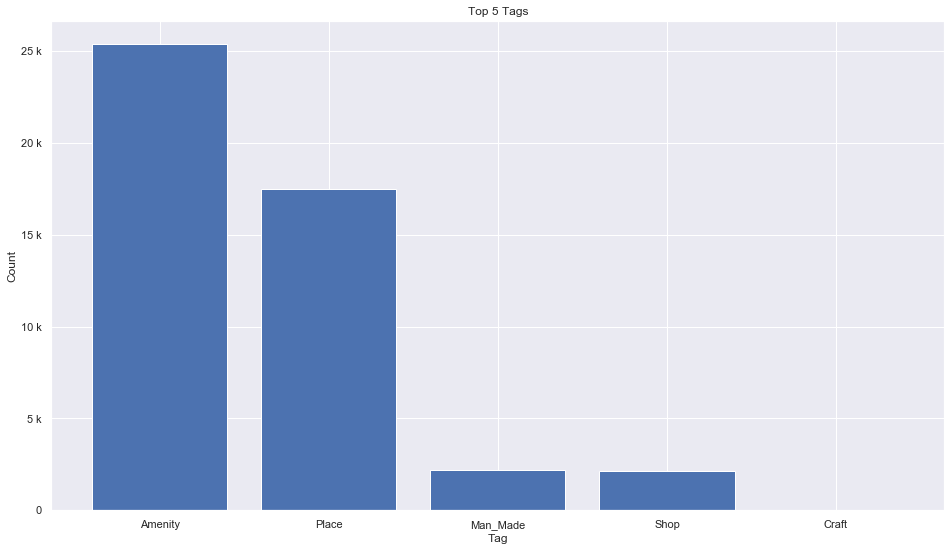

|Tag|Count|
|-|-:|
|Amenity|25380|
|Place|17472|
|Man_Made|2177|
|Shop|2158|
|Craft|33|

### &Uuml;bersicht Ortsangaben

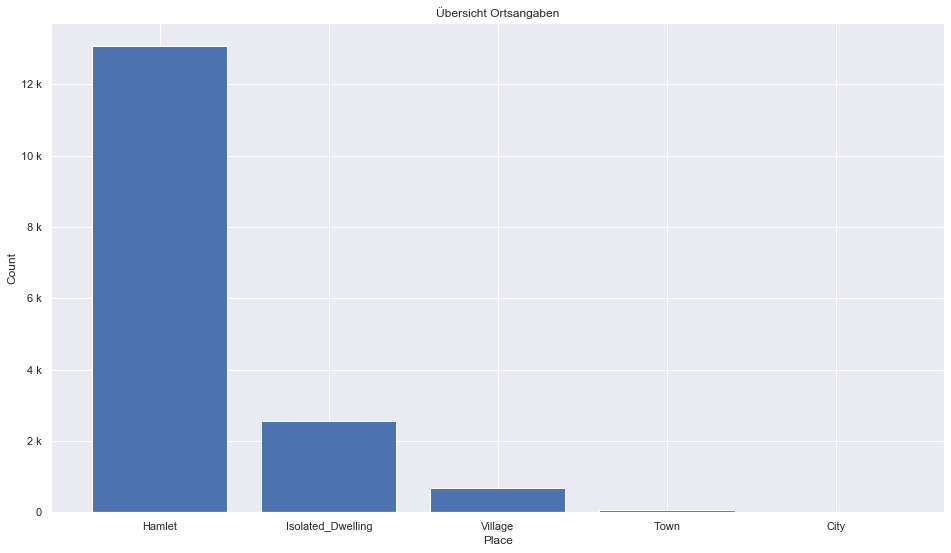

|Place|Count|
|-|-:|
|Hamlet|13062|
|Isolated_Dwelling|2546|
|Village|673|
|Town|55|
|City|2|

### Die 5 gr&ouml;&szlig;ten bewohnte Gebiete

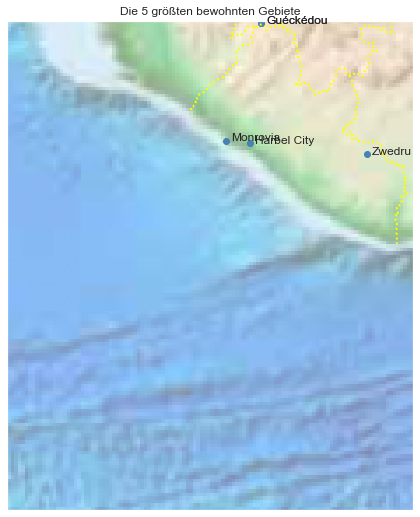

|Name|Lat|Lon|Type|Population|
|----|--:|--:|:--:|---------:|
|Monrovia|6.328034|-10.797788|City|1010970|
|Guéckédou|8.5616492|-10.1328278|Town|290611|
|Guéckédou|8.561649|-10.132821|City|221715|
|Harbel City|6.2767412|-10.3447395|Town|25000|
|Zwedru|6.068724|-8.1342735|Town|23903|

---

## Libya [&#10159;](libya.sqlite)

### Allgemeine Informationen

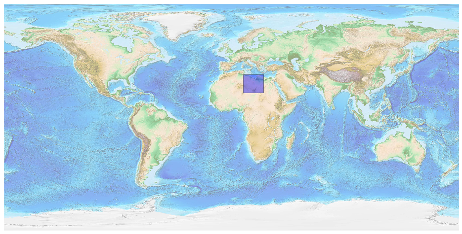

|Eigenschaft|Wert|
|-|-:|
Dateiname|[libya.sqlite](libya.sqlite)|
Zeitstempel|09.09.2019 18:52|
Dateigr&ouml;&szlig;e|4.96 Mb|
|||
Gesamtanzahl Nodes|101361|
|MinLat|19.45087|
|MaxLat|33.57972|
|MinLon|9.374405|
|MaxLon|25.48516|

### Top 5 Tags

|Tag|Count|
|-|-:|
|Power|81215|
|Amenity|9988|
|Shop|6979|
|Man_Made|1534|
|Place|1080|

### &Uuml;bersicht Ortsangaben

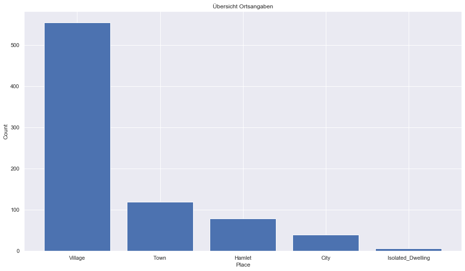

|Place|Count|
|-|-:|
|Village|554|
|Town|119|
|Hamlet|79|
|City|40|
|Isolated_Dwelling|6|

### Die 5 gr&ouml;&szlig;ten bewohnte Gebiete

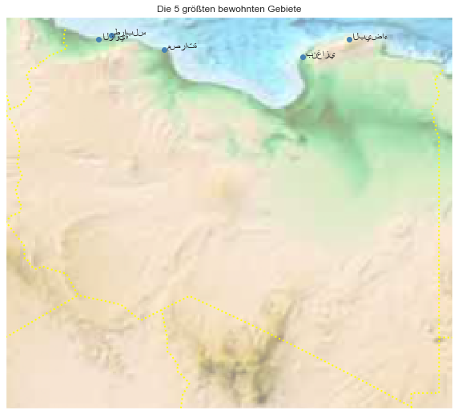

|Name|Lat|Lon|Type|Population|
|----|--:|--:|:--:|---------:|
|طرابلس|32.896672|13.1777923|City|2127000|
|بنغازي|32.1288331|20.0817204|City|631555|
|الزاوية|32.7626409|12.7264789|City|318726|
|البيضاء|32.7609529|21.7577175|City|310329|
|مصراتة|32.3745318|15.0904886|City|281000|

---

## Madagascar [&#10159;](madagascar.sqlite)

### Allgemeine Informationen

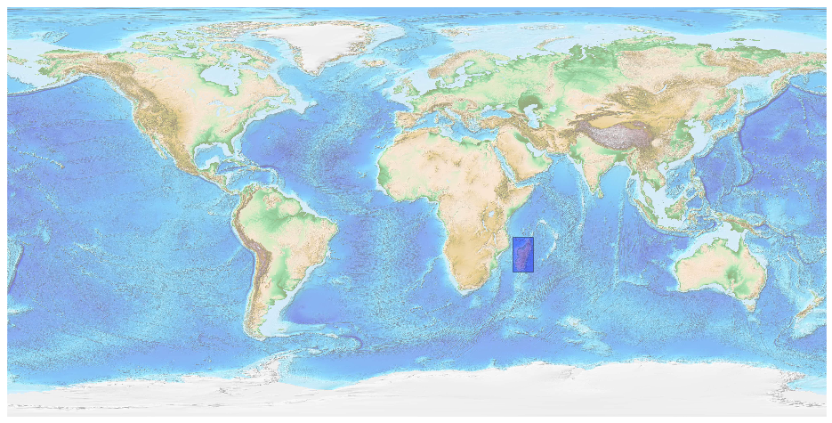

|Eigenschaft|Wert|
|-|-:|
Dateiname|[madagascar.sqlite](madagascar.sqlite)|
Zeitstempel|09.09.2019 18:53|
Dateigr&ouml;&szlig;e|1.61 Mb|
|||
Gesamtanzahl Nodes|31941|
|MinLat|-26.5823|
|MaxLat|-11.36225|
|MinLon|42.30124|
|MaxLon|51.14843|

### Top 5 Tags

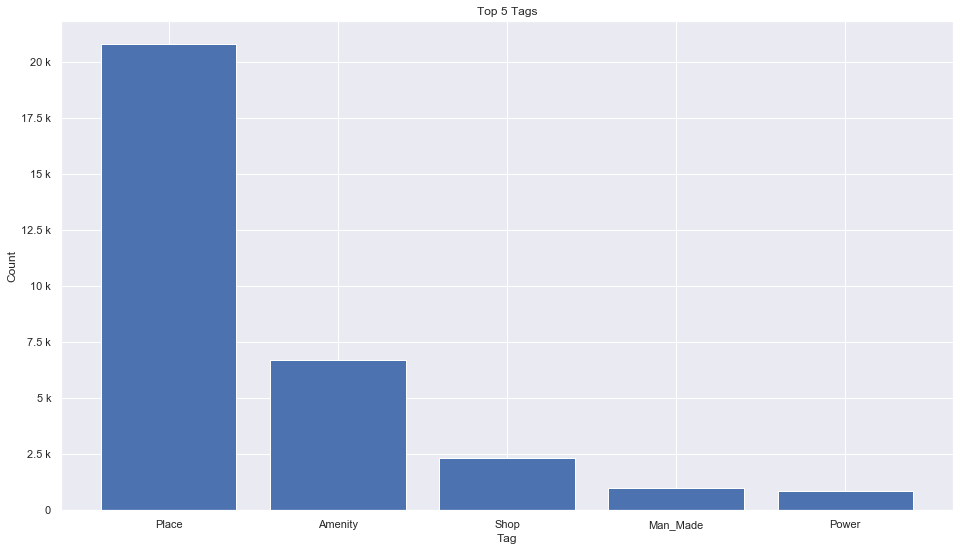

|Tag|Count|
|-|-:|
|Place|20787|
|Amenity|6713|
|Shop|2313|
|Man_Made|1001|
|Power|837|

### &Uuml;bersicht Ortsangaben

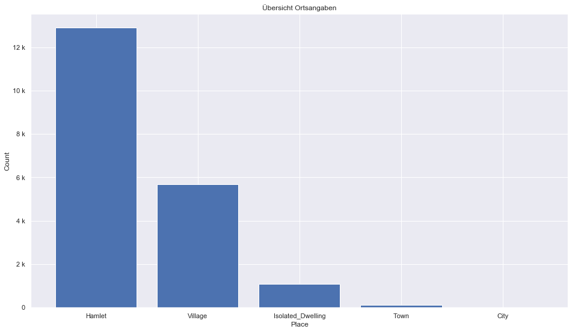

|Place|Count|
|-|-:|
|Hamlet|12897|
|Village|5672|
|Isolated_Dwelling|1073|
|Town|105|
|City|8|

### Die 5 gr&ouml;&szlig;ten bewohnte Gebiete

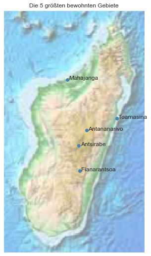

|Name|Lat|Lon|Type|Population|
|----|--:|--:|:--:|---------:|
|Antananarivo|-18.9100122|47.5255809|City|2200000|
|Antsirabe|-19.871403|47.034667|City|307102|
|Toamasina|-18.1553985|49.4098352|City|300813|
|Mahajanga|-15.7181492|46.3172577|City|244279|
|Fianarantsoa|-21.456444|47.085149|City|200482|

---

## Malawi [&#10159;](malawi.sqlite)

### Allgemeine Informationen

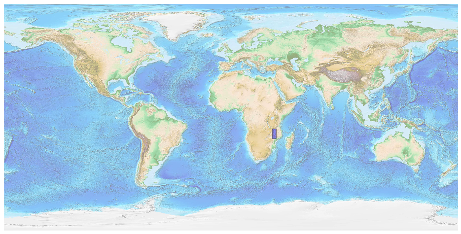

|Eigenschaft|Wert|
|-|-:|
Dateiname|[malawi.sqlite](malawi.sqlite)|
Zeitstempel|09.09.2019 18:55|
Dateigr&ouml;&szlig;e|1.41 Mb|
|||
Gesamtanzahl Nodes|29786|
|MinLat|-17.1455039|
|MaxLat|-9.353419|
|MinLon|32.659998|
|MaxLon|35.934239|

### Top 5 Tags

|Tag|Count|
|-|-:|
|Amenity|16775|
|Power|9181|
|Shop|1671|
|Place|1570|
|Leisure|291|

### &Uuml;bersicht Ortsangaben

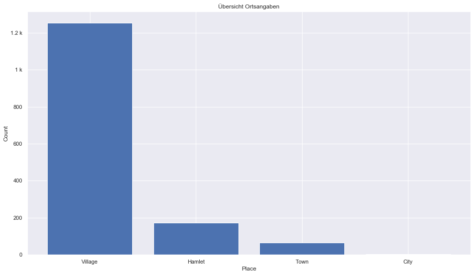

|Place|Count|
|-|-:|
|Village|1252|
|Hamlet|172|
|Town|64|
|City|4|

### Die 5 gr&ouml;&szlig;ten bewohnte Gebiete

|Name|Lat|Lon|Type|Population|
|----|--:|--:|:--:|---------:|
|Blantyre|-15.7862543|35.0035694|City|994500|
|Lilongwe|-13.973456|33.7878122|City|781538|
|Zomba|-15.3863208|35.3268273|City|101140|
|Mangochi|-14.4805084|35.2606129|Town|51429|
|Karonga|-9.9393499|33.9271368|Town|42555|

---

## Mali [&#10159;](mali.sqlite)

### Allgemeine Informationen

|Eigenschaft|Wert|
|-|-:|
Dateiname|[mali.sqlite](mali.sqlite)|
Zeitstempel|09.09.2019 18:56|
Dateigr&ouml;&szlig;e|2.23 Mb|
|||
Gesamtanzahl Nodes|42700|
|MinLat|10.05845|
|MaxLat|25.09499|
|MinLon|-12.3292|
|MaxLon|4.330257|

### Top 5 Tags

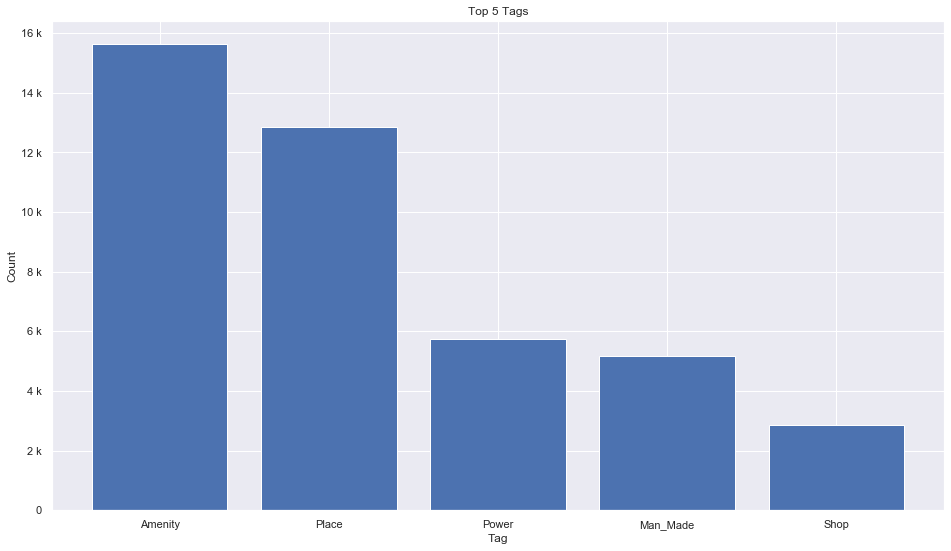

|Tag|Count|
|-|-:|
|Amenity|15623|
|Place|12866|
|Power|5749|
|Man_Made|5170|
|Shop|2862|

### &Uuml;bersicht Ortsangaben

|Place|Count|
|-|-:|
|Hamlet|8034|
|Village|3601|
|Town|478|
|Isolated_Dwelling|445|
|City|11|

### Die 5 gr&ouml;&szlig;ten bewohnte Gebiete

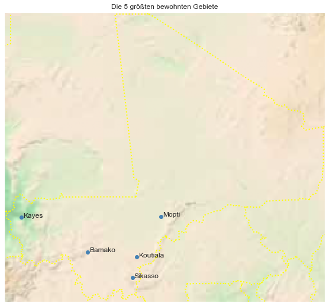

|Name|Lat|Lon|Type|Population|
|----|--:|--:|:--:|---------:|
|Bamako|12.649319|-8.000337|City|1809106|
|Sikasso|11.3164979|-5.6777499|City|226000|
|Kayes|14.443406|-11.437914|City|127368|
|Mopti|14.4879631|-4.1905986|City|114296|
|Koutiala|12.3869501|-5.4600937|City|99000|

---

## Mauritania [&#10159;](mauritania.sqlite)

### Allgemeine Informationen

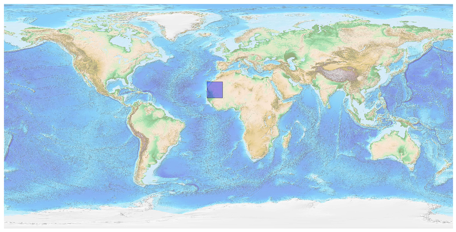

|Eigenschaft|Wert|
|-|-:|
Dateiname|[mauritania.sqlite](mauritania.sqlite)|
Zeitstempel|09.09.2019 18:56|
Dateigr&ouml;&szlig;e|676.00 Kb|
|||
Gesamtanzahl Nodes|13728|
|MinLat|14.694297|
|MaxLat|27.336135|
|MinLon|-17.15606|
|MaxLon|-4.816056|

### Top 5 Tags

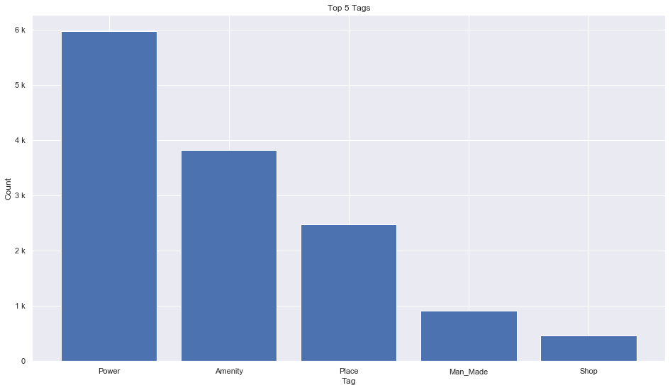

|Tag|Count|
|-|-:|
|Power|5973|
|Amenity|3822|
|Place|2483|
|Man_Made|913|
|Shop|471|

### &Uuml;bersicht Ortsangaben

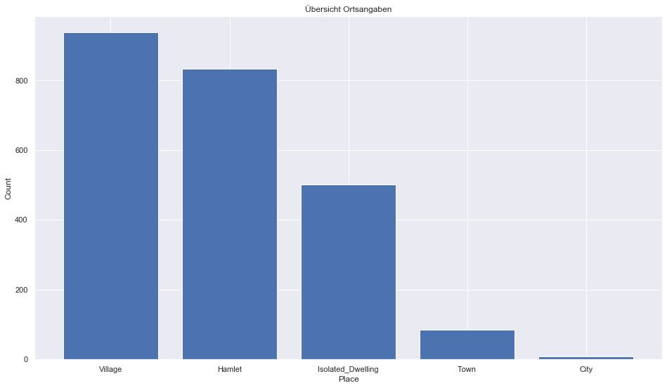

|Place|Count|
|-|-:|
|Village|937|
|Hamlet|834|
|Isolated_Dwelling|502|
|Town|84|
|City|8|

### Die 5 gr&ouml;&szlig;ten bewohnte Gebiete

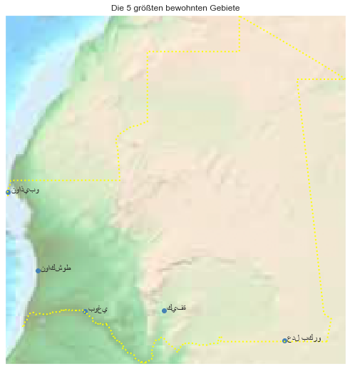

|Name|Lat|Lon|Type|Population|
|----|--:|--:|:--:|---------:|
|نواكشوط|18.0792379|-15.9780071|City|760000|
|نواذيبو|20.9131304|-17.0501015|City|85953|
|كيفة|16.6161559|-11.4002038|City|60005|
|عدل بكرو|15.5337297|-7.028246|Town|58429|
|بوغي|16.5955353|-14.2603202|Town|49089|

---

## Mauritius [&#10159;](mauritius.sqlite)

### Allgemeine Informationen

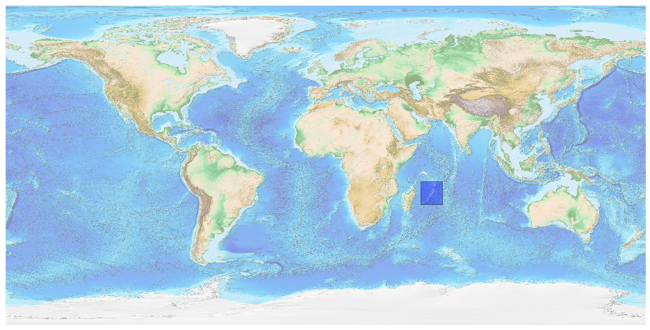

|Eigenschaft|Wert|
|-|-:|
Dateiname|[mauritius.sqlite](mauritius.sqlite)|
Zeitstempel|09.09.2019 18:56|
Dateigr&ouml;&szlig;e|300.00 Kb|
|||
Gesamtanzahl Nodes|5124|
|MinLat|-22.241095|
|MaxLat|-9.183617|
|MinLon|53.547275|
|MaxLon|65.639906|

### Top 5 Tags

|Tag|Count|
|-|-:|
|Shop|2192|
|Amenity|1849|
|Power|636|
|Place|218|
|Leisure|114|

### &Uuml;bersicht Ortsangaben

|Place|Count|
|-|-:|
|Village|131|
|Hamlet|42|
|Town|11|
|City|2|

### Die 5 gr&ouml;&szlig;ten bewohnte Gebiete

|Name|Lat|Lon|Type|Population|
|----|--:|--:|:--:|---------:|
|Port-Louis|-20.1637281|57.5045331|City|147688|
|Vacoas-Phoenix|-20.2988802|57.4927689|City|107678|
|Beau Bassin - Rose Hill|-20.234269|57.4693447|Town|96000|
|Quatre Bornes|-20.2643015|57.4800061|Town|81773|
|Curepipe|-20.3150516|57.5211497|Town|81600|

---

## Morocco [&#10159;](morocco.sqlite)

### Allgemeine Informationen

|Eigenschaft|Wert|
|-|-:|
Dateiname|[morocco.sqlite](morocco.sqlite)|
Zeitstempel|09.09.2019 19:01|
Dateigr&ouml;&szlig;e|6.92 Mb|
|||
Gesamtanzahl Nodes|147456|
|MinLat|20.40373|
|MaxLat|36.16199|
|MinLon|-18.183499|
|MaxLon|-0.997533|

### Top 5 Tags

|Tag|Count|
|-|-:|
|Power|101815|
|Amenity|20364|
|Place|11760|
|Shop|9249|
|Man_Made|2851|

### &Uuml;bersicht Ortsangaben

|Place|Count|
|-|-:|
|Village|5808|
|Hamlet|4247|
|Town|288|
|Isolated_Dwelling|179|
|City|52|

### Die 5 gr&ouml;&szlig;ten bewohnte Gebiete

|Name|Lat|Lon|Type|Population|
|----|--:|--:|:--:|---------:|
|Casablanca ⵜⴰⴷⴷⴰⵔⵜ ⵜⵓⵎⵍⵉⵍⵜ الدار البيضاء|33.5950627|-7.6187768|City|3359818|
|Rabat ⵔⴱⴰⵟ الرباط|34.022405|-6.834543|City|1650000|
|Fès ⴼⴰⵙ فاس|34.0346534|-5.0161926|City|1112072|
|Salé ⵙⵍⴰ سلا|34.044889|-6.814017|City|1000000|
|Tanger ⵟⴰⵏⵊⴰ طنجة|35.777103|-5.803792|City|947952|

---

## Mozambique [&#10159;](mozambique.sqlite)

### Allgemeine Informationen

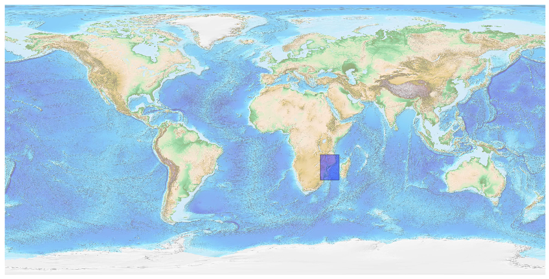

|Eigenschaft|Wert|
|-|-:|
Dateiname|[mozambique.sqlite](mozambique.sqlite)|
Zeitstempel|09.09.2019 19:00|
Dateigr&ouml;&szlig;e|1.34 Mb|
|||
Gesamtanzahl Nodes|29192|
|MinLat|-26.938372|
|MaxLat|-9.986206|
|MinLon|30.178227|
|MaxLon|42.534886|

### Top 5 Tags

|Tag|Count|
|-|-:|
|Power|21496|
|Amenity|3446|
|Place|2202|
|Shop|1178|
|Man_Made|682|

### &Uuml;bersicht Ortsangaben

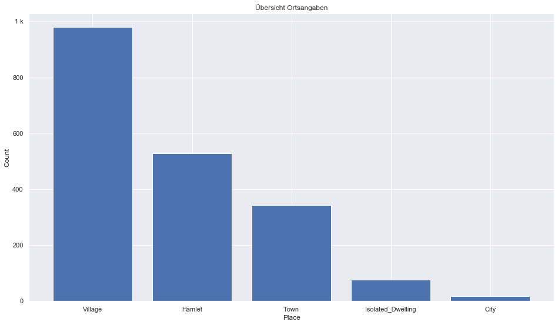

|Place|Count|
|-|-:|
|Village|979|
|Hamlet|528|
|Town|343|
|Isolated_Dwelling|77|
|City|18|

### Die 5 gr&ouml;&szlig;ten bewohnte Gebiete

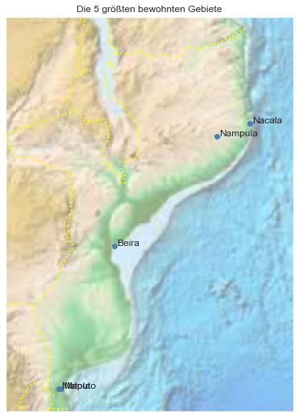

|Name|Lat|Lon|Type|Population|
|----|--:|--:|:--:|---------:|
|Maputo|-25.966213|32.56745|City|1244227|
|Matola|-25.966917|32.466956|City|675422|
|Nampula|-15.1194063|39.2615886|City|477900|
|Beira|-19.828707|34.841782|City|436240|
|Nacala|-14.5583059|40.6863816|City|389000|

---

## Namibia [&#10159;](namibia.sqlite)

### Allgemeine Informationen

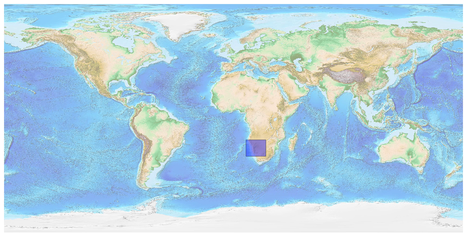

|Eigenschaft|Wert|
|-|-:|
Dateiname|[namibia.sqlite](namibia.sqlite)|
Zeitstempel|09.09.2019 19:02|
Dateigr&ouml;&szlig;e|7.22 Mb|
|||
Gesamtanzahl Nodes|165789|
|MinLat|-30.072362|
|MaxLat|-16.91682|
|MinLon|9.784615|
|MaxLon|25.29929|

### Top 5 Tags

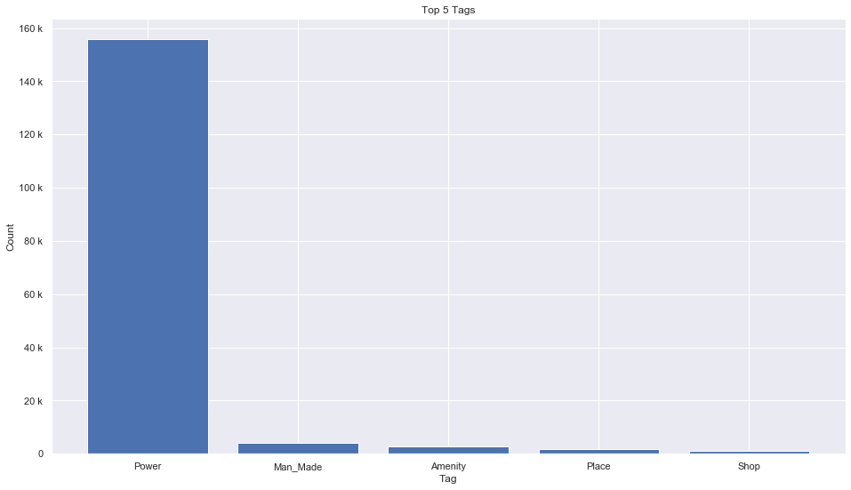

|Tag|Count|
|-|-:|
|Power|155744|
|Man_Made|4053|
|Amenity|2644|
|Place|1779|
|Shop|1096|

### &Uuml;bersicht Ortsangaben

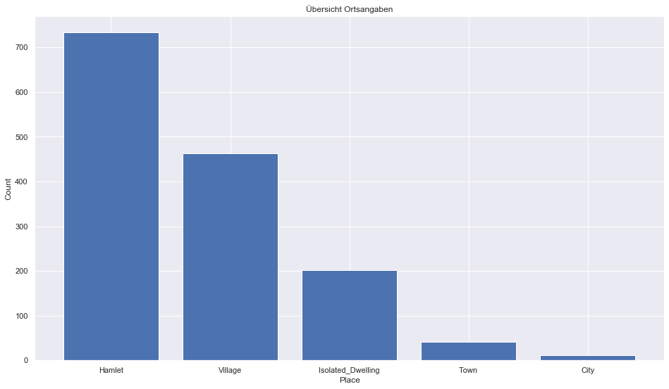

|Place|Count|
|-|-:|
|Hamlet|733|
|Village|463|
|Isolated_Dwelling|201|
|Town|41|
|City|11|

### Die 5 gr&ouml;&szlig;ten bewohnte Gebiete

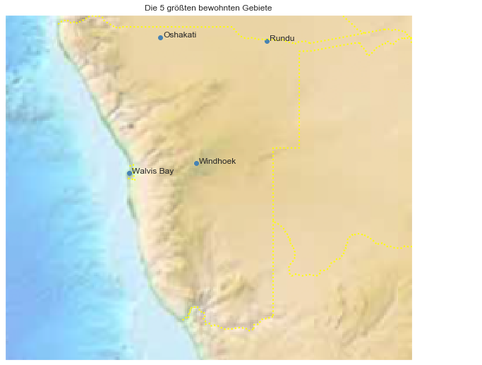

|Name|Lat|Lon|Type|Population|
|----|--:|--:|:--:|---------:|
|Windhoek|-22.5743922|17.0790688|City|325858|
|Rundu|-17.9136037|19.7666849|City|63431|
|Walvis Bay|-22.9543269|14.50748|City|61300|
|Oshakati|-17.7834339|15.7002428|City|43000|
|Victoria Falls|-17.9349458|25.8252767|Town|33060|

---

## Niger [&#10159;](niger.sqlite)

### Allgemeine Informationen

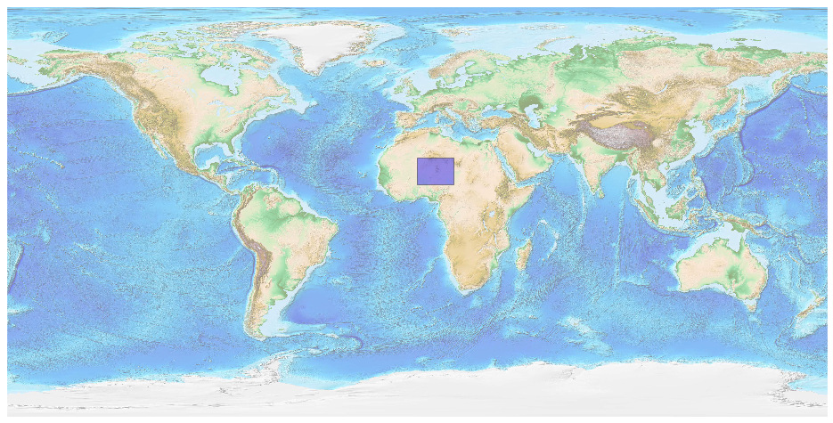

|Eigenschaft|Wert|
|-|-:|
Dateiname|[niger.sqlite](niger.sqlite)|
Zeitstempel|09.09.2019 19:01|
Dateigr&ouml;&szlig;e|1.84 Mb|
|||
Gesamtanzahl Nodes|35091|
|MinLat|11.686838|
|MaxLat|23.56864|
|MinLon|0.119721|
|MaxLon|16.0560499|

### Top 5 Tags

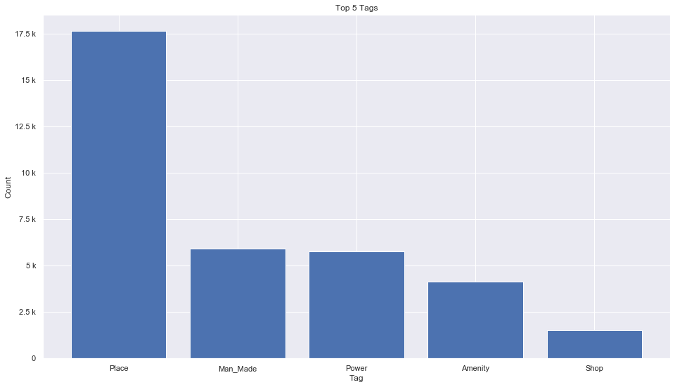

|Tag|Count|
|-|-:|
|Place|17627|
|Man_Made|5899|
|Power|5744|
|Amenity|4132|
|Shop|1517|

### &Uuml;bersicht Ortsangaben

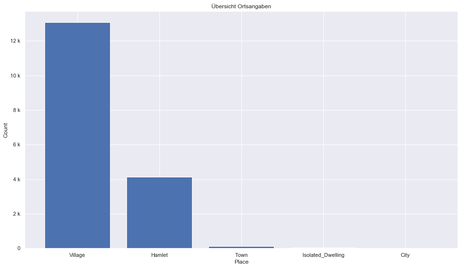

|Place|Count|
|-|-:|
|Village|13068|
|Hamlet|4137|
|Town|133|
|Isolated_Dwelling|45|
|City|19|

### Die 5 gr&ouml;&szlig;ten bewohnte Gebiete

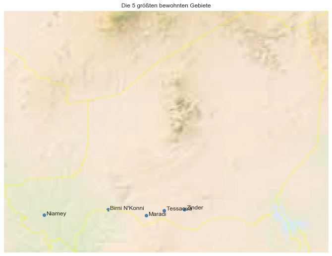

|Name|Lat|Lon|Type|Population|
|----|--:|--:|:--:|---------:|
|Niamey|13.524834|2.109823|City|1026848|
|Maradi|13.501206|7.102534|City|174485|
|Zinder|13.8063421|8.9891659|City|170574|
|Tessaoua|13.755513|7.990456|City|166682|
|Birni N'Konni|13.791612|5.24779|City|143530|

---

## Nigeria [&#10159;](nigeria.sqlite)

### Allgemeine Informationen

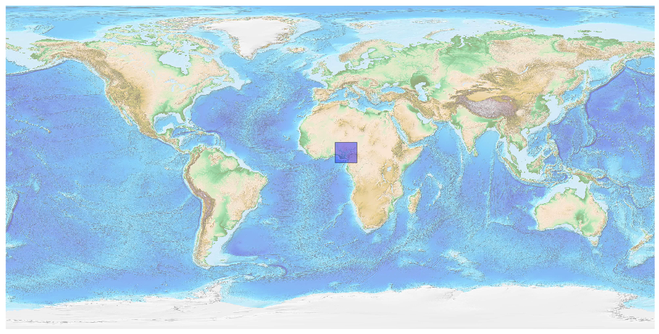

|Eigenschaft|Wert|
|-|-:|
Dateiname|[nigeria.sqlite](nigeria.sqlite)|
Zeitstempel|09.09.2019 19:07|
Dateigr&ouml;&szlig;e|5.15 Mb|
|||
Gesamtanzahl Nodes|102730|
|MinLat|2.674022|
|MaxLat|13.89545|
|MinLon|2.678891|
|MaxLon|14.67886|

### Top 5 Tags

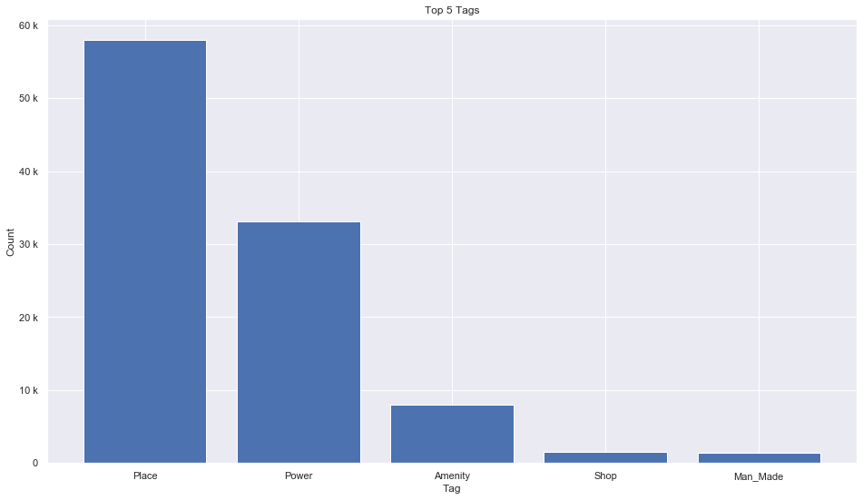

|Tag|Count|
|-|-:|
|Place|57940|
|Power|33114|
|Amenity|7935|
|Shop|1516|
|Man_Made|1413|

### &Uuml;bersicht Ortsangaben

|Place|Count|
|-|-:|
|Village|50888|
|Hamlet|5096|
|Isolated_Dwelling|896|
|Town|483|
|City|61|

### Die 5 gr&ouml;&szlig;ten bewohnte Gebiete

|Name|Lat|Lon|Type|Population|
|----|--:|--:|:--:|---------:|
|Lagos|6.4550575|3.3941795|City|10404112|
|Ibadan|7.3777462|3.8972497|City|3034200|
|Nnewi|6.019531|6.917181|Town|2500000|
|Kano|11.9918671|8.5303654|City|2395375|
|Port Harcourt|4.7676576|7.0188527|City|1382592|

---

## Rwanda [&#10159;](rwanda.sqlite)

### Allgemeine Informationen

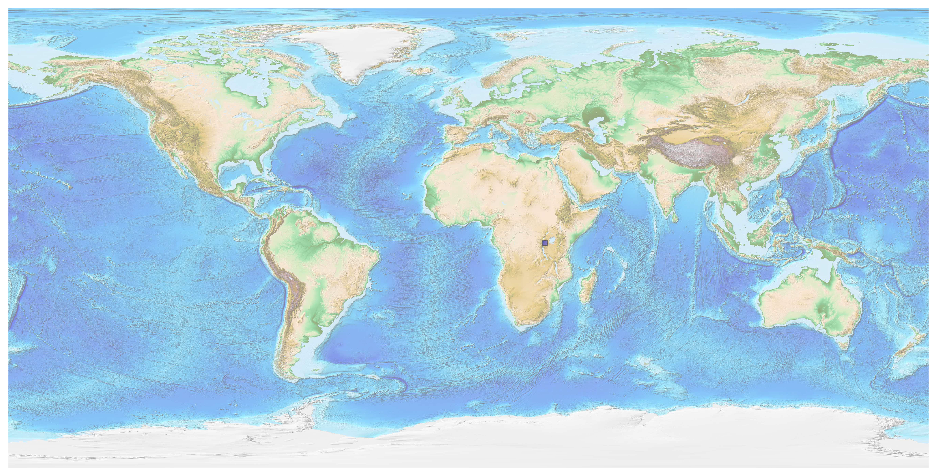

|Eigenschaft|Wert|
|-|-:|
Dateiname|[rwanda.sqlite](rwanda.sqlite)|
Zeitstempel|09.09.2019 19:03|
Dateigr&ouml;&szlig;e|272.00 Kb|
|||
Gesamtanzahl Nodes|5129|
|MinLat|-2.84741|
|MaxLat|-1.03831|
|MinLon|28.85246|
|MaxLon|30.908642|

### Top 5 Tags

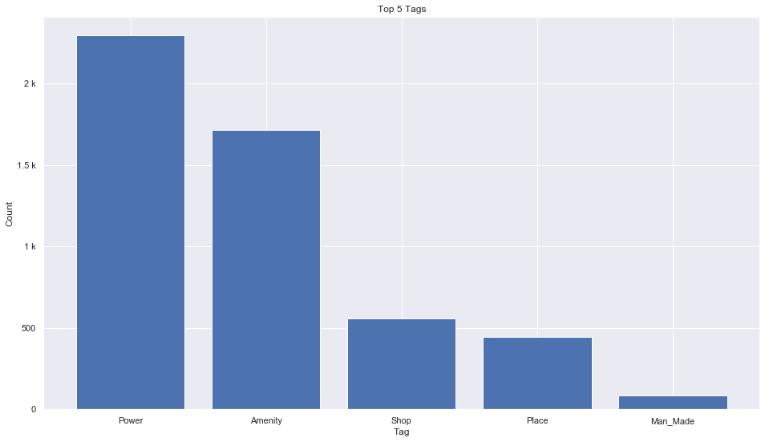

|Tag|Count|
|-|-:|
|Power|2295|
|Amenity|1716|
|Shop|559|
|Place|445|
|Man_Made|83|

### &Uuml;bersicht Ortsangaben

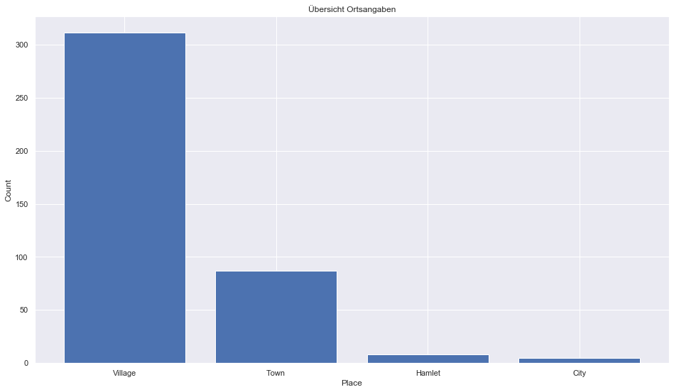

|Place|Count|
|-|-:|
|Village|311|
|Town|87|
|Hamlet|8|
|City|5|

### Die 5 gr&ouml;&szlig;ten bewohnte Gebiete

|Name|Lat|Lon|Type|Population|
|----|--:|--:|:--:|---------:|
|Kigali|-1.950851|30.061507|City|1132686|
|Ngororero|-1.854725|29.632534|Town|34559|
|Kivumu|-2.0487624|29.8041467|Village|30000|
|Nyakiziba|-2.40028|30.75278|Village|9594|
|Gahuru|-1.3351521|29.736979|Village|816|

---

## Saint Helena Ascension And Tristan Da Cunha [&#10159;](saint-helena-ascension-and-tristan-da-cunha.sqlite)

### Allgemeine Informationen

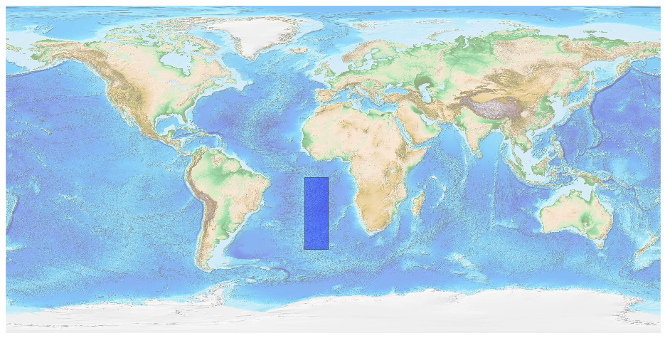

|Eigenschaft|Wert|
|-|-:|
Dateiname|[saint-helena-ascension-and-tristan-da-cunha.sqlite](saint-helena-ascension-and-tristan-da-cunha.sqlite)|
Zeitstempel|09.09.2019 19:03|
Dateigr&ouml;&szlig;e|24.00 Kb|
|||
Gesamtanzahl Nodes|193|
|MinLat|-43.832453|
|MaxLat|-4.591221|
|MinLon|-15.570256|
|MaxLon|-2.781278|

### Top 5 Tags

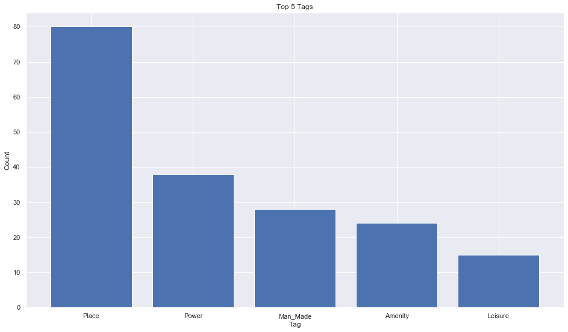

|Tag|Count|
|-|-:|
|Place|80|
|Power|38|
|Man_Made|28|
|Amenity|24|
|Leisure|15|

### &Uuml;bersicht Ortsangaben

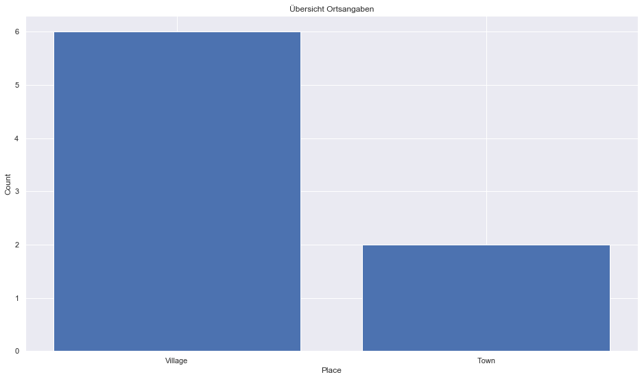

|Place|Count|
|-|-:|
|Village|6|
|Town|2|

### Die 5 gr&ouml;&szlig;ten bewohnte Gebiete

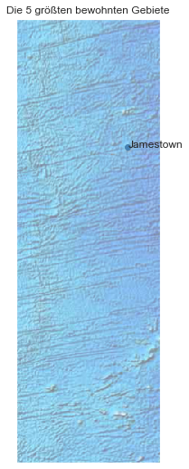

|Name|Lat|Lon|Type|Population|
|----|--:|--:|:--:|---------:|
|Jamestown|-15.9277296|-5.7160872|Town|629|

---

## Sao Tome And Principe [&#10159;](sao-tome-and-principe.sqlite)

### Allgemeine Informationen

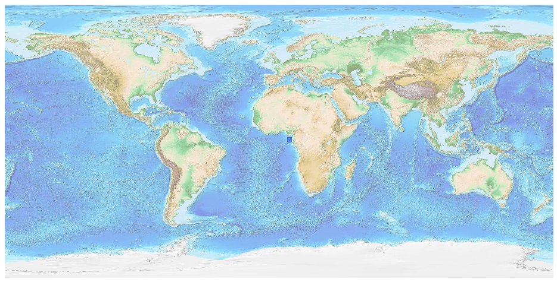

|Eigenschaft|Wert|
|-|-:|
Dateiname|[sao-tome-and-principe.sqlite](sao-tome-and-principe.sqlite)|
Zeitstempel|09.09.2019 19:03|
Dateigr&ouml;&szlig;e|52.00 Kb|
|||
Gesamtanzahl Nodes|642|
|MinLat|-0.5255649|
|MaxLat|2.440286|
|MinLon|5.273916|
|MaxLon|8.3669949|

### Top 5 Tags

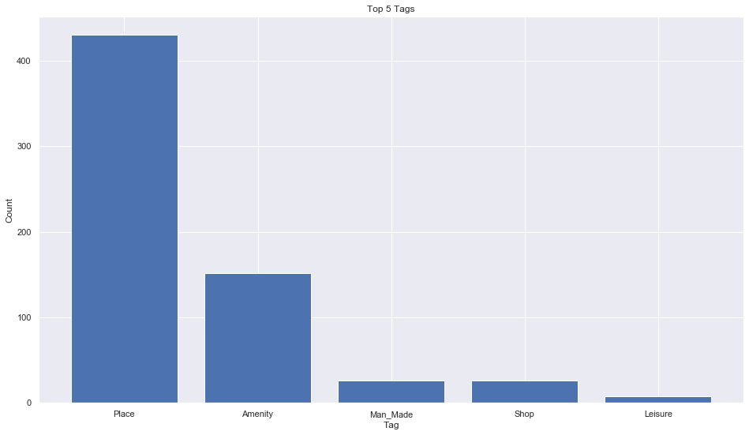

|Tag|Count|
|-|-:|
|Place|430|
|Amenity|152|
|Man_Made|26|
|Shop|26|
|Leisure|8|

### &Uuml;bersicht Ortsangaben

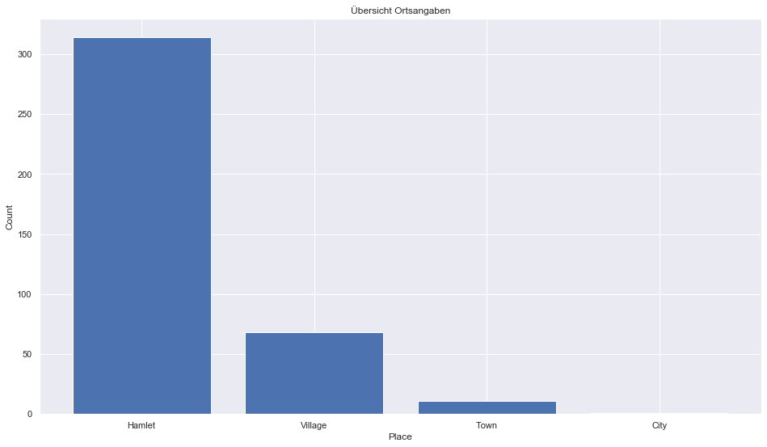

|Place|Count|
|-|-:|
|Hamlet|314|
|Village|68|
|Town|11|
|City|1|

### Die 5 gr&ouml;&szlig;ten bewohnte Gebiete

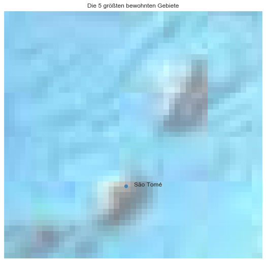

|Name|Lat|Lon|Type|Population|
|----|--:|--:|:--:|---------:|
|São Tomé|0.3389242|6.7313031|City|53300|

---

## Senegal And Gambia [&#10159;](senegal-and-gambia.sqlite)

### Allgemeine Informationen

|Eigenschaft|Wert|
|-|-:|
Dateiname|[senegal-and-gambia.sqlite](senegal-and-gambia.sqlite)|
Zeitstempel|09.09.2019 19:05|
Dateigr&ouml;&szlig;e|1.68 Mb|
|||
Gesamtanzahl Nodes|33380|
|MinLat|12.01511|
|MaxLat|16.70088|
|MinLon|-19.85623|
|MaxLon|-11.33595|

### Top 5 Tags

|Tag|Count|
|-|-:|
|Place|11732|
|Power|7003|
|Amenity|6486|
|Shop|5400|
|Man_Made|1676|

### &Uuml;bersicht Ortsangaben

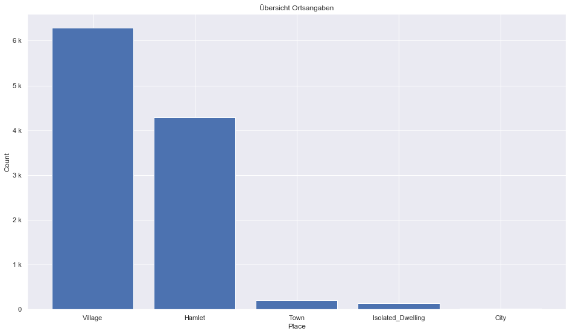

|Place|Count|
|-|-:|
|Village|6284|
|Hamlet|4288|
|Town|199|
|Isolated_Dwelling|136|
|City|18|

### Die 5 gr&ouml;&szlig;ten bewohnte Gebiete

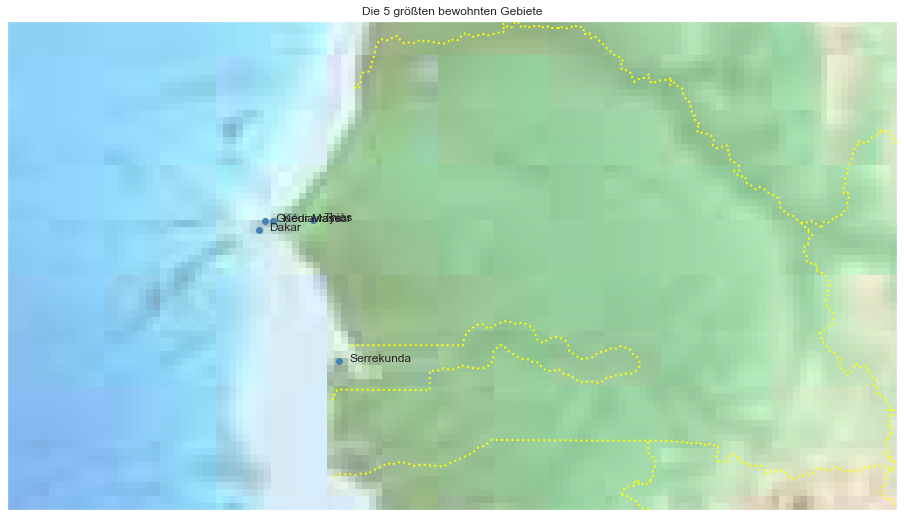

|Name|Lat|Lon|Type|Population|
|----|--:|--:|:--:|---------:|
|Dakar|14.693425|-17.447938|City|2396800|
|Serrekunda|13.438762|-16.674807|City|380000|
|Keur Massar|14.7825027|-17.3111773|Town|337611|
|Thiès|14.791461|-16.925605|City|320000|
|Guédiawaye|14.7771207|-17.390071|City|286989|

---

## Seychelles [&#10159;](seychelles.sqlite)

### Allgemeine Informationen

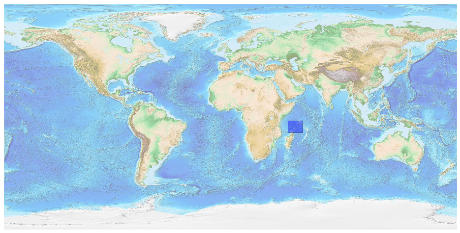

|Eigenschaft|Wert|
|-|-:|
Dateiname|[seychelles.sqlite](seychelles.sqlite)|
Zeitstempel|09.09.2019 19:05|
Dateigr&ouml;&szlig;e|68.00 Kb|
|||
Gesamtanzahl Nodes|945|
|MinLat|-12.55844|
|MaxLat|-3.17239|
|MinLon|45.684947|
|MaxLon|57.574329|

### Top 5 Tags

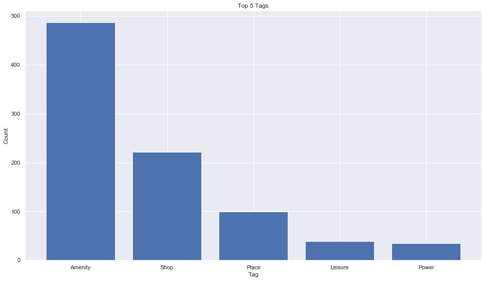

|Tag|Count|
|-|-:|
|Amenity|486|
|Shop|221|
|Place|99|
|Leisure|39|
|Power|35|

### &Uuml;bersicht Ortsangaben

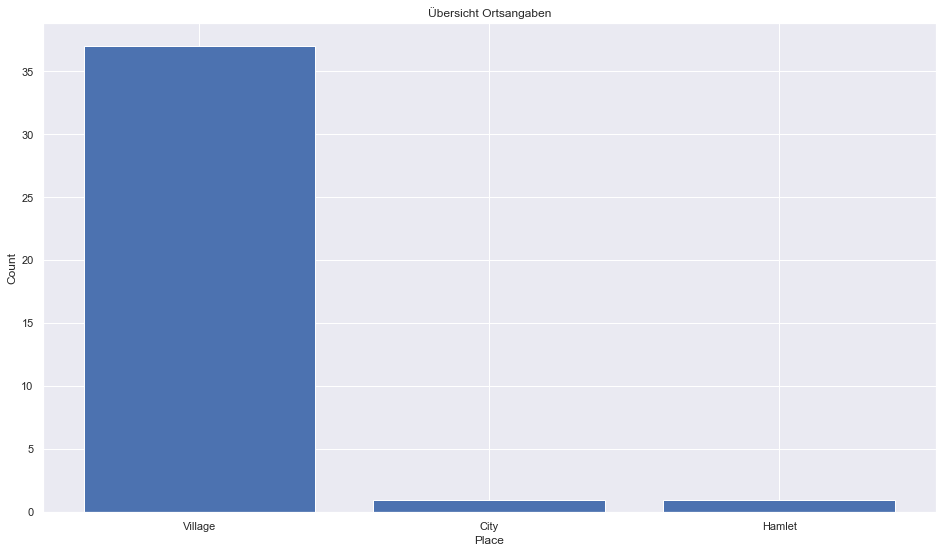

|Place|Count|
|-|-:|
|Village|37|
|City|1|
|Hamlet|1|

### Die 5 gr&ouml;&szlig;ten bewohnte Gebiete

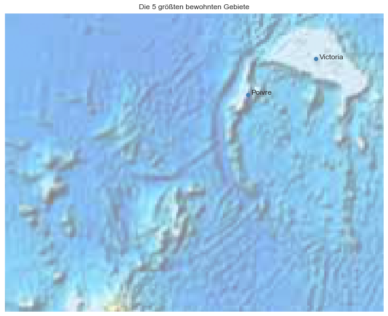

|Name|Lat|Lon|Type|Population|
|----|--:|--:|:--:|---------:|
|Victoria|-4.6232085|55.452359|City|26450|
|Poivre|-5.7467898|53.311817|Village|10|

---

## Sierra Leone [&#10159;](sierra-leone.sqlite)

### Allgemeine Informationen

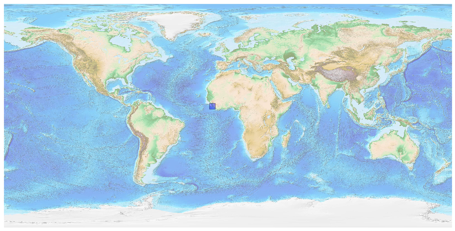

|Eigenschaft|Wert|
|-|-:|
Dateiname|[sierra-leone.sqlite](sierra-leone.sqlite)|
Zeitstempel|09.09.2019 19:07|
Dateigr&ouml;&szlig;e|860.00 Kb|
|||
Gesamtanzahl Nodes|15642|
|MinLat|5.391619|
|MaxLat|10.0096|
|MinLon|-14.76451|
|MaxLon|-10.2558|

### Top 5 Tags

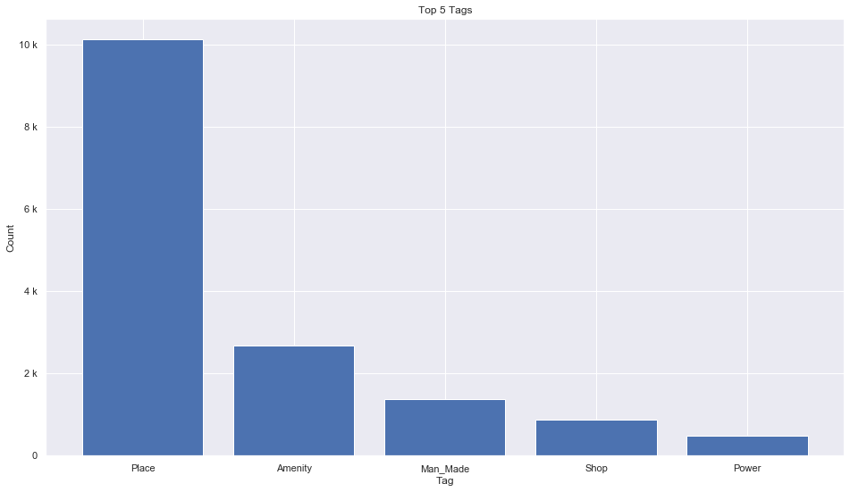

|Tag|Count|
|-|-:|
|Place|10114|
|Amenity|2666|
|Man_Made|1364|
|Shop|879|
|Power|482|

### &Uuml;bersicht Ortsangaben

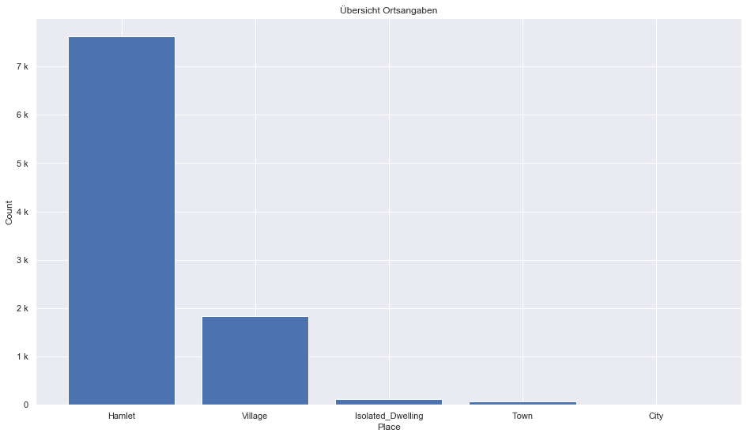

|Place|Count|
|-|-:|
|Hamlet|7619|
|Village|1839|
|Isolated_Dwelling|113|
|Town|63|
|City|7|

### Die 5 gr&ouml;&szlig;ten bewohnte Gebiete

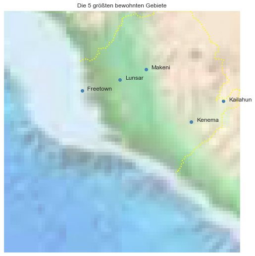

|Name|Lat|Lon|Type|Population|
|----|--:|--:|:--:|---------:|
|Freetown|8.479004|-13.26795|City|951000|
|Kenema|7.885936|-11.18639|City|188463|
|Makeni|8.88474|-12.04912|City|112489|
|Lunsar|8.686834|-12.543584|Town|36108|
|Kailahun|8.277001|-10.573943|Town|30411|

---

## Somalia [&#10159;](somalia.sqlite)

### Allgemeine Informationen

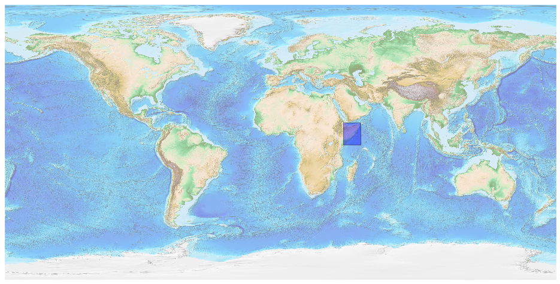

|Eigenschaft|Wert|
|-|-:|
Dateiname|[somalia.sqlite](somalia.sqlite)|
Zeitstempel|09.09.2019 19:08|
Dateigr&ouml;&szlig;e|1.27 Mb|
|||
Gesamtanzahl Nodes|24791|
|MinLat|-1.816753|
|MaxLat|12.710943|
|MinLon|40.97489|
|MaxLon|52.448708|

### Top 5 Tags

|Tag|Count|
|-|-:|
|Man_Made|13165|
|Place|10592|
|Amenity|867|
|Shop|106|
|Military|21|

### &Uuml;bersicht Ortsangaben

|Place|Count|
|-|-:|
|Village|6823|
|Hamlet|2223|
|Isolated_Dwelling|819|
|Town|101|
|City|29|

### Die 5 gr&ouml;&szlig;ten bewohnte Gebiete

|Name|Lat|Lon|Type|Population|
|----|--:|--:|:--:|---------:|
|Muqdisho مقديشو|2.042778|45.338564|City|1700000|
|Berbera بربرة|10.4386215|45.0134007|City|263000|
|Ceerigaabo عيرجابو|10.61806|47.37|City|190000|
|Burco برعو|9.52749|45.537472|City|65000|
|Luuq|3.7995708|42.5450627|Village|34000|

---

## South Africa [&#10159;](south-africa.sqlite)

### Allgemeine Informationen

|Eigenschaft|Wert|
|-|-:|
Dateiname|[south-africa.sqlite](south-africa.sqlite)|
Zeitstempel|09.09.2019 19:14|
Dateigr&ouml;&szlig;e|11.87 Mb|
|||
Gesamtanzahl Nodes|254959|
|MinLat|-48.464971|
|MaxLat|-21.775433|
|MinLon|14.373284|
|MaxLon|40.2702|

### Top 5 Tags

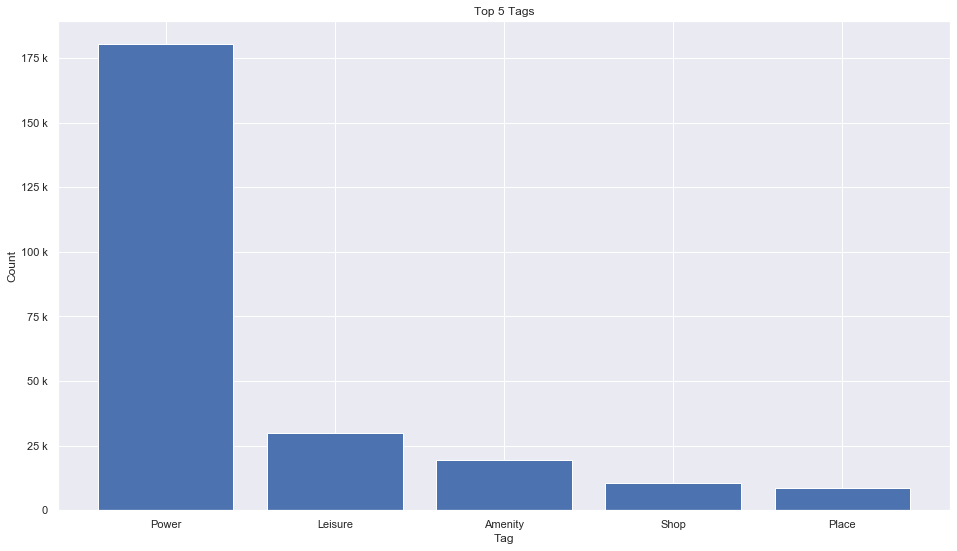

|Tag|Count|
|-|-:|
|Power|180264|
|Leisure|29751|
|Amenity|19584|
|Shop|10636|
|Place|8600|

### &Uuml;bersicht Ortsangaben

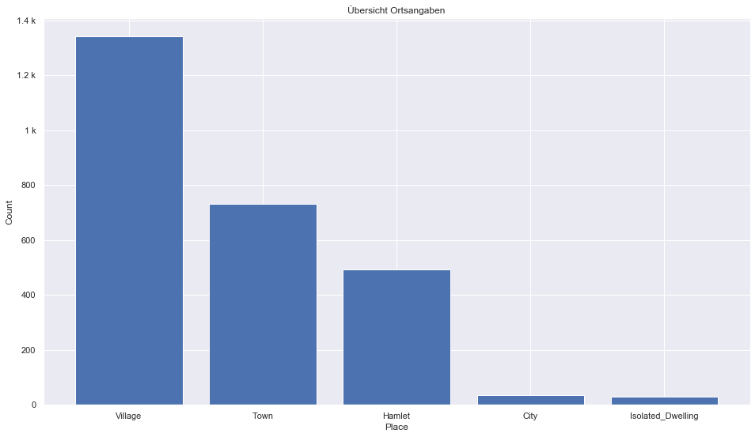

|Place|Count|
|-|-:|
|Village|1341|
|Town|731|
|Hamlet|493|
|City|34|
|Isolated_Dwelling|30|

### Die 5 gr&ouml;&szlig;ten bewohnte Gebiete

|Name|Lat|Lon|Type|Population|
|----|--:|--:|:--:|---------:|
|Johannesburg|-26.205|28.049722|City|4435000|
|Cape Town|-33.928992|18.417396|City|3500000|
|Durban|-29.861825|31.009909|City|3460000|
|Soweto|-26.2227778|27.89|City|1270000|
|Port Elizabeth|-33.9617051|25.6207519|City|1050000|

---

## South Sudan [&#10159;](south-sudan.sqlite)

### Allgemeine Informationen

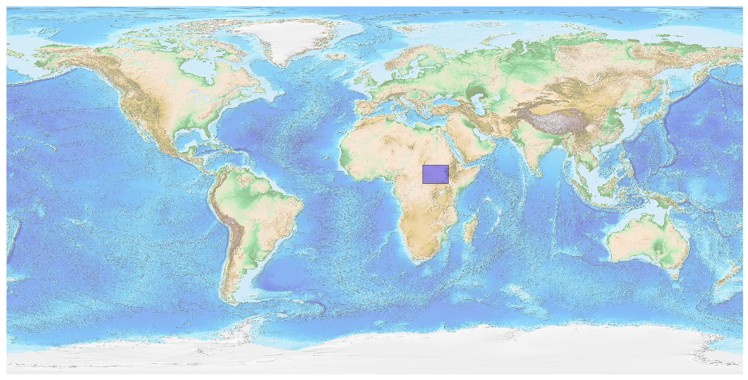

|Eigenschaft|Wert|
|-|-:|
Dateiname|[south-sudan.sqlite](south-sudan.sqlite)|
Zeitstempel|09.09.2019 19:10|
Dateigr&ouml;&szlig;e|452.00 Kb|
|||
Gesamtanzahl Nodes|8699|
|MinLat|3.44237|
|MaxLat|12.282153|
|MinLon|23.403722|
|MaxLon|35.962977|

### Top 5 Tags

|Tag|Count|
|-|-:|
|Place|4050|
|Power|1500|
|Amenity|1394|
|Man_Made|917|
|Aeroway|379|

### &Uuml;bersicht Ortsangaben

|Place|Count|
|-|-:|
|Hamlet|1967|
|Village|1071|
|Isolated_Dwelling|544|
|Town|197|
|City|18|

### Die 5 gr&ouml;&szlig;ten bewohnte Gebiete

|Name|Lat|Lon|Type|Population|
|----|--:|--:|:--:|---------:|
|Juba|4.8472017|31.5951655|City|372410|
|Bor|6.2039927|31.5587285|City|315351|
|Renk|11.748914|32.816359|City|176020|
|Malakal|9.5410608|31.6504255|City|147450|
|Wau|7.6999269|27.9910035|City|136179|

---

## Sudan [&#10159;](sudan.sqlite)

### Allgemeine Informationen

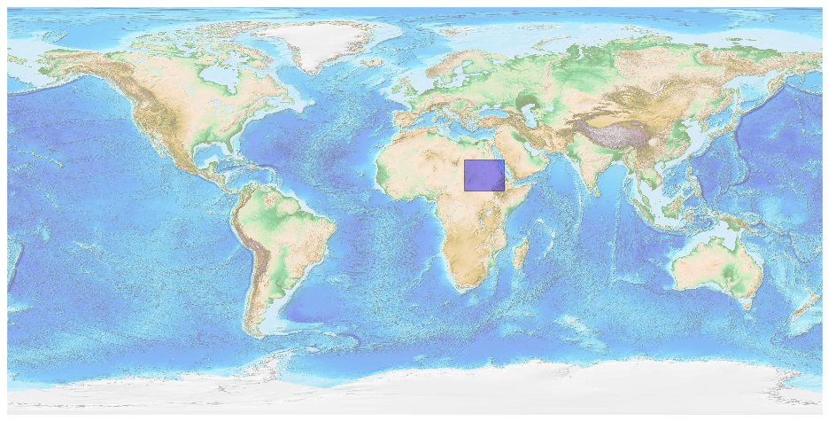

|Eigenschaft|Wert|
|-|-:|
Dateiname|[sudan.sqlite](sudan.sqlite)|
Zeitstempel|09.09.2019 19:10|
Dateigr&ouml;&szlig;e|1.50 Mb|
|||
Gesamtanzahl Nodes|31541|
|MinLat|8.653747|
|MaxLat|22.48111|
|MinLon|21.780999|
|MaxLon|39.627812|

### Top 5 Tags

|Tag|Count|
|-|-:|
|Power|21324|
|Place|4553|
|Amenity|3757|
|Shop|864|
|Man_Made|853|

### &Uuml;bersicht Ortsangaben

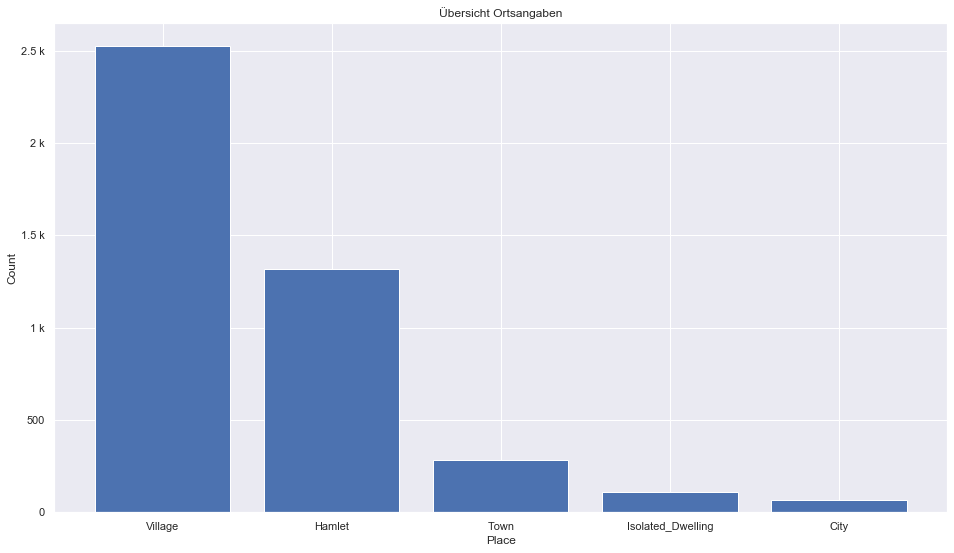

|Place|Count|
|-|-:|
|Village|2523|
|Hamlet|1318|
|Town|282|
|Isolated_Dwelling|111|
|City|69|

### Die 5 gr&ouml;&szlig;ten bewohnte Gebiete

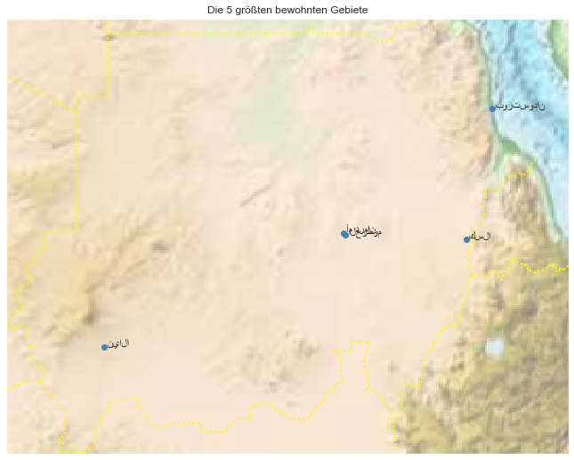

|Name|Lat|Lon|Type|Population|
|----|--:|--:|:--:|---------:|
|الخرطوم|15.593325|32.53565|City|2682431|
|أم درمان|15.6445536|32.4777311|City|2395159|
|نيالا|12.0505098|24.8795115|City|566000|
|بورتسودان|19.619217|37.211709|City|489000|
|كسلا|15.4521163|36.3771099|City|436000|

---

## Swaziland [&#10159;](swaziland.sqlite)

### Allgemeine Informationen

|Eigenschaft|Wert|
|-|-:|
Dateiname|[swaziland.sqlite](swaziland.sqlite)|
Zeitstempel|09.09.2019 19:11|
Dateigr&ouml;&szlig;e|116.00 Kb|
|||
Gesamtanzahl Nodes|2142|
|MinLat|-27.318256|
|MaxLat|-25.717811|
|MinLon|30.786367|
|MaxLon|32.135992|

### Top 5 Tags

|Tag|Count|
|-|-:|
|Power|1536|
|Amenity|313|
|Shop|153|
|Place|73|
|Man_Made|40|

### &Uuml;bersicht Ortsangaben

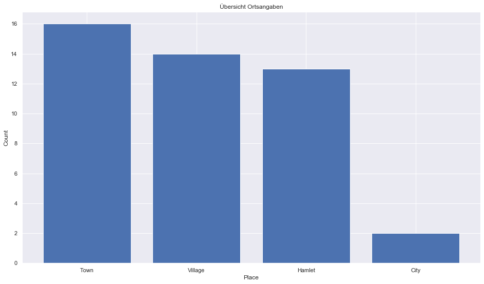

|Place|Count|
|-|-:|
|Town|16|
|Village|14|
|Hamlet|13|
|City|2|

### Die 5 gr&ouml;&szlig;ten bewohnte Gebiete

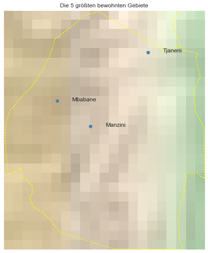

|Name|Lat|Lon|Type|Population|
|----|--:|--:|:--:|---------:|
|Manzini|-26.4958706|31.3695887|City|110508|
|Mbabane|-26.325745|31.144663|City|94874|
|Tjaneni|-25.9994572|31.7542997|Village|1899|

---

## Tanzania [&#10159;](tanzania.sqlite)

### Allgemeine Informationen

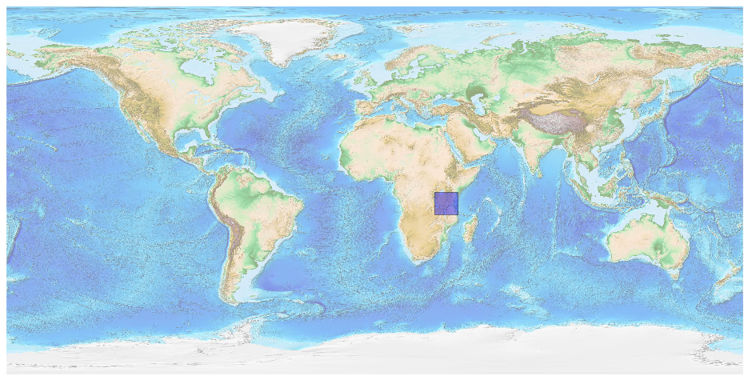

|Eigenschaft|Wert|
|-|-:|
Dateiname|[tanzania.sqlite](tanzania.sqlite)|
Zeitstempel|09.09.2019 19:22|
Dateigr&ouml;&szlig;e|4.63 Mb|
|||
Gesamtanzahl Nodes|87629|
|MinLat|-11.775945|
|MaxLat|-0.974988|
|MinLon|29.24395|
|MaxLon|40.69487|

### Top 5 Tags

|Tag|Count|
|-|-:|
|Shop|38498|
|Amenity|25715|
|Power|14494|
|Place|5447|
|Man_Made|2430|

### &Uuml;bersicht Ortsangaben

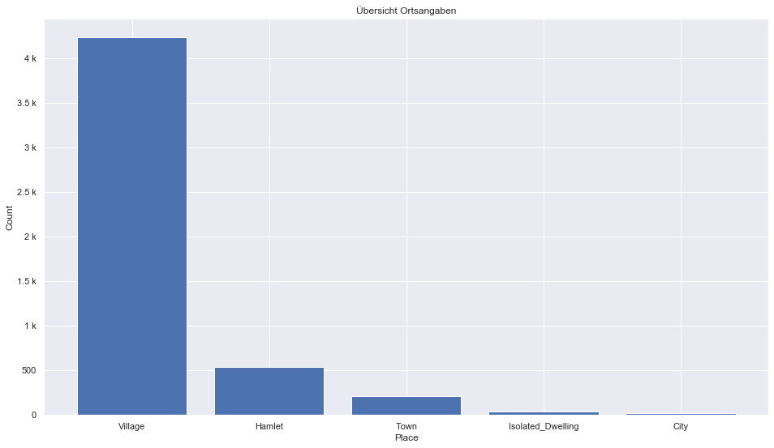

|Place|Count|
|-|-:|
|Village|4236|
|Hamlet|540|
|Town|215|
|Isolated_Dwelling|35|
|City|18|

### Die 5 gr&ouml;&szlig;ten bewohnte Gebiete

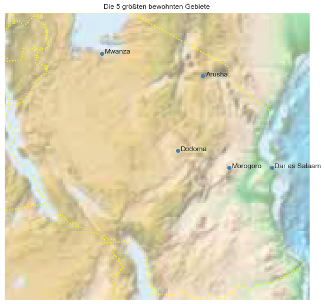

|Name|Lat|Lon|Type|Population|
|----|--:|--:|:--:|---------:|
|Dar es Salaam|-6.8160837|39.2803583|City|4364541|
|Arusha|-3.3696827|36.6880794|City|416442|
|Dodoma|-6.1791181|35.7468174|City|410956|
|Mwanza|-2.5196915|32.9014417|City|385810|
|Morogoro|-6.8161626|37.6693891|City|315866|

---

## Togo [&#10159;](togo.sqlite)

### Allgemeine Informationen

|Eigenschaft|Wert|
|-|-:|
Dateiname|[togo.sqlite](togo.sqlite)|
Zeitstempel|09.09.2019 19:16|
Dateigr&ouml;&szlig;e|888.00 Kb|
|||
Gesamtanzahl Nodes|16418|
|MinLat|5.892541|
|MaxLat|11.14395|
|MinLon|-0.148338|
|MaxLon|1.803016|

### Top 5 Tags

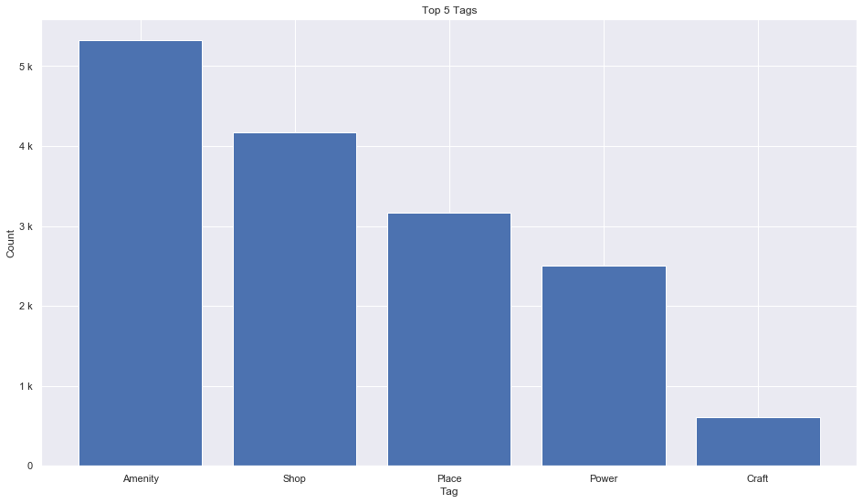

|Tag|Count|
|-|-:|
|Amenity|5321|
|Shop|4170|
|Place|3165|
|Power|2509|
|Craft|611|

### &Uuml;bersicht Ortsangaben

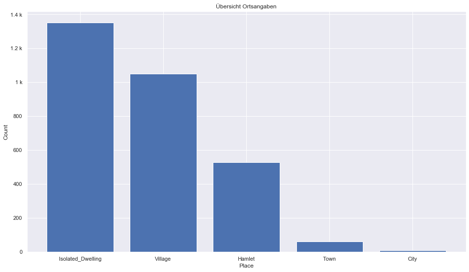

|Place|Count|
|-|-:|
|Isolated_Dwelling|1351|
|Village|1051|
|Hamlet|529|
|Town|61|
|City|8|

### Die 5 gr&ouml;&szlig;ten bewohnte Gebiete

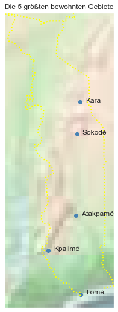

|Name|Lat|Lon|Type|Population|
|----|--:|--:|:--:|---------:|
|Lomé|6.130419|1.215829|City|837437|
|Sokodé|8.9833194|1.1438149|City|120000|
|Kara|9.548767|1.1980859|City|110000|
|Atakpamé|7.5320603|1.1219479|City|87000|
|Kpalimé|6.9105873|0.63202|City|75000|

---

## Tunisia [&#10159;](tunisia.sqlite)

### Allgemeine Informationen

|Eigenschaft|Wert|
|-|-:|
Dateiname|[tunisia.sqlite](tunisia.sqlite)|
Zeitstempel|09.09.2019 19:17|
Dateigr&ouml;&szlig;e|1.27 Mb|
|||
Gesamtanzahl Nodes|25943|
|MinLat|30.238884|
|MaxLat|37.941381|
|MinLon|7.520699|
|MaxLon|12.127679|

### Top 5 Tags

|Tag|Count|
|-|-:|
|Power|13348|
|Amenity|7077|
|Shop|3155|
|Place|1076|
|Man_Made|759|

### &Uuml;bersicht Ortsangaben

|Place|Count|
|-|-:|
|Village|440|
|Hamlet|222|
|Town|120|
|City|13|
|Isolated_Dwelling|7|

### Die 5 gr&ouml;&szlig;ten bewohnte Gebiete

|Name|Lat|Lon|Type|Population|
|----|--:|--:|:--:|---------:|
|طرابلس|32.896672|13.1777923|City|2127000|
|تونس|36.800108|10.184794|City|728453|
|صفاقس|34.7397986|10.7600021|City|484329|
|سوسة|35.828829|10.640525|City|221530|
|القيروان‎|35.6775263|10.1006205|City|139070|

---

## Uganda [&#10159;](uganda.sqlite)

### Allgemeine Informationen

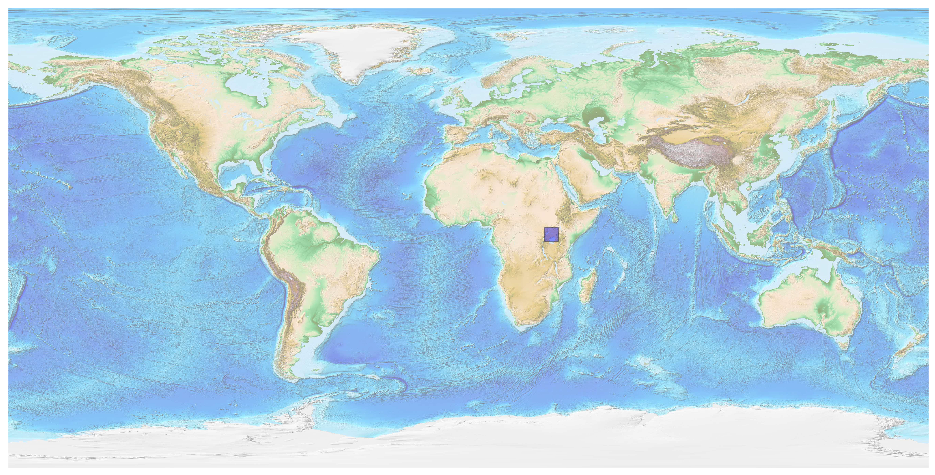

|Eigenschaft|Wert|
|-|-:|
Dateiname|[uganda.sqlite](uganda.sqlite)|
Zeitstempel|09.09.2019 19:24|
Dateigr&ouml;&szlig;e|5.76 Mb|
|||
Gesamtanzahl Nodes|99146|
|MinLat|-1.487315|
|MaxLat|4.2331399|
|MinLon|29.56346|
|MaxLon|35.01031|

### Top 5 Tags

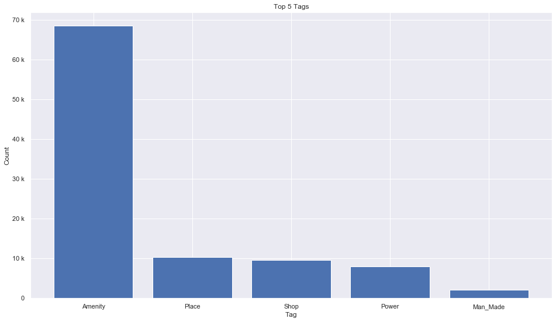

|Tag|Count|
|-|-:|
|Amenity|68431|
|Place|10377|
|Shop|9588|
|Power|7957|
|Man_Made|2099|

### &Uuml;bersicht Ortsangaben

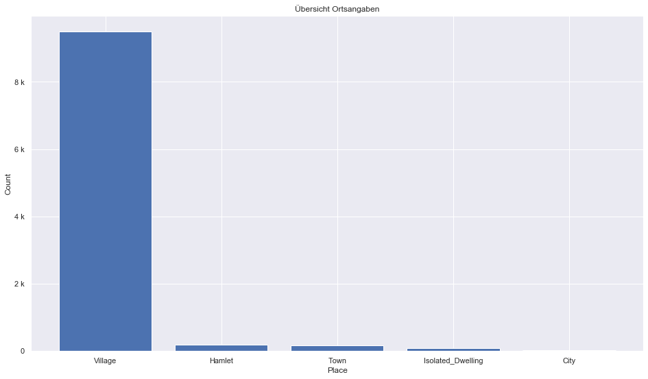

|Place|Count|
|-|-:|
|Village|9489|
|Hamlet|185|
|Town|175|
|Isolated_Dwelling|85|
|City|26|

### Die 5 gr&ouml;&szlig;ten bewohnte Gebiete

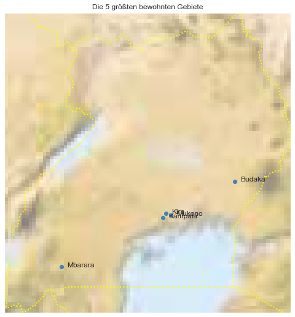

|Name|Lat|Lon|Type|Population|
|----|--:|--:|:--:|---------:|
|Kampala|0.3177137|32.5813539|City|1516210|
|Kira|0.4003408|32.6391845|City|313761|
|Mbarara|-0.6109532|30.6533047|City|195013|
|Budaka|1.0158418|33.9490661|Town|178900|
|Mukono|0.3689136|32.7348393|City|161996|

---

## Zambia [&#10159;](zambia.sqlite)

### Allgemeine Informationen

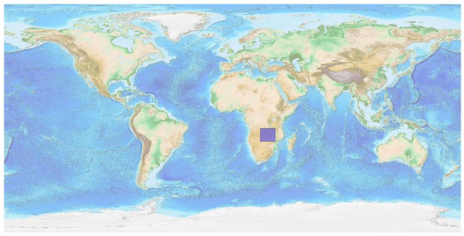

|Eigenschaft|Wert|
|-|-:|
Dateiname|[zambia.sqlite](zambia.sqlite)|
Zeitstempel|09.09.2019 19:28|
Dateigr&ouml;&szlig;e|2.96 Mb|
|||
Gesamtanzahl Nodes|64978|
|MinLat|-18.084936|
|MaxLat|-8.239483|
|MinLon|21.987834|
|MaxLon|33.711288|

### Top 5 Tags

|Tag|Count|
|-|-:|
|Power|43316|
|Amenity|17110|
|Shop|2313|
|Place|1100|
|Man_Made|580|

### &Uuml;bersicht Ortsangaben

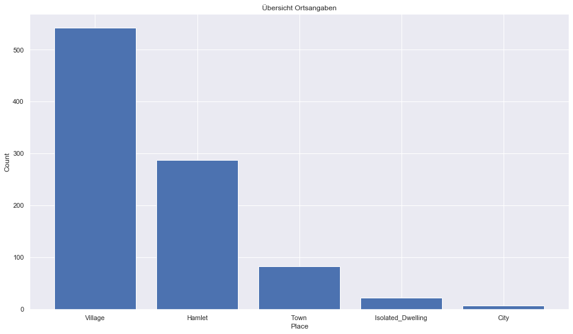

|Place|Count|
|-|-:|
|Village|542|
|Hamlet|288|
|Town|83|
|Isolated_Dwelling|22|
|City|7|

### Die 5 gr&ouml;&szlig;ten bewohnte Gebiete

|Name|Lat|Lon|Type|Population|
|----|--:|--:|:--:|---------:|
|Lusaka|-15.4164488|28.2821535|City|1742979|
|Kitwe|-12.8104186|28.2068361|City|522092|
|Chipata|-13.6390687|32.6457228|City|455783|
|Ndola|-12.9693056|28.6365894|City|455194|
|Chingola|-12.5474926|27.8600422|Town|210073|

---

## Zimbabwe [&#10159;](zimbabwe.sqlite)

### Allgemeine Informationen

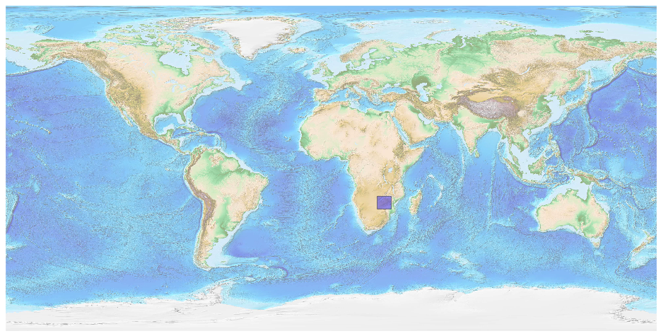

|Eigenschaft|Wert|
|-|-:|
Dateiname|[zimbabwe.sqlite](zimbabwe.sqlite)|
Zeitstempel|09.09.2019 19:29|
Dateigr&ouml;&szlig;e|960.00 Kb|
|||
Gesamtanzahl Nodes|20276|
|MinLat|-22.447246|
|MaxLat|-15.587067|
|MinLon|25.222896|
|MaxLon|33.0854149|

### Top 5 Tags

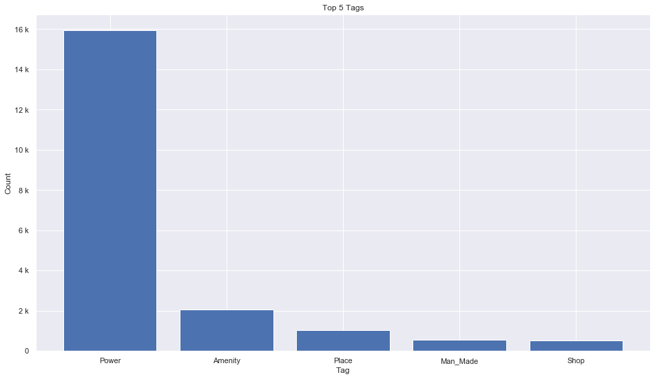

|Tag|Count|
|-|-:|
|Power|15936|
|Amenity|2060|
|Place|1022|
|Man_Made|548|
|Shop|534|

### &Uuml;bersicht Ortsangaben

|Place|Count|
|-|-:|
|Village|335|
|Isolated_Dwelling|229|
|Hamlet|161|
|Town|97|
|City|8|

### Die 5 gr&ouml;&szlig;ten bewohnte Gebiete

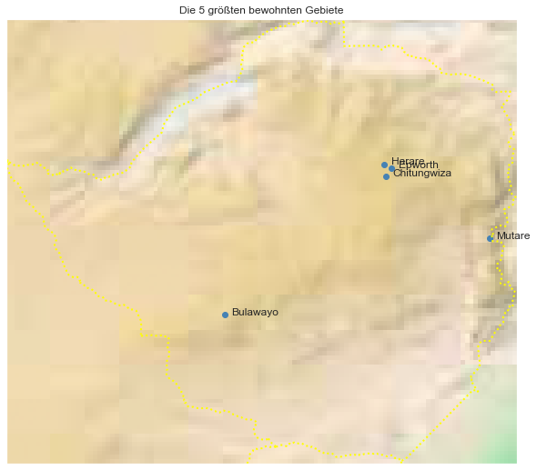

|Name|Lat|Lon|Type|Population|
|----|--:|--:|:--:|---------:|
|Harare|-17.831773|31.045686|City|1606000|
|Bulawayo|-20.1560599|28.5887063|City|653337|
|Chitungwiza|-18.0143462|31.0726737|City|321782|
|Mutare|-18.974656|32.670473|City|188243|
|Epworth|-17.8877361|31.156797|Town|152116|

---

**Some Useful Links:**

- [OpenStreetMap Data Extracts](http://download.geofabrik.de)
- [OpenStreetMap Map Features](https://wiki.openstreetmap.org/wiki/DE:Map_Features)
