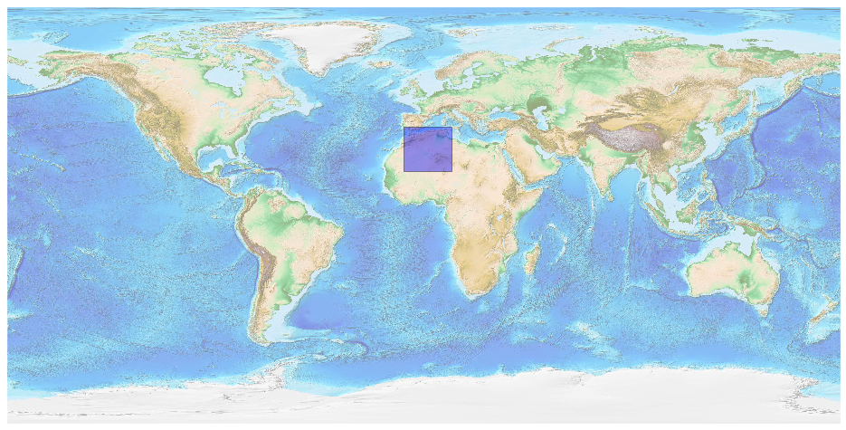
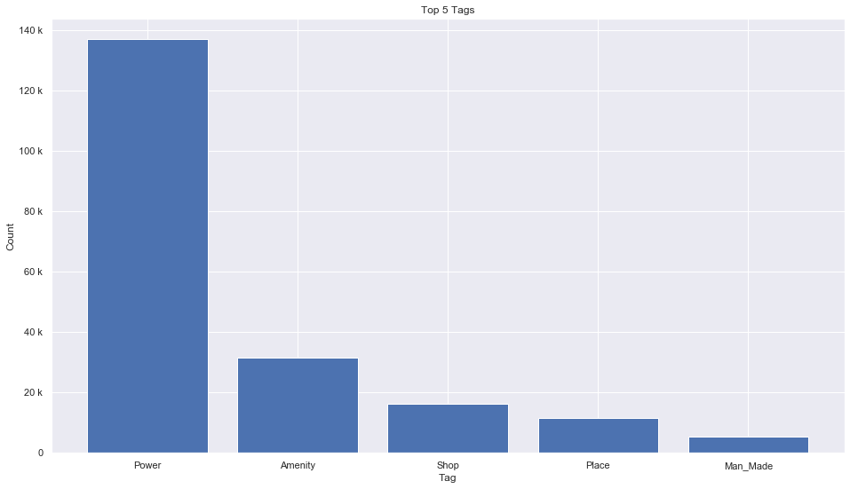
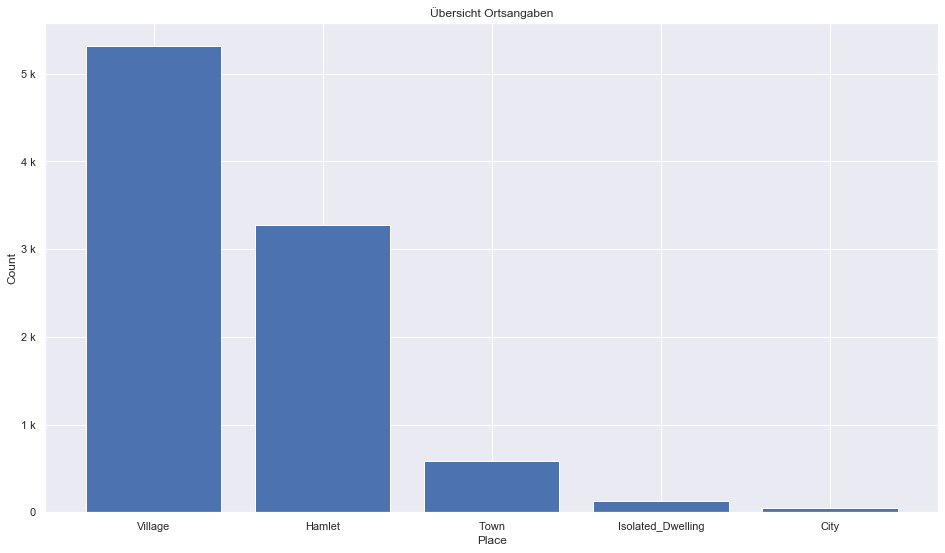
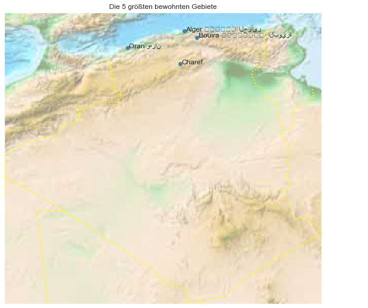

## Algeria [&#10159;](algeria.sqlite)

### Allgemeine Informationen

|Eigenschaft|Wert|
|-|-:|
Dateiname|[algeria.sqlite](algeria.sqlite)|
Zeitstempel|09.09.2019 18:33|
Dateigr&ouml;&szlig;e|9.68 Mb|
|||
Gesamtanzahl Nodes|203945|
|MinLat|18.928737|
|MaxLat|38.018304|
|MinLon|-8.704895|
|MaxLon|12.035975|

### Top 5 Tags

|Tag|Count|
|-|-:|
|Power|136986|
|Amenity|31621|
|Shop|16301|
|Place|11549|
|Man_Made|5405|

### &Uuml;bersicht Ortsangaben

|Place|Count|
|-|-:|
|Village|5313|
|Hamlet|3275|
|Town|587|
|Isolated_Dwelling|123|
|City|52|

### Die 5 gr&ouml;&szlig;ten bewohnte Gebiete

|Name|Lat|Lon|Type|Population|
|----|--:|--:|:--:|---------:|
|Alger ⴷⵣⴰⵢⴻⵔ الجزائر|36.7753606|3.0601882|City|3415811|
|طرابلس|32.896672|13.1777923|City|2127000|
|Oran وهران|35.7032751|-0.6492976|City|852576|
|Bouira ⵝⵓⵠⵉⵔⴻⵙⵜ  البويرة|36.3739012|3.9007007|Town|695585|
|Charef|34.6270918|2.8059171|Town|600000|
