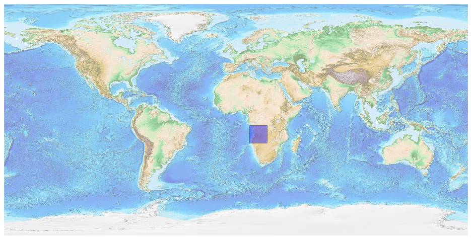
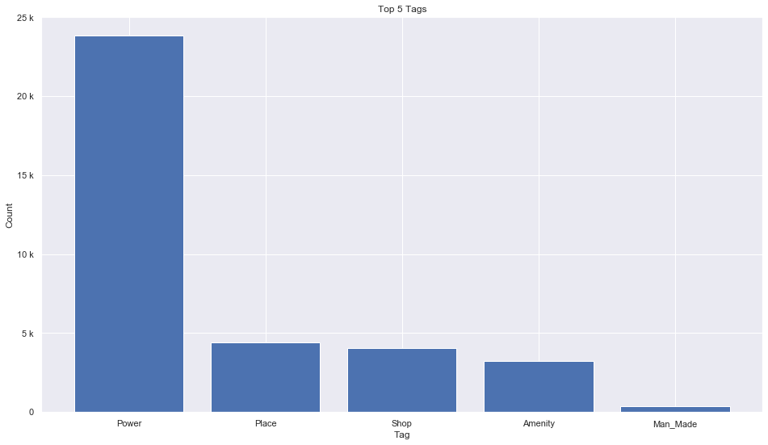
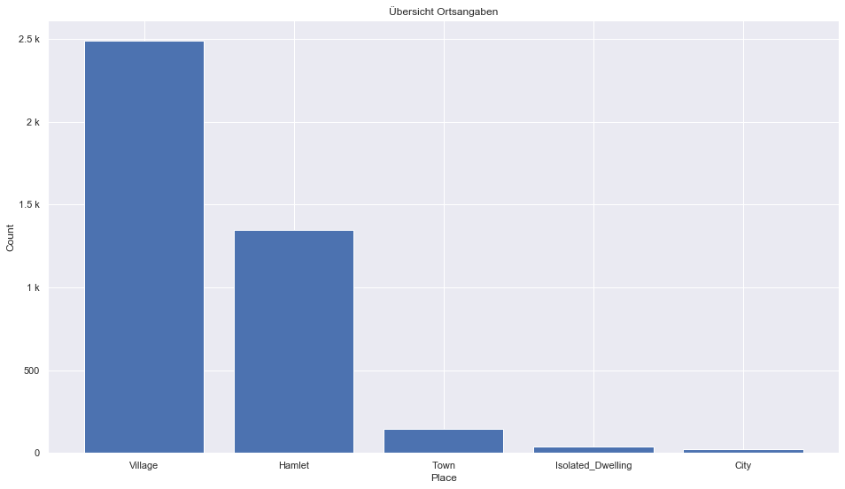
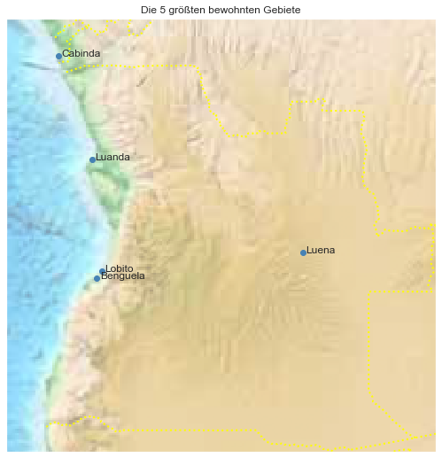

## Angola [&#10159;](angola.sqlite)

### Allgemeine Informationen

|Eigenschaft|Wert|
|-|-:|
Dateiname|[angola.sqlite](angola.sqlite)|
Zeitstempel|09.09.2019 18:29|
Dateigr&ouml;&szlig;e|1.71 Mb|
|||
Gesamtanzahl Nodes|36213|
|MinLat|-18.065085|
|MaxLat|-4.356853|
|MinLon|10.53848|
|MaxLon|24.12712|

### Top 5 Tags

|Tag|Count|
|-|-:|
|Power|23830|
|Place|4418|
|Shop|4075|
|Amenity|3241|
|Man_Made|366|

### &Uuml;bersicht Ortsangaben

|Place|Count|
|-|-:|
|Village|2488|
|Hamlet|1349|
|Town|144|
|Isolated_Dwelling|41|
|City|21|

### Die 5 gr&ouml;&szlig;ten bewohnte Gebiete

|Name|Lat|Lon|Type|Population|
|----|--:|--:|:--:|---------:|
|Luanda|-8.8272699|13.2439512|City|5172900|
|Lobito|-12.3506867|13.5464318|City|805000|
|Benguela|-12.5790048|13.4037117|City|513000|
|Luena|-11.7790355|19.9122676|City|456000|
|Cabinda|-5.5576435|12.1919468|City|377931|
