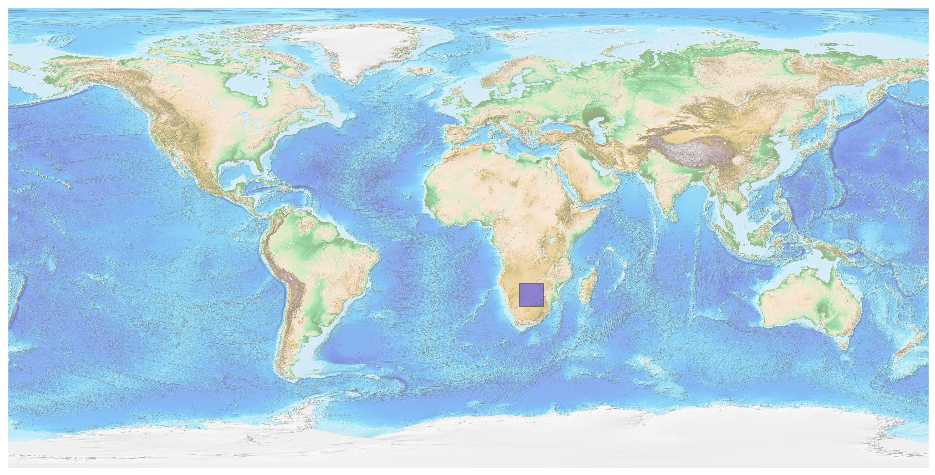
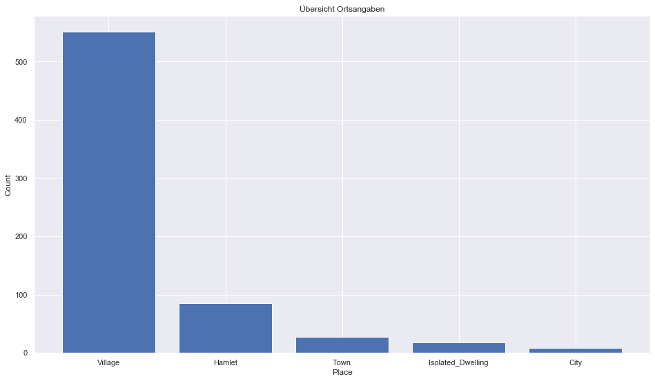
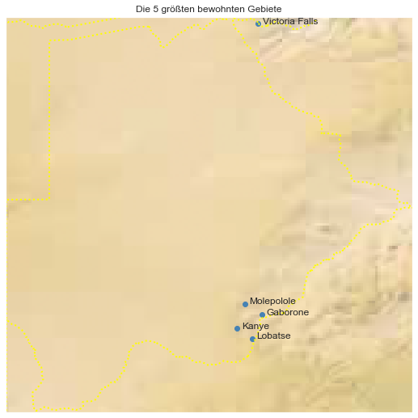

## Botswana [&#10159;](botswana.sqlite)

### Allgemeine Informationen

|Eigenschaft|Wert|
|-|-:|
Dateiname|[botswana.sqlite](botswana.sqlite)|
Zeitstempel|09.09.2019 18:31|
Dateigr&ouml;&szlig;e|720.00 Kb|
|||
Gesamtanzahl Nodes|14971|
|MinLat|-26.91539|
|MaxLat|-17.76871|
|MinLon|19.98745|
|MaxLon|29.38549|

### Top 5 Tags

|Tag|Count|
|-|-:|
|Power|11624|
|Amenity|1479|
|Place|752|
|Shop|733|
|Man_Made|217|

### &Uuml;bersicht Ortsangaben

|Place|Count|
|-|-:|
|Village|551|
|Hamlet|86|
|Town|28|
|Isolated_Dwelling|18|
|City|8|

### Die 5 gr&ouml;&szlig;ten bewohnte Gebiete

|Name|Lat|Lon|Type|Population|
|----|--:|--:|:--:|---------:|
|Gaborone|-24.6581357|25.9088474|City|231626|
|Molepolole|-24.4058025|25.5151645|Town|67598|
|Kanye|-24.9766112|25.3358859|City|45196|
|Victoria Falls|-17.9349458|25.8252767|Town|33060|
|Lobatse|-25.2100604|25.6819594|Town|29700|
