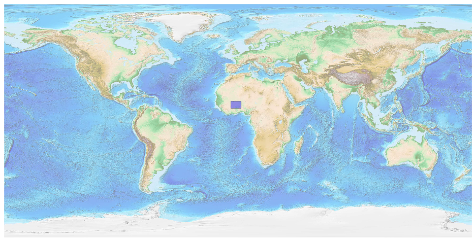
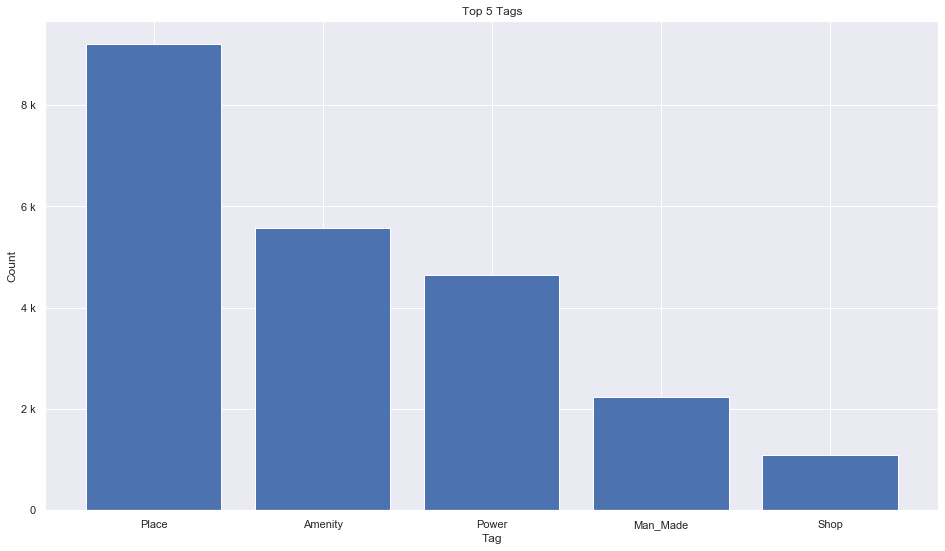
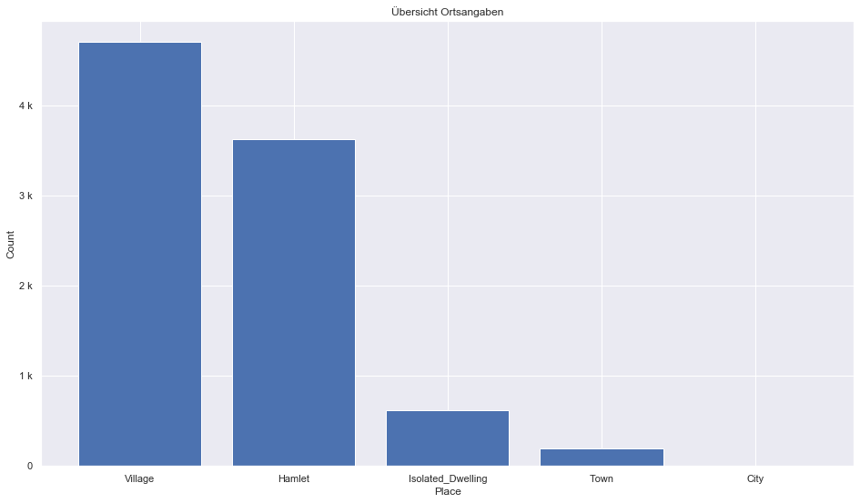
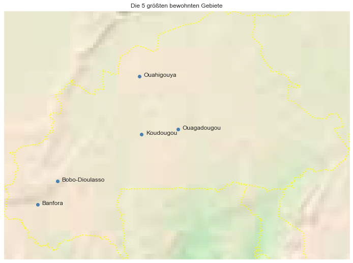

## Burkina Faso [&#10159;](burkina-faso.sqlite)

### Allgemeine Informationen

|Eigenschaft|Wert|
|-|-:|
Dateiname|[burkina-faso.sqlite](burkina-faso.sqlite)|
Zeitstempel|09.09.2019 18:32|
Dateigr&ouml;&szlig;e|1.15 Mb|
|||
Gesamtanzahl Nodes|22981|
|MinLat|9.384107|
|MaxLat|15.09271|
|MinLon|-5.527409|
|MaxLon|2.412483|

### Top 5 Tags

|Tag|Count|
|-|-:|
|Place|9202|
|Amenity|5579|
|Power|4655|
|Man_Made|2241|
|Shop|1101|

### &Uuml;bersicht Ortsangaben

|Place|Count|
|-|-:|
|Village|4704|
|Hamlet|3627|
|Isolated_Dwelling|621|
|Town|191|
|City|3|

### Die 5 gr&ouml;&szlig;ten bewohnte Gebiete

|Name|Lat|Lon|Type|Population|
|----|--:|--:|:--:|---------:|
|Ouagadougou|12.368148|-1.527085|City|1915102|
|Bobo-Dioulasso|11.1757783|-4.2957591|City|724971|
|Koudougou|12.2503992|-2.3657338|Town|91981|
|Banfora|10.642703|-4.752639|City|75917|
|Ouahigouya|13.580982|-2.417699|Town|73153|
