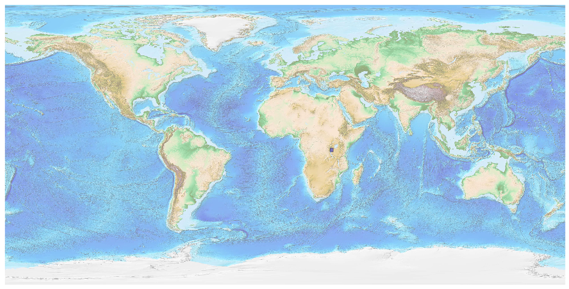
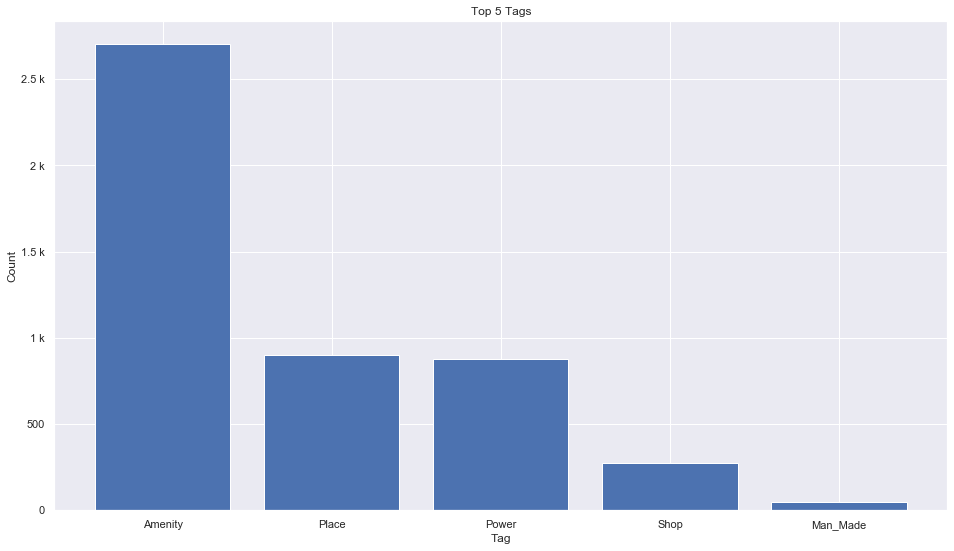
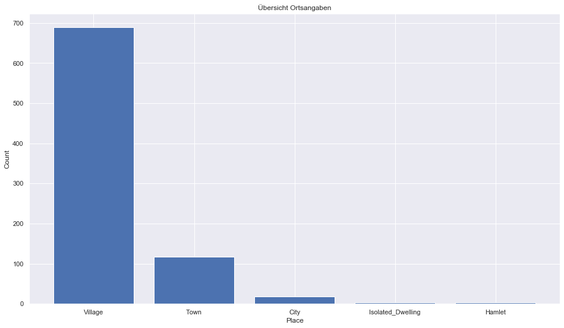
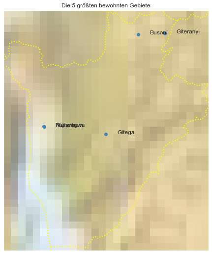

## Burundi [&#10159;](burundi.sqlite)

### Allgemeine Informationen

|Eigenschaft|Wert|
|-|-:|
Dateiname|[burundi.sqlite](burundi.sqlite)|
Zeitstempel|09.09.2019 18:32|
Dateigr&ouml;&szlig;e|280.00 Kb|
|||
Gesamtanzahl Nodes|4842|
|MinLat|-4.481328|
|MaxLat|-2.307893|
|MinLon|29.000181|
|MaxLon|30.851147|

### Top 5 Tags

|Tag|Count|
|-|-:|
|Amenity|2702|
|Place|903|
|Power|880|
|Shop|274|
|Man_Made|46|

### &Uuml;bersicht Ortsangaben

|Place|Count|
|-|-:|
|Village|689|
|Town|117|
|City|18|
|Isolated_Dwelling|4|
|Hamlet|3|

### Die 5 gr&ouml;&szlig;ten bewohnte Gebiete

|Name|Lat|Lon|Type|Population|
|----|--:|--:|:--:|---------:|
|Bujumbura|-3.3638125|29.3675028|City|658859|
|Ntahangwa|-3.3590416|29.3656716|Town|248915|
|Gitega|-3.4284953|29.9249718|City|155005|
|Giteranyi|-2.5172828|30.458614|Town|151230|
|Busoni|-2.5261969|30.2170754|Town|145424|
