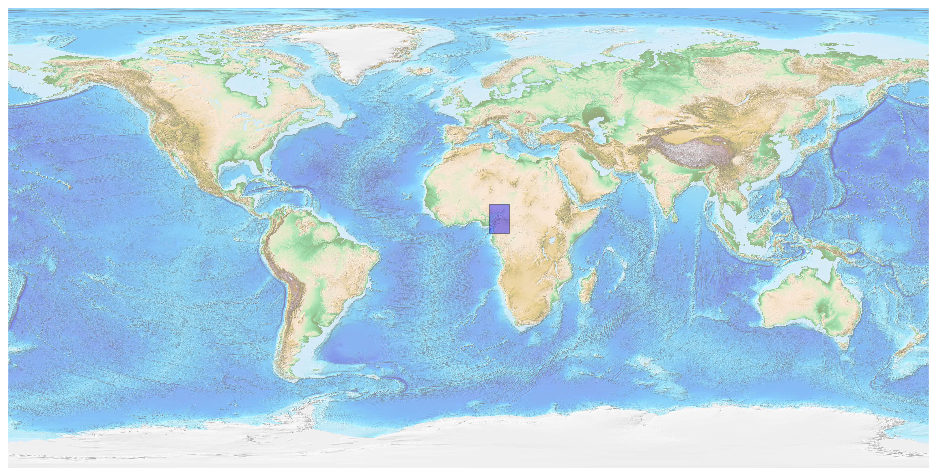
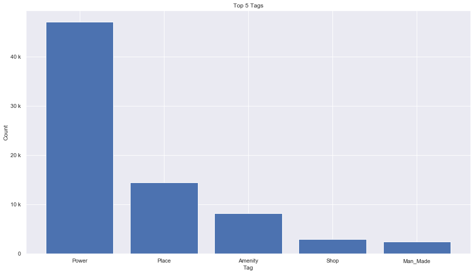
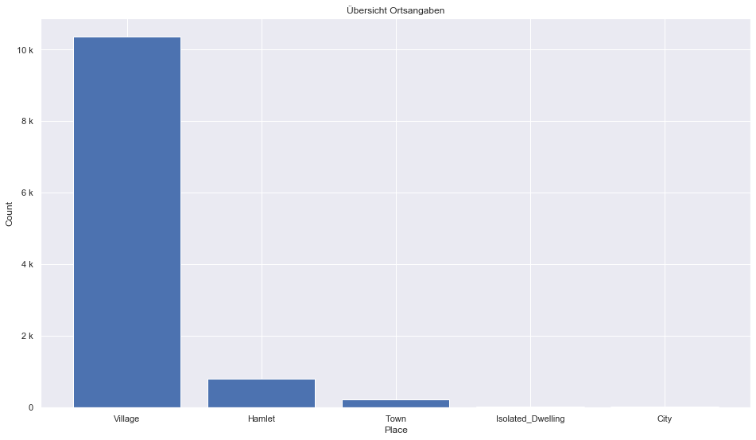
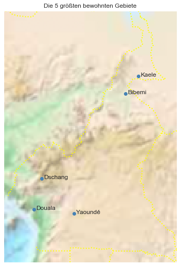

## Cameroon [&#10159;](cameroon.sqlite)

### Allgemeine Informationen

|Eigenschaft|Wert|
|-|-:|
Dateiname|[cameroon.sqlite](cameroon.sqlite)|
Zeitstempel|09.09.2019 18:36|
Dateigr&ouml;&szlig;e|3.57 Mb|
|||
Gesamtanzahl Nodes|75589|
|MinLat|1.648733|
|MaxLat|13.09278|
|MinLon|8.33|
|MaxLon|16.20305|

### Top 5 Tags

|Tag|Count|
|-|-:|
|Power|46988|
|Place|14420|
|Amenity|8231|
|Shop|2927|
|Man_Made|2442|

### &Uuml;bersicht Ortsangaben

|Place|Count|
|-|-:|
|Village|10358|
|Hamlet|810|
|Town|238|
|Isolated_Dwelling|30|
|City|25|

### Die 5 gr&ouml;&szlig;ten bewohnte Gebiete

|Name|Lat|Lon|Type|Population|
|----|--:|--:|:--:|---------:|
|Douala|4.0429408|9.706203|City|2000000|
|Yaoundé|3.8689867|11.5213344|City|1817524|
|Dschang|5.4469923|10.053309|Town|200000|
|Kaele|10.1095738|14.446062|City|141431|
|Bibemi|9.312913|13.870952|Town|133191|
