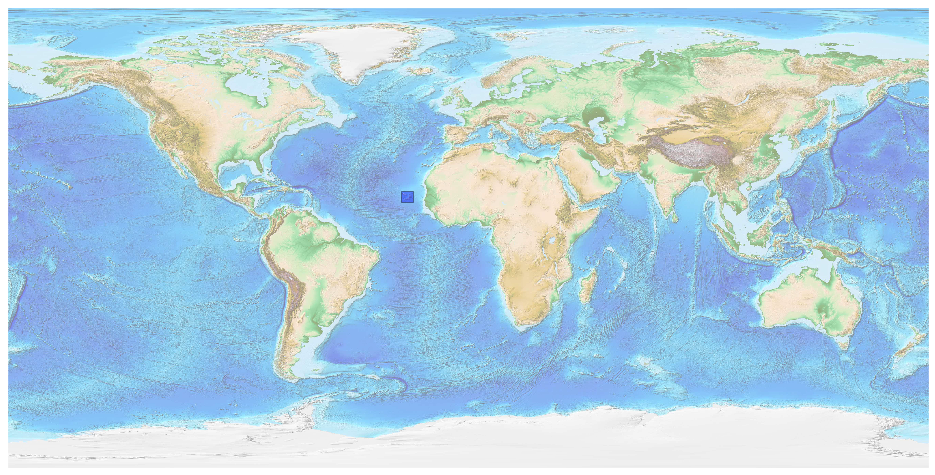
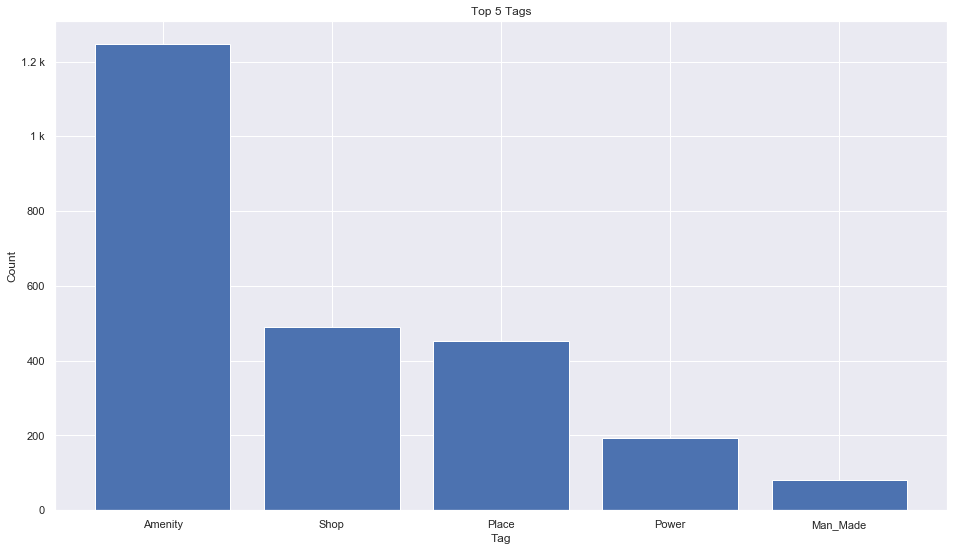
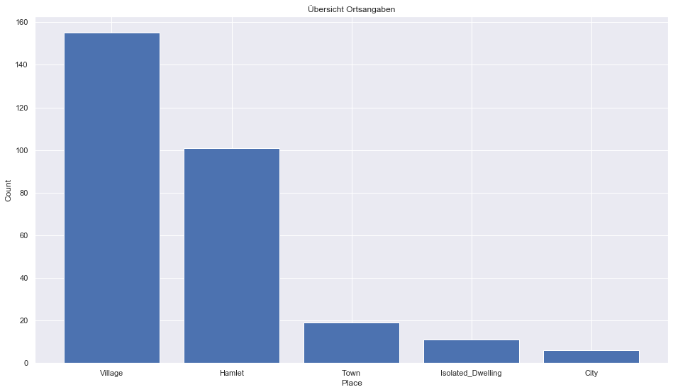
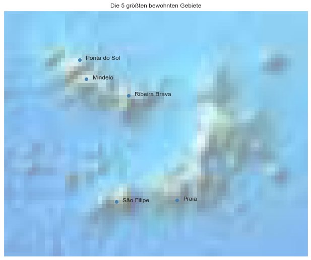

## Cape Verde [&#10159;](cape-verde.sqlite)

### Allgemeine Informationen

|Eigenschaft|Wert|
|-|-:|
Dateiname|[cape-verde.sqlite](cape-verde.sqlite)|
Zeitstempel|09.09.2019 18:35|
Dateigr&ouml;&szlig;e|152.00 Kb|
|||
Gesamtanzahl Nodes|2568|
|MinLat|14.004855|
|MaxLat|18.004998|
|MinLon|-26.323786|
|MaxLon|-21.390957|

### Top 5 Tags

|Tag|Count|
|-|-:|
|Amenity|1246|
|Shop|490|
|Place|453|
|Power|194|
|Man_Made|80|

### &Uuml;bersicht Ortsangaben

|Place|Count|
|-|-:|
|Village|155|
|Hamlet|101|
|Town|19|
|Isolated_Dwelling|11|
|City|6|

### Die 5 gr&ouml;&szlig;ten bewohnte Gebiete

|Name|Lat|Lon|Type|Population|
|----|--:|--:|:--:|---------:|
|Praia|14.9160169|-23.5096132|City|127832|
|São Filipe|14.8952963|-24.4969361|City|94000|
|Mindelo|16.8874145|-24.9863842|City|70000|
|Ribeira Brava|16.6156821|-24.298231|City|5550|
|Ponta do Sol|17.2020504|-25.0922664|Town|4575|
