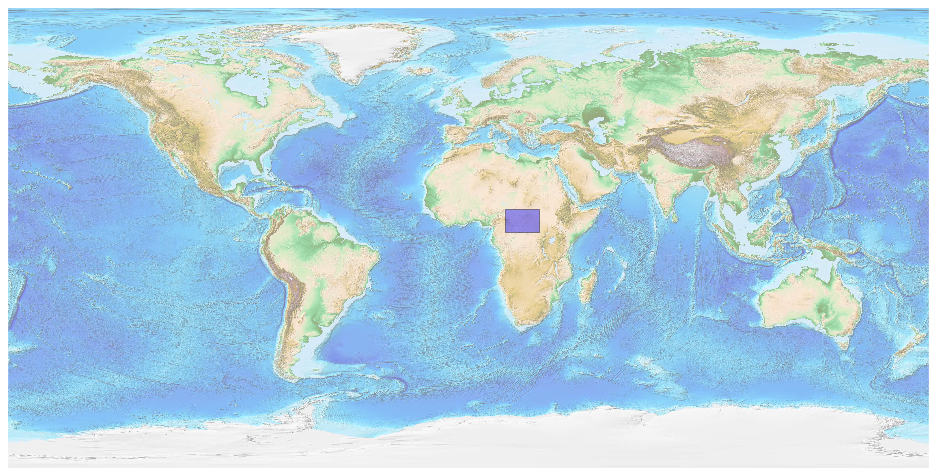

## Central African Republic [&#10159;](central-african-republic.sqlite)

### Allgemeine Informationen

|Eigenschaft|Wert|
|-|-:|
Dateiname|[central-african-republic.sqlite](central-african-republic.sqlite)|
Zeitstempel|09.09.2019 18:36|
Dateigr&ouml;&szlig;e|588.00 Kb|
|||
Gesamtanzahl Nodes|11084|
|MinLat|2.127879|
|MaxLat|11.032637|
|MinLon|14.389621|
|MaxLon|27.549417|

### Top 5 Tags

|Tag|Count|
|-|-:|
|Place|6826|
|Man_Made|1975|
|Amenity|1888|
|Power|325|
|Aeroway|38|

### &Uuml;bersicht Ortsangaben

|Place|Count|
|-|-:|
|Village|4223|
|Hamlet|2156|
|Town|141|
|Isolated_Dwelling|122|
|City|21|

### Die 5 gr&ouml;&szlig;ten bewohnte Gebiete

|Name|Lat|Lon|Type|Population|
|----|--:|--:|:--:|---------:|
|Bangî - Bangui|4.3907153|18.5509126|City|734350|
|Bimbo|4.3325548|18.5250512|City|124176|
|Berbérati|4.2593379|15.7877826|City|76918|
|Bocaranga|6.995897|15.638835|City|61000|
|Carnot|4.9421173|15.8690967|Town|45421|
