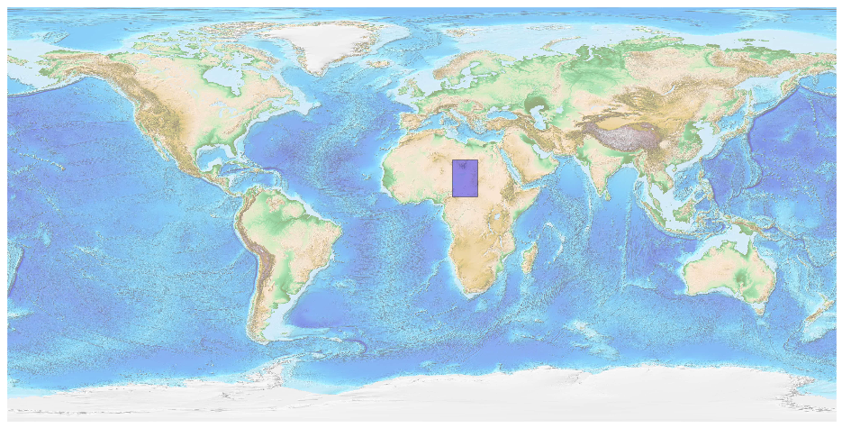
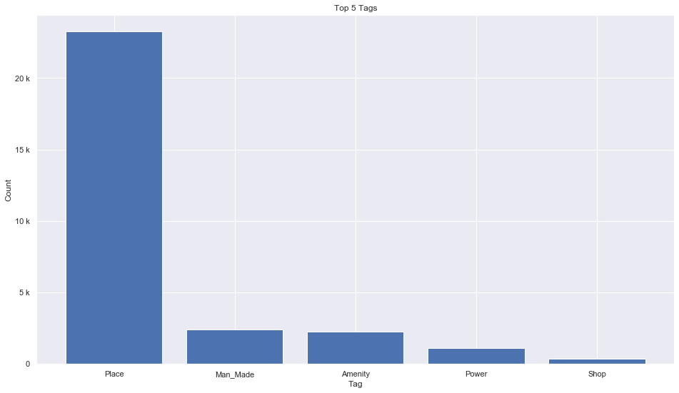
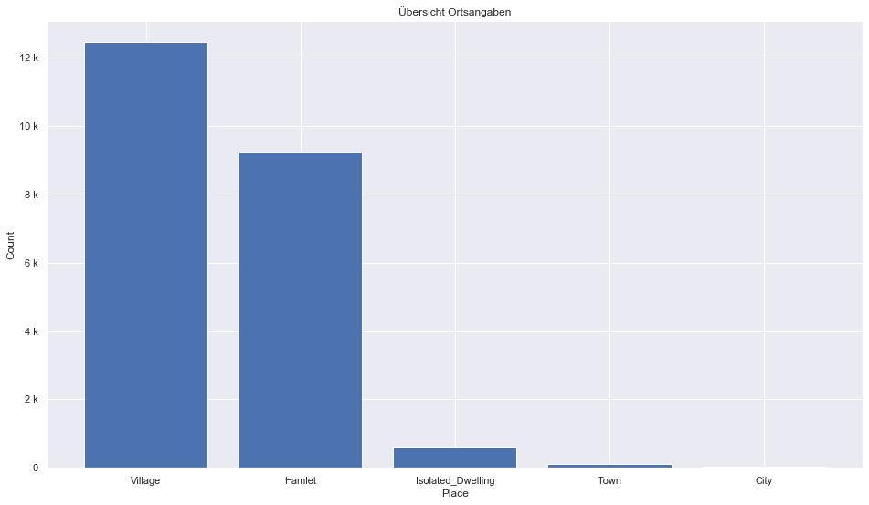
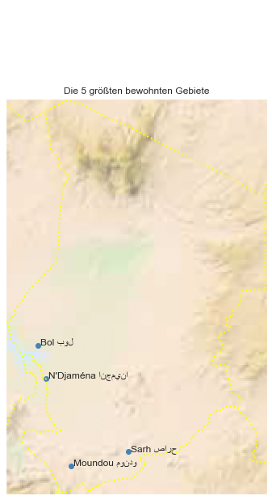

## Chad [&#10159;](chad.sqlite)

### Allgemeine Informationen

|Eigenschaft|Wert|
|-|-:|
Dateiname|[chad.sqlite](chad.sqlite)|
Zeitstempel|09.09.2019 18:38|
Dateigr&ouml;&szlig;e|1.55 Mb|
|||
Gesamtanzahl Nodes|29502|
|MinLat|7.404683|
|MaxLat|23.537926|
|MinLon|13.40129|
|MaxLon|24.0654|

### Top 5 Tags

|Tag|Count|
|-|-:|
|Place|23253|
|Man_Made|2397|
|Amenity|2274|
|Power|1133|
|Shop|372|

### &Uuml;bersicht Ortsangaben

|Place|Count|
|-|-:|
|Village|12446|
|Hamlet|9247|
|Isolated_Dwelling|590|
|Town|103|
|City|31|

### Die 5 gr&ouml;&szlig;ten bewohnte Gebiete

|Name|Lat|Lon|Type|Population|
|----|--:|--:|:--:|---------:|
|N'Djaména انجمينا|12.1191543|15.0502758|City|1092066|
|سبها‎|27.0331541|14.4316929|City|138231|
|Moundou موندو|8.5654637|16.073831|City|137929|
|Sarh صارح|9.1406471|18.3937969|City|113000|
|Bol بول|13.4676491|14.714412|City|112490|
