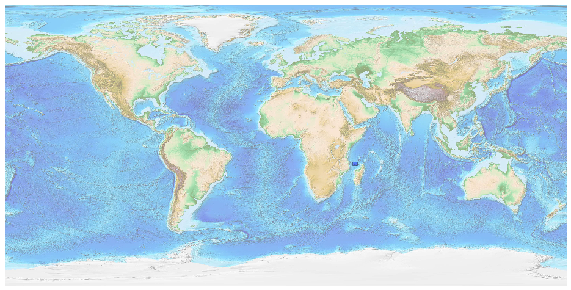
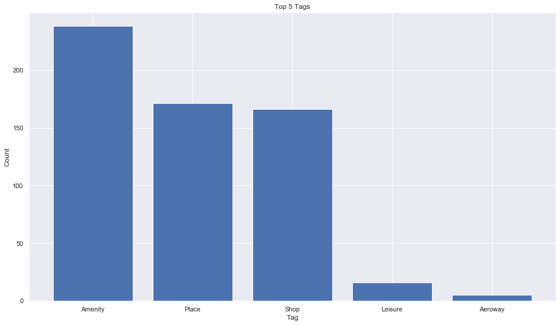
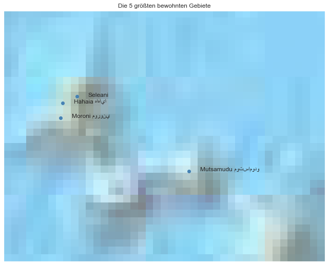

## Comores [&#10159;](comores.sqlite)

### Allgemeine Informationen

|Eigenschaft|Wert|
|-|-:|
Dateiname|[comores.sqlite](comores.sqlite)|
Zeitstempel|09.09.2019 18:36|
Dateigr&ouml;&szlig;e|48.00 Kb|
|||
Gesamtanzahl Nodes|603|
|MinLat|-12.968996|
|MaxLat|-10.741812|
|MinLon|42.749809|
|MaxLon|45.596611|

### Top 5 Tags

|Tag|Count|
|-|-:|
|Amenity|238|
|Place|171|
|Shop|166|
|Leisure|16|
|Aeroway|5|

### &Uuml;bersicht Ortsangaben

|Place|Count|
|-|-:|
|Village|118|
|Town|21|
|City|2|
|Hamlet|2|

### Die 5 gr&ouml;&szlig;ten bewohnte Gebiete

|Name|Lat|Lon|Type|Population|
|----|--:|--:|:--:|---------:|
|Moroni موروني|-11.6931255|43.2543044|City|111329|
|Mutsamudu موتسامودو|-12.168846|44.3942831|City|30000|
|Seleani|-11.5035445|43.3984576|Village|8000|
|Hahaia هاهايا|-11.5644457|43.2713158|Town|2638|
