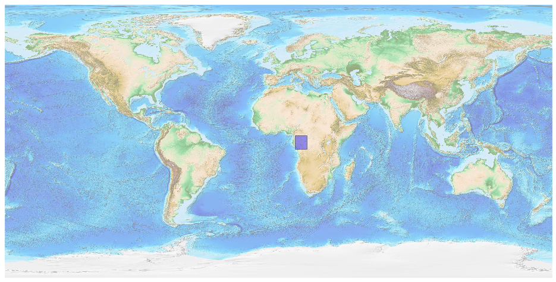
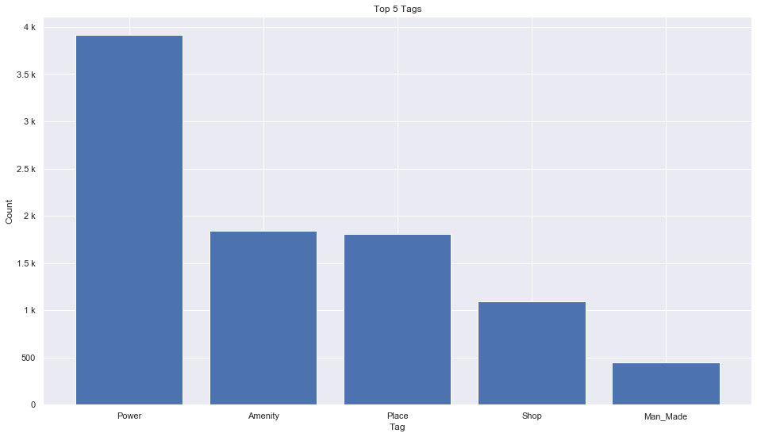
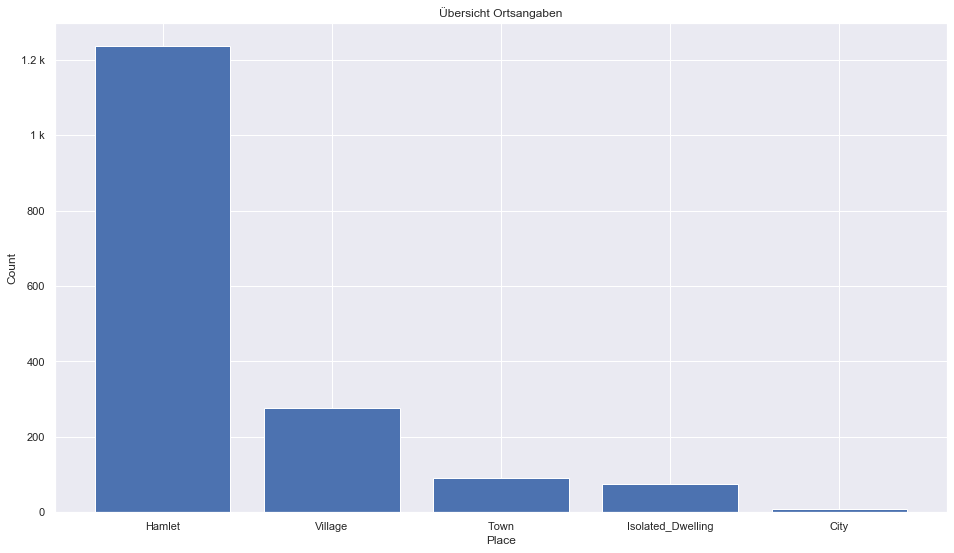
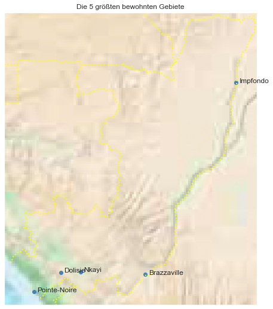

## Congo Brazzaville [&#10159;](congo-brazzaville.sqlite)

### Allgemeine Informationen

|Eigenschaft|Wert|
|-|-:|
Dateiname|[congo-brazzaville.sqlite](congo-brazzaville.sqlite)|
Zeitstempel|09.09.2019 18:37|
Dateigr&ouml;&szlig;e|480.00 Kb|
|||
Gesamtanzahl Nodes|9208|
|MinLat|-5.195885|
|MaxLat|3.775194|
|MinLon|10.944174|
|MaxLon|18.701642|

### Top 5 Tags

|Tag|Count|
|-|-:|
|Power|3913|
|Amenity|1840|
|Place|1811|
|Shop|1093|
|Man_Made|449|

### &Uuml;bersicht Ortsangaben

|Place|Count|
|-|-:|
|Hamlet|1236|
|Village|276|
|Town|90|
|Isolated_Dwelling|74|
|City|9|

### Die 5 gr&ouml;&szlig;ten bewohnte Gebiete

|Name|Lat|Lon|Type|Population|
|----|--:|--:|:--:|---------:|
|Pointe-Noire|-4.7975373|11.8503297|City|1100000|
|Brazzaville|-4.2694407|15.2712256|City|1018541|
|Dolisie|-4.2005398|12.6791573|City|80000|
|Nkayi|-4.1840962|13.2883675|Town|71620|
|Impfondo|1.6187416|18.0623499|City|40000|
