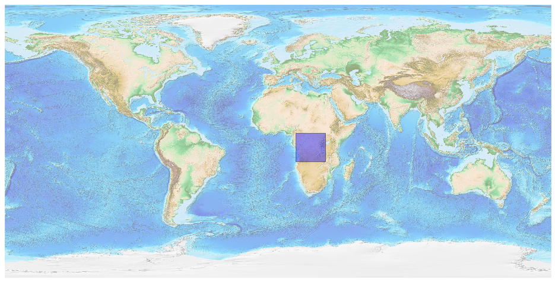
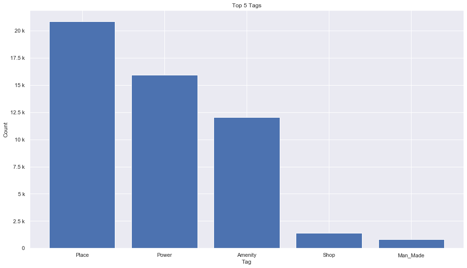
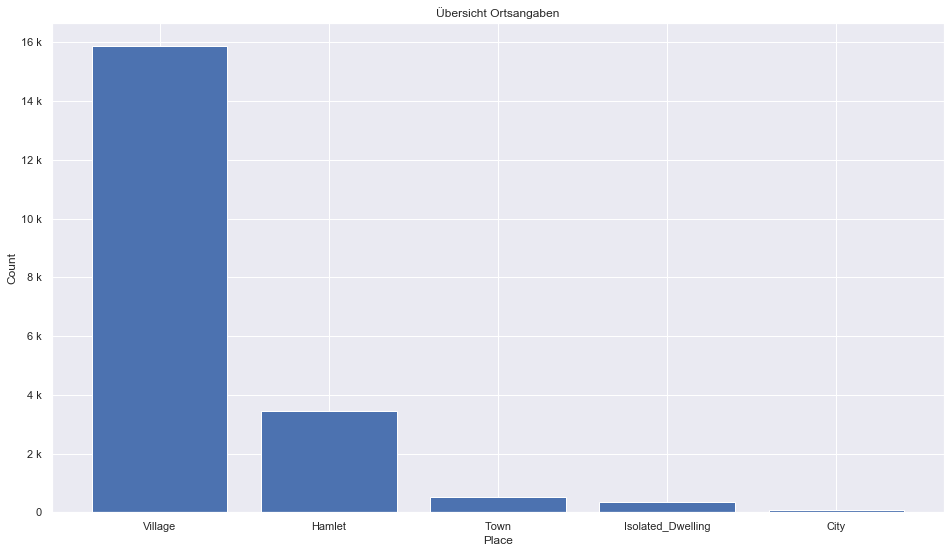
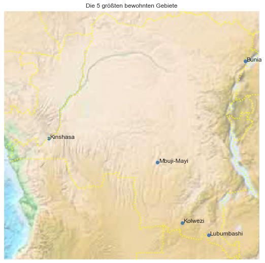

## Congo Democratic Republic [&#10159;](congo-democratic-republic.sqlite)

### Allgemeine Informationen

|Eigenschaft|Wert|
|-|-:|
Dateiname|[congo-democratic-republic.sqlite](congo-democratic-republic.sqlite)|
Zeitstempel|09.09.2019 18:42|
Dateigr&ouml;&szlig;e|2.59 Mb|
|||
Gesamtanzahl Nodes|51751|
|MinLat|-13.5006|
|MaxLat|5.401396|
|MinLon|11.883432|
|MaxLon|31.335694|

### Top 5 Tags

|Tag|Count|
|-|-:|
|Place|20841|
|Power|15913|
|Amenity|12054|
|Shop|1413|
|Man_Made|812|

### &Uuml;bersicht Ortsangaben

|Place|Count|
|-|-:|
|Village|15862|
|Hamlet|3440|
|Town|523|
|Isolated_Dwelling|351|
|City|60|

### Die 5 gr&ouml;&szlig;ten bewohnte Gebiete

|Name|Lat|Lon|Type|Population|
|----|--:|--:|:--:|---------:|
|Kinshasa|-4.3217055|15.3125974|City|9046000|
|Mbuji-Mayi|-6.1258942|23.5998111|City|1680991|
|Lubumbashi|-11.6642316|27.4826264|City|1139064|
|Kolwezi|-10.7169952|25.4669918|City|453147|
|Bunia|1.5620529|30.2478844|City|366126|
