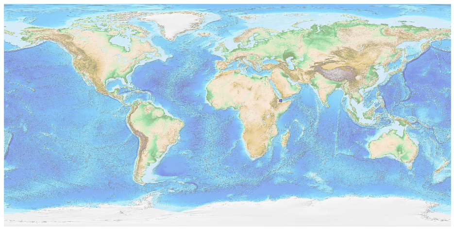
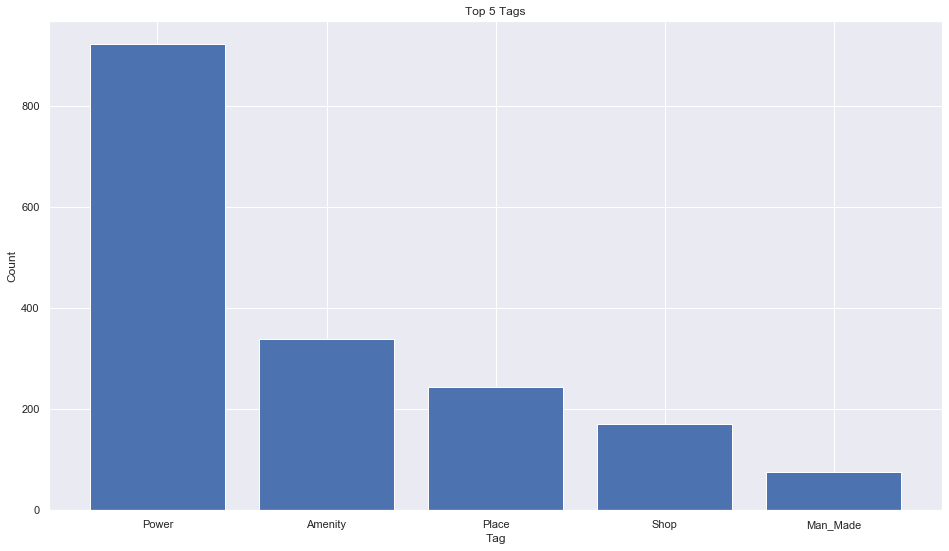
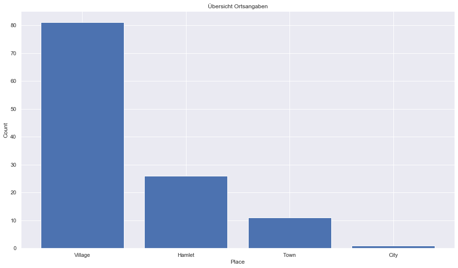
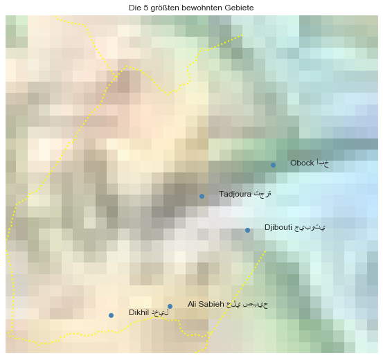

## Djibouti [&#10159;](djibouti.sqlite)

### Allgemeine Informationen

|Eigenschaft|Wert|
|-|-:|
Dateiname|[djibouti.sqlite](djibouti.sqlite)|
Zeitstempel|09.09.2019 18:38|
Dateigr&ouml;&szlig;e|108.00 Kb|
|||
Gesamtanzahl Nodes|1790|
|MinLat|10.888238|
|MaxLat|12.826145|
|MinLon|41.761773|
|MaxLon|43.896251|

### Top 5 Tags

|Tag|Count|
|-|-:|
|Power|921|
|Amenity|338|
|Place|243|
|Shop|171|
|Man_Made|76|

### &Uuml;bersicht Ortsangaben

|Place|Count|
|-|-:|
|Village|81|
|Hamlet|26|
|Town|11|
|City|1|

### Die 5 gr&ouml;&szlig;ten bewohnte Gebiete

|Name|Lat|Lon|Type|Population|
|----|--:|--:|:--:|---------:|
|Djibouti جيبوتي|11.5936903|43.1472724|City|475332|
|Ali Sabieh علي صبيح|11.1560462|42.7045067|Town|71230|
|Dikhil دخيل|11.1071149|42.3687433|Town|35000|
|Tadjoura تجرة|11.7851745|42.8846919|Town|25000|
|Obock أبخ|11.9640149|43.292228|Town|8500|
