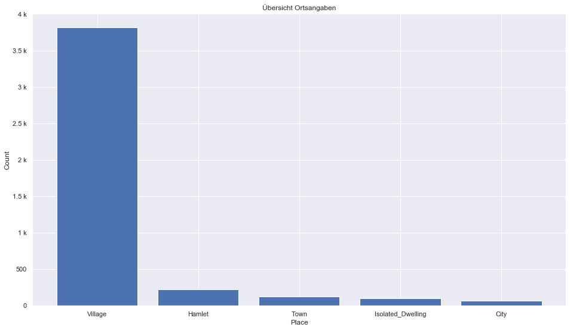
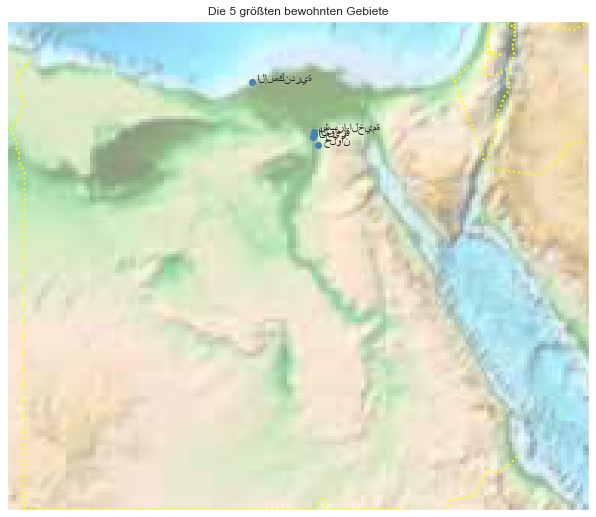

## Egypt [&#10159;](egypt.sqlite)

### Allgemeine Informationen

|Eigenschaft|Wert|
|-|-:|
Dateiname|[egypt.sqlite](egypt.sqlite)|
Zeitstempel|09.09.2019 18:42|
Dateigr&ouml;&szlig;e|5.37 Mb|
|||
Gesamtanzahl Nodes|108696|
|MinLat|21.983803|
|MaxLat|32.52518|
|MinLon|24.626276|
|MaxLon|37.162628|

### Top 5 Tags

|Tag|Count|
|-|-:|
|Power|85684|
|Place|8452|
|Amenity|7456|
|Shop|2593|
|Man_Made|2502|

### &Uuml;bersicht Ortsangaben

|Place|Count|
|-|-:|
|Village|3813|
|Hamlet|226|
|Town|128|
|Isolated_Dwelling|104|
|City|70|

### Die 5 gr&ouml;&szlig;ten bewohnte Gebiete

|Name|Lat|Lon|Type|Population|
|----|--:|--:|:--:|---------:|
|القاهرة|30.048819|31.243666|City|9120350|
|الإسكندرية|31.199004|29.894378|City|4546231|
|الجيزة|30.0170059|31.2134513|City|2681863|
|شبرا الخيمة|30.128611|31.242222|City|1016722|
|حلوان|29.8500001|31.333333|Town|643327|
