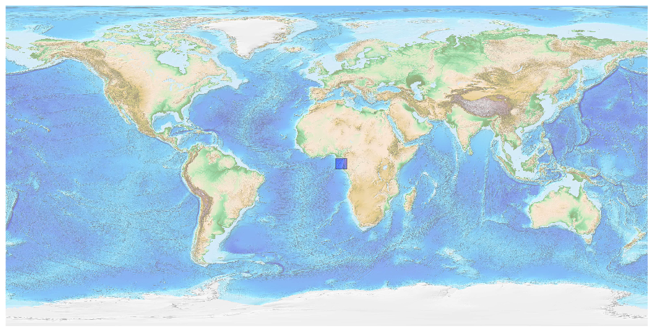
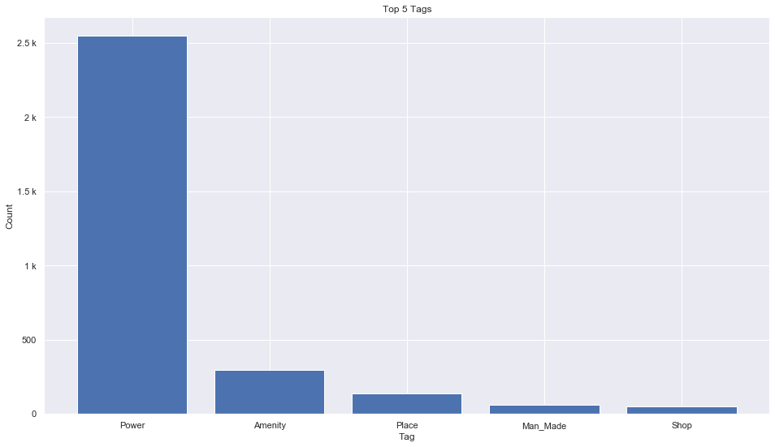
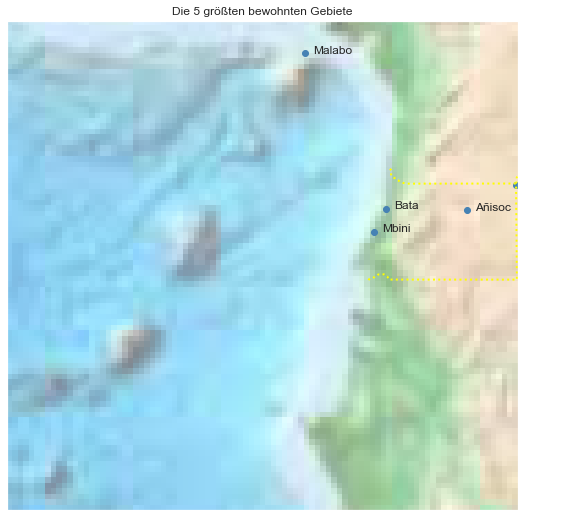

## Equatorial Guinea [&#10159;](equatorial-guinea.sqlite)

### Allgemeine Informationen

|Eigenschaft|Wert|
|-|-:|
Dateiname|[equatorial-guinea.sqlite](equatorial-guinea.sqlite)|
Zeitstempel|09.09.2019 18:42|
Dateigr&ouml;&szlig;e|160.00 Kb|
|||
Gesamtanzahl Nodes|3118|
|MinLat|-1.792669|
|MaxLat|4.147134|
|MinLon|5.165631|
|MaxLon|11.361901|

### Top 5 Tags

|Tag|Count|
|-|-:|
|Power|2547|
|Amenity|297|
|Place|136|
|Man_Made|64|
|Shop|52|

### &Uuml;bersicht Ortsangaben

|Place|Count|
|-|-:|
|Village|77|
|Town|17|
|Hamlet|11|
|City|4|

### Die 5 gr&ouml;&szlig;ten bewohnte Gebiete

|Name|Lat|Lon|Type|Population|
|----|--:|--:|:--:|---------:|
|Bata|1.8650897|9.768665|City|230282|
|Malabo|3.752828|8.780061|City|187302|
|Ebebiyín|2.1537363|11.3370815|City|36565|
|Añisoc|1.844383|10.747593|Town|16626|
|Mbini|1.58369|9.616028|Town|14034|
