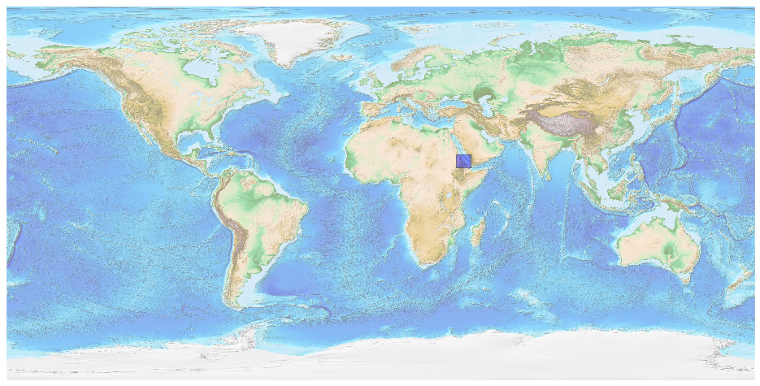
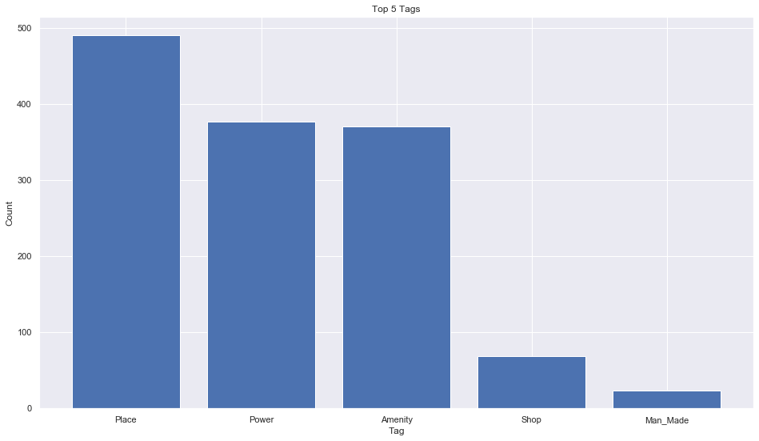
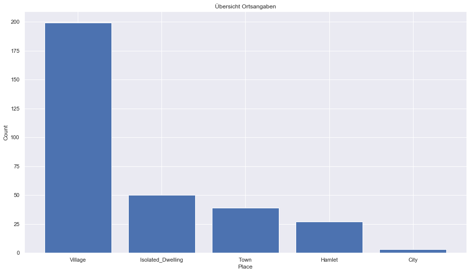
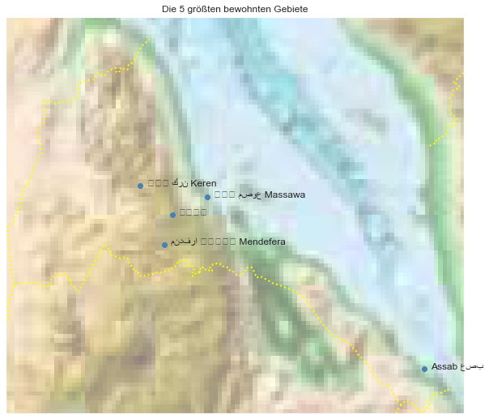

## Eritrea [&#10159;](eritrea.sqlite)

### Allgemeine Informationen

|Eigenschaft|Wert|
|-|-:|
Dateiname|[eritrea.sqlite](eritrea.sqlite)|
Zeitstempel|09.09.2019 18:42|
Dateigr&ouml;&szlig;e|92.00 Kb|
|||
Gesamtanzahl Nodes|1346|
|MinLat|12.343852|
|MaxLat|18.329616|
|MinLon|36.420705|
|MaxLon|43.346016|

### Top 5 Tags

|Tag|Count|
|-|-:|
|Place|490|
|Power|377|
|Amenity|370|
|Shop|69|
|Man_Made|23|

### &Uuml;bersicht Ortsangaben

|Place|Count|
|-|-:|
|Village|199|
|Isolated_Dwelling|50|
|Town|39|
|Hamlet|27|
|City|3|

### Die 5 gr&ouml;&szlig;ten bewohnte Gebiete

|Name|Lat|Lon|Type|Population|
|----|--:|--:|:--:|---------:|
|ኣስመራ|15.3389667|38.9326763|City|579000|
|ከረን كرن Keren|15.780477|38.453606|City|86438|
|Assab عصب|13.0091289|42.7444596|City|74405|
|ምጽዋ مصوع Massawa|15.604286|39.4651496|Town|45975|
|مندفرا መንደፈራ Mendefera|14.884126|38.81331|Town|30000|
