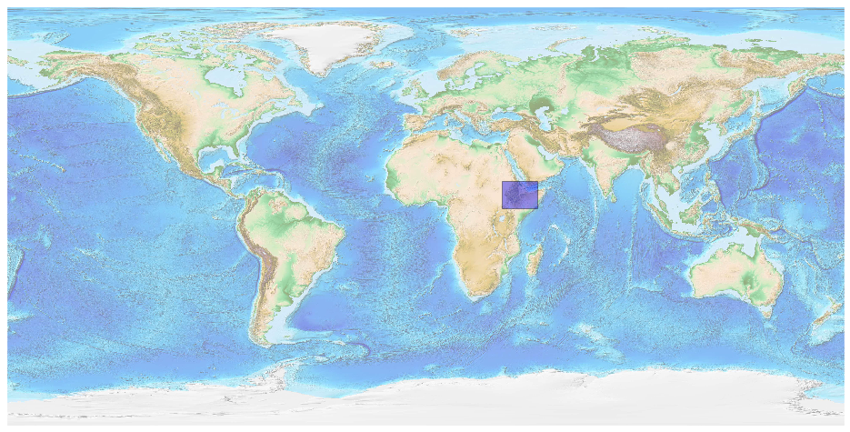
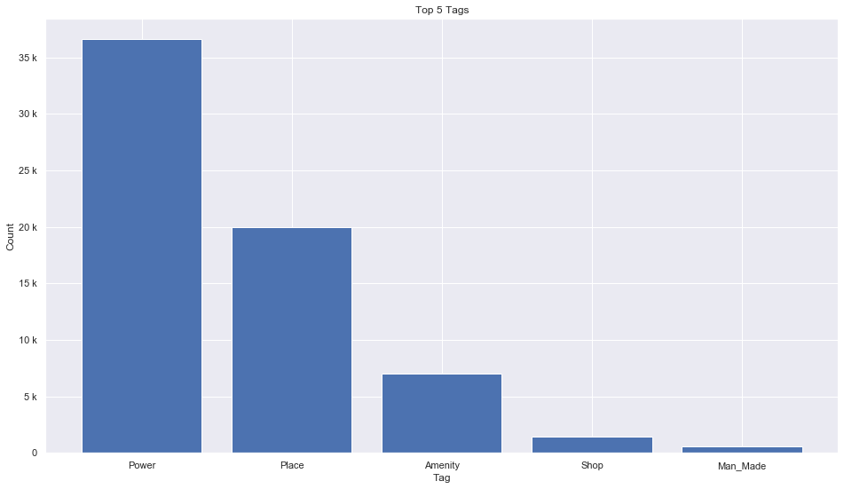
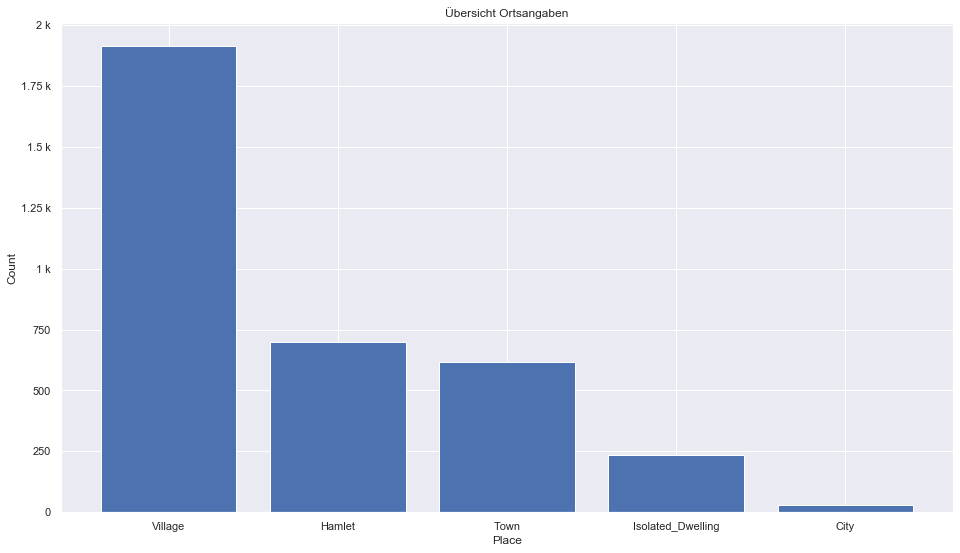
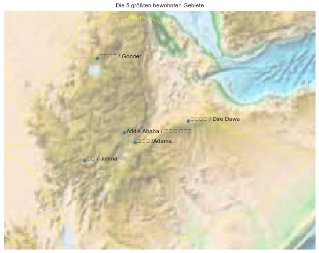

## Ethiopia [&#10159;](ethiopia.sqlite)

### Allgemeine Informationen

|Eigenschaft|Wert|
|-|-:|
Dateiname|[ethiopia.sqlite](ethiopia.sqlite)|
Zeitstempel|09.09.2019 18:44|
Dateigr&ouml;&szlig;e|3.32 Mb|
|||
Gesamtanzahl Nodes|65852|
|MinLat|3.378665|
|MaxLat|14.92381|
|MinLon|32.93807|
|MaxLon|48.02163|

### Top 5 Tags

|Tag|Count|
|-|-:|
|Power|36587|
|Place|19960|
|Amenity|6993|
|Shop|1449|
|Man_Made|574|

### &Uuml;bersicht Ortsangaben

|Place|Count|
|-|-:|
|Village|1913|
|Hamlet|701|
|Town|616|
|Isolated_Dwelling|236|
|City|31|

### Die 5 gr&ouml;&szlig;ten bewohnte Gebiete

|Name|Lat|Lon|Type|Population|
|----|--:|--:|:--:|---------:|
|Addis Ababa / አዲስ አበባ|9.0107934|38.7612525|City|3500000|
|ድሬዳዋ / Dire Dawa|9.5913193|41.8566373|City|398000|
|ኣዳማ /Adama|8.5410261|39.2705461|City|228623|
|ጎንደር / Gonder|12.610368|37.466766|City|213434|
|ጂማ / Jimma|7.6741372|36.8392841|City|207573|
