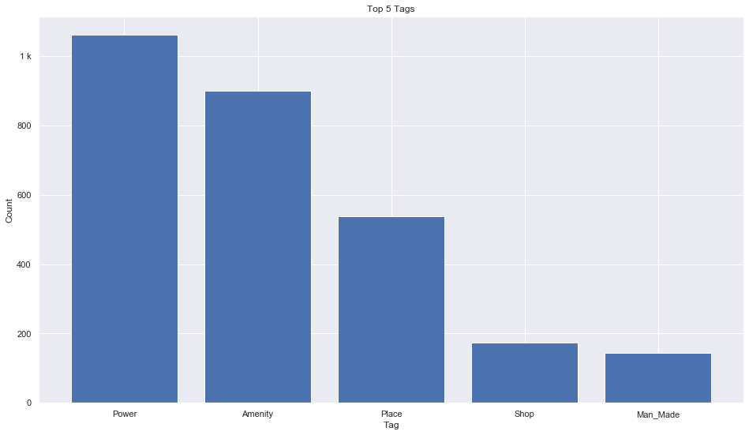

## Gabon [&#10159;](gabon.sqlite)

### Allgemeine Informationen

|Eigenschaft|Wert|
|-|-:|
Dateiname|[gabon.sqlite](gabon.sqlite)|
Zeitstempel|09.09.2019 18:42|
Dateigr&ouml;&szlig;e|160.00 Kb|
|||
Gesamtanzahl Nodes|2910|
|MinLat|-5.756775|
|MaxLat|2.336986|
|MinLon|7.389727|
|MaxLon|14.602758|

### Top 5 Tags

|Tag|Count|
|-|-:|
|Power|1061|
|Amenity|899|
|Place|539|
|Shop|174|
|Man_Made|143|

### &Uuml;bersicht Ortsangaben

|Place|Count|
|-|-:|
|Village|290|
|Hamlet|67|
|Town|27|
|City|4|
|Isolated_Dwelling|1|

### Die 5 gr&ouml;&szlig;ten bewohnte Gebiete

|Name|Lat|Lon|Type|Population|
|----|--:|--:|:--:|---------:|
|Libreville|0.390002|9.454001|City|850000|
|Franceville|-1.634363|13.589513|City|56000|
|Moanda|-1.554004|13.220574|Town|39300|
|Ebebiyín|2.1537363|11.3370815|City|36565|
|Mouila|-1.8628064|11.0588096|Town|22469|
