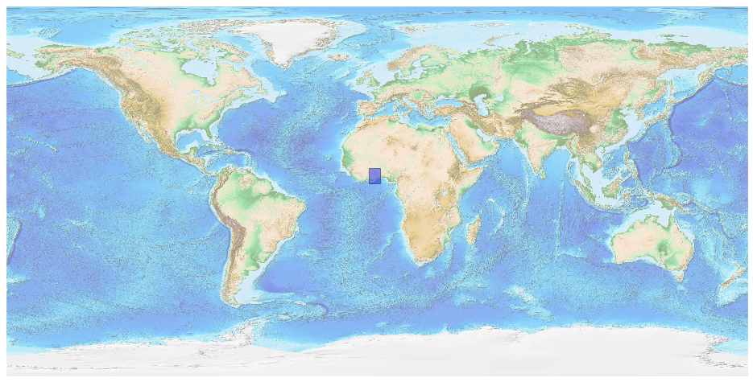
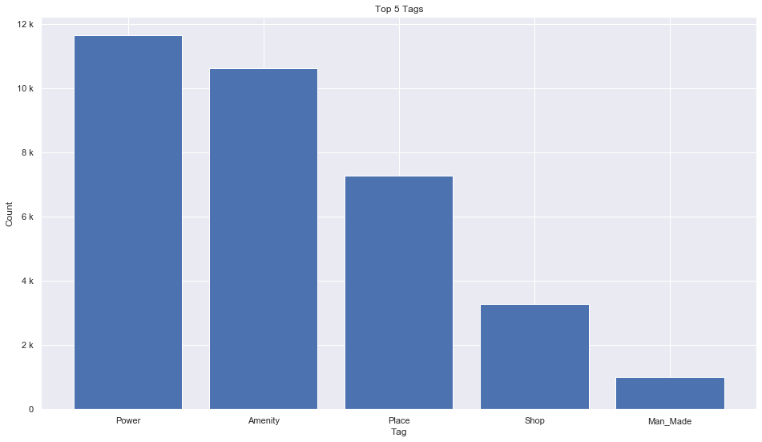
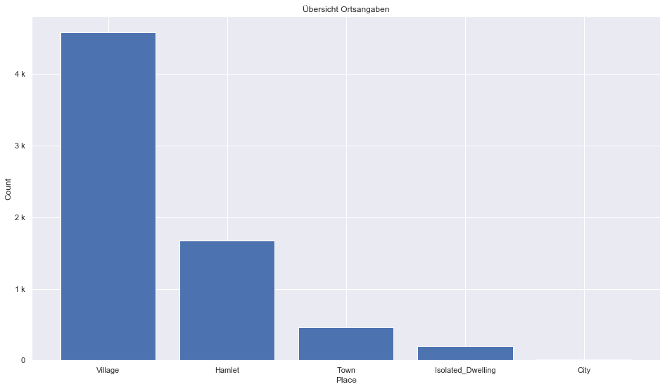
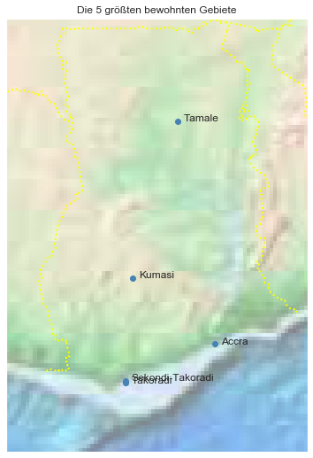

## Ghana [&#10159;](ghana.sqlite)

### Allgemeine Informationen

|Eigenschaft|Wert|
|-|-:|
Dateiname|[ghana.sqlite](ghana.sqlite)|
Zeitstempel|09.09.2019 18:44|
Dateigr&ouml;&szlig;e|1.69 Mb|
|||
Gesamtanzahl Nodes|34204|
|MinLat|3.704056|
|MaxLat|11.177723|
|MinLon|-3.807399|
|MaxLon|1.394038|

### Top 5 Tags

|Tag|Count|
|-|-:|
|Power|11643|
|Amenity|10632|
|Place|7282|
|Shop|3284|
|Man_Made|1010|

### &Uuml;bersicht Ortsangaben

|Place|Count|
|-|-:|
|Village|4581|
|Hamlet|1671|
|Town|464|
|Isolated_Dwelling|196|
|City|14|

### Die 5 gr&ouml;&szlig;ten bewohnte Gebiete

|Name|Lat|Lon|Type|Population|
|----|--:|--:|:--:|---------:|
|Accra|5.5600141|-0.2057437|City|2388000|
|Kumasi|6.698081|-1.6230404|City|1517000|
|Tamale|9.4043366|-0.8430289|City|950124|
|Takoradi|4.887401|-1.7519316|City|539548|
|Sekondi-Takoradi|4.927456|-1.7490216|City|445000|
