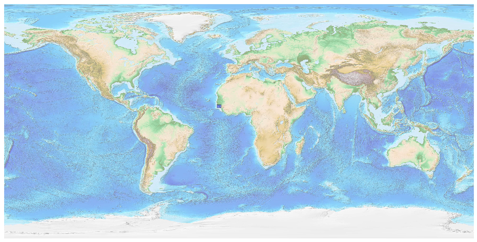
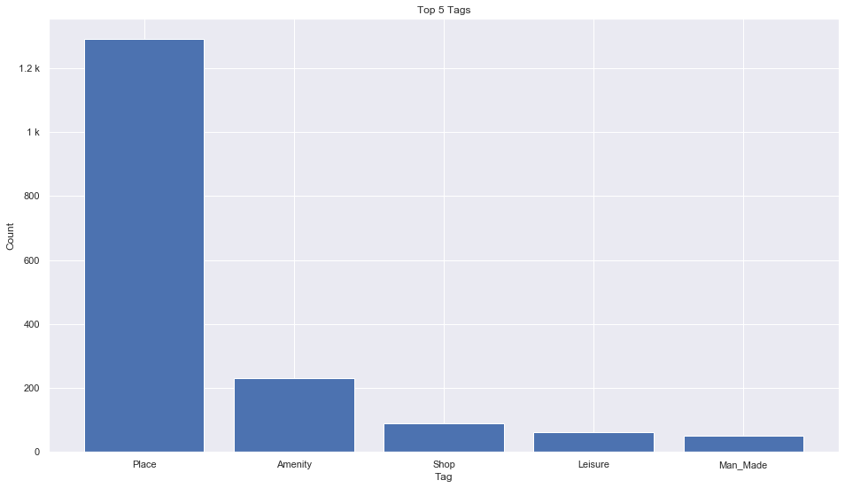
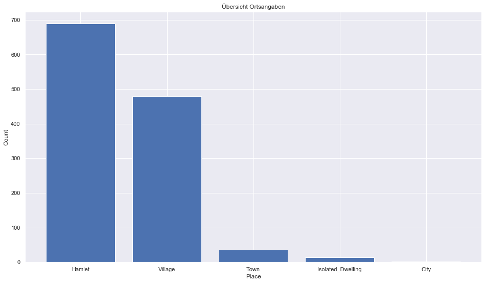
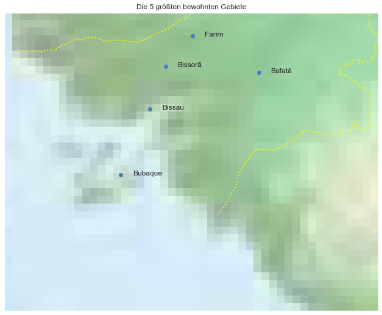

## Guinea Bissau [&#10159;](guinea-bissau.sqlite)

### Allgemeine Informationen

|Eigenschaft|Wert|
|-|-:|
Dateiname|[guinea-bissau.sqlite](guinea-bissau.sqlite)|
Zeitstempel|09.09.2019 18:44|
Dateigr&ouml;&szlig;e|100.00 Kb|
|||
Gesamtanzahl Nodes|1728|
|MinLat|10.14494|
|MaxLat|12.68248|
|MinLon|-16.8237999|
|MaxLon|-13.64192|

### Top 5 Tags

|Tag|Count|
|-|-:|
|Place|1290|
|Amenity|230|
|Shop|90|
|Leisure|62|
|Man_Made|50|

### &Uuml;bersicht Ortsangaben

|Place|Count|
|-|-:|
|Hamlet|689|
|Village|479|
|Town|36|
|Isolated_Dwelling|13|
|City|2|

### Die 5 gr&ouml;&szlig;ten bewohnte Gebiete

|Name|Lat|Lon|Type|Population|
|----|--:|--:|:--:|---------:|
|Bissau|11.861324|-15.583055|City|395954|
|Bissorã|12.2235221|-15.4507416|Town|50774|
|Bafatá|12.1723403|-14.6555027|Town|34760|
|Farim|12.4823646|-15.2196439|Town|6405|
|Bubaque|11.2984224|-15.8321387|Village|3500|
