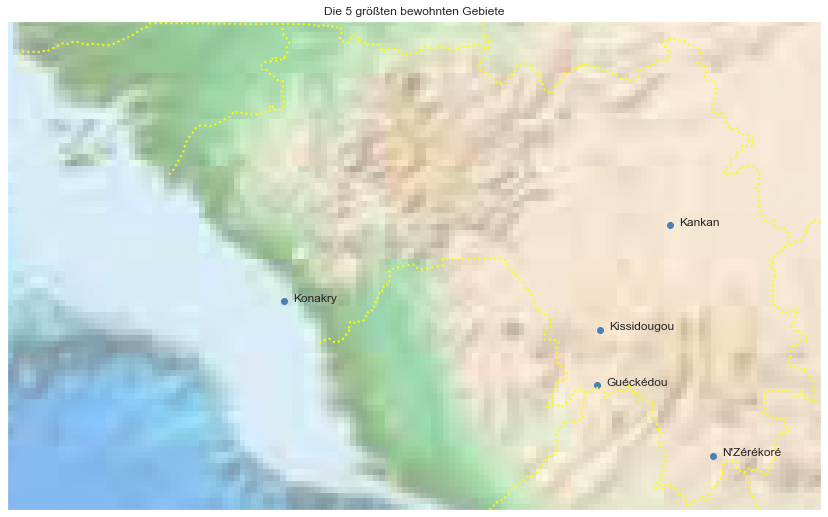

## Guinea [&#10159;](guinea.sqlite)

### Allgemeine Informationen

|Eigenschaft|Wert|
|-|-:|
Dateiname|[guinea.sqlite](guinea.sqlite)|
Zeitstempel|09.09.2019 18:46|
Dateigr&ouml;&szlig;e|1.73 Mb|
|||
Gesamtanzahl Nodes|33101|
|MinLat|7.13926|
|MaxLat|12.713005|
|MinLon|-16.857083|
|MaxLon|-7.587571|

### Top 5 Tags

|Tag|Count|
|-|-:|
|Place|13746|
|Amenity|13250|
|Shop|2708|
|Man_Made|1661|
|Power|1394|

### &Uuml;bersicht Ortsangaben

|Place|Count|
|-|-:|
|Hamlet|9532|
|Village|3316|
|Isolated_Dwelling|385|
|Town|208|
|City|15|

### Die 5 gr&ouml;&szlig;ten bewohnte Gebiete

|Name|Lat|Lon|Type|Population|
|----|--:|--:|:--:|---------:|
|Konakry|9.5170602|-13.6998434|City|1660973|
|Kankan|10.3835169|-9.3069354|City|473359|
|Guéckédou|8.5616492|-10.1328278|Town|290611|
|Kissidougou|9.192389|-10.098269|City|283778|
|N'Zérékoré|7.7574322|-8.8174807|City|280256|
