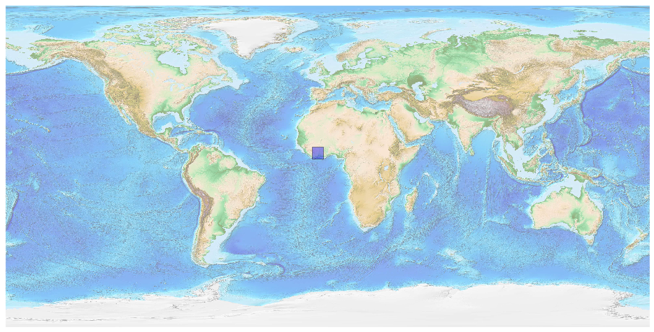
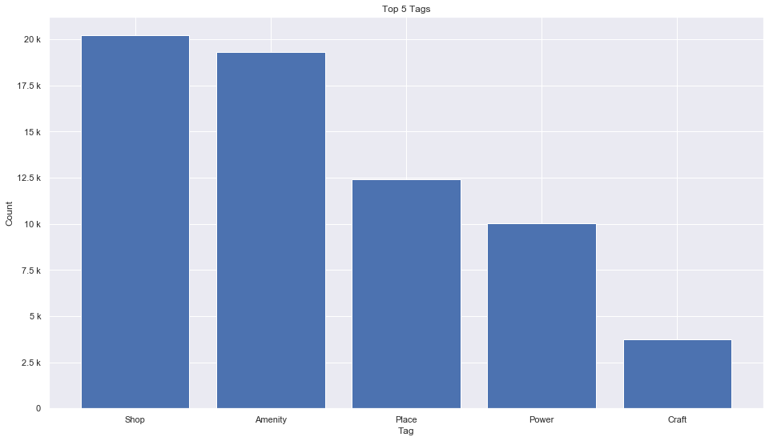
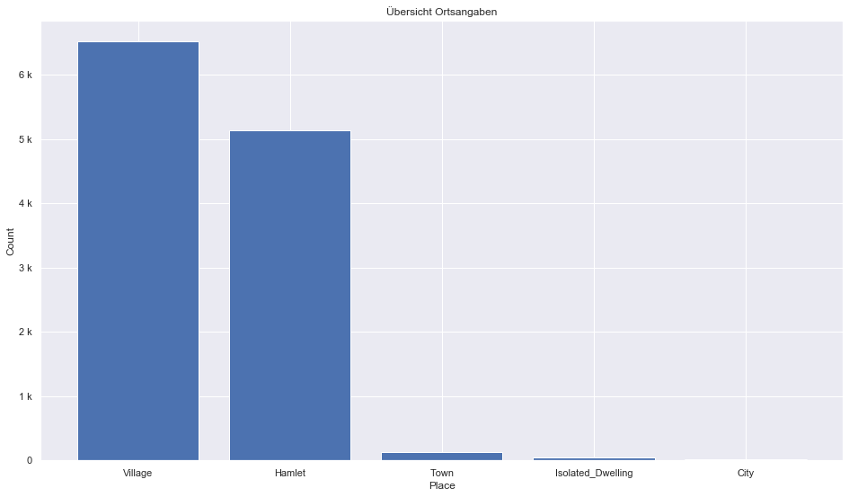
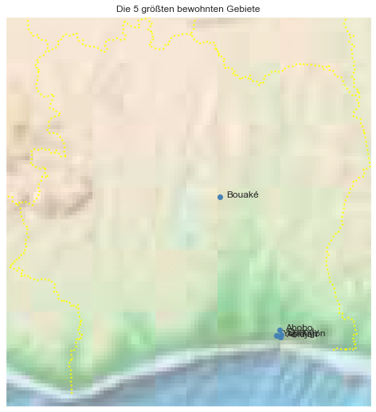

## Ivory Coast [&#10159;](ivory-coast.sqlite)

### Allgemeine Informationen

|Eigenschaft|Wert|
|-|-:|
Dateiname|[ivory-coast.sqlite](ivory-coast.sqlite)|
Zeitstempel|09.09.2019 18:46|
Dateigr&ouml;&szlig;e|3.42 Mb|
|||
Gesamtanzahl Nodes|66889|
|MinLat|4.141916|
|MaxLat|10.74769|
|MinLon|-8.665129|
|MaxLon|-2.476215|

### Top 5 Tags

|Tag|Count|
|-|-:|
|Shop|20212|
|Amenity|19294|
|Place|12427|
|Power|10027|
|Craft|3752|

### &Uuml;bersicht Ortsangaben

|Place|Count|
|-|-:|
|Village|6514|
|Hamlet|5136|
|Town|128|
|Isolated_Dwelling|49|
|City|24|

### Die 5 gr&ouml;&szlig;ten bewohnte Gebiete

|Name|Lat|Lon|Type|Population|
|----|--:|--:|:--:|---------:|
|Abidjan|5.320357|-4.016107|City|7567409|
|Abobo|5.435487|-4.029007|City|1500000|
|Yopougon|5.335194|-4.075756|City|1375020|
|Bouaké|7.6906058|-5.0298408|City|659223|
|Cocody|5.357367|-3.994934|City|450000|
