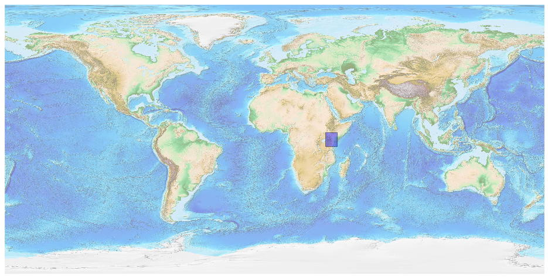
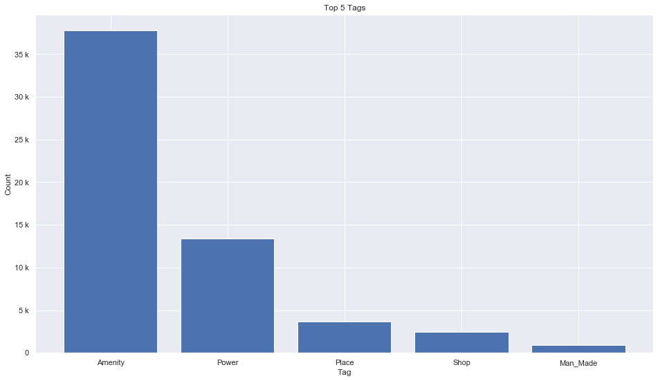
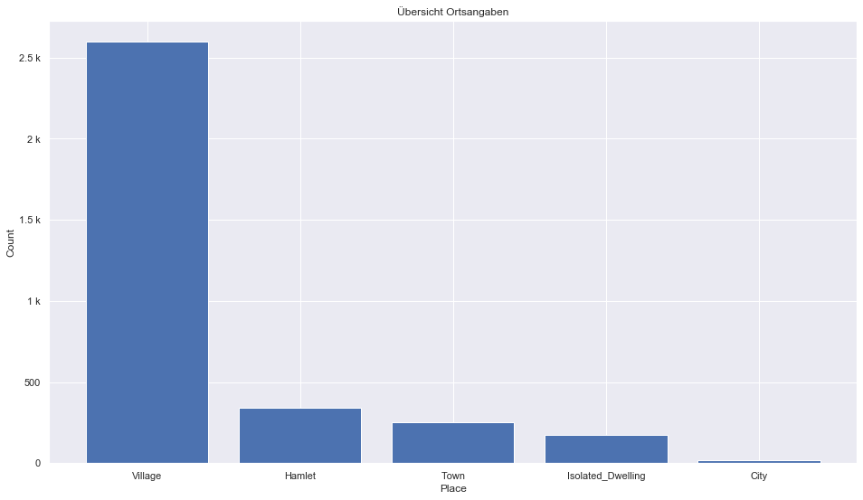
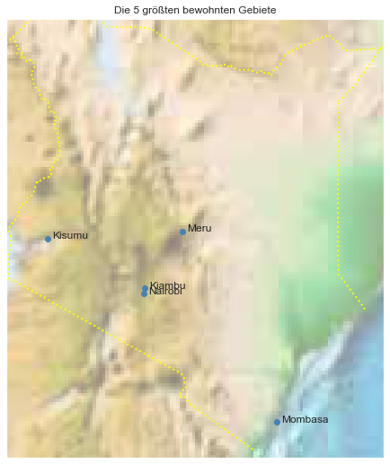

## Kenya [&#10159;](kenya.sqlite)

### Allgemeine Informationen

|Eigenschaft|Wert|
|-|-:|
Dateiname|[kenya.sqlite](kenya.sqlite)|
Zeitstempel|09.09.2019 18:51|
Dateigr&ouml;&szlig;e|3.00 Mb|
|||
Gesamtanzahl Nodes|59070|
|MinLat|-4.816276|
|MaxLat|4.629931|
|MinLon|33.8679|
|MaxLon|41.97685|

### Top 5 Tags

|Tag|Count|
|-|-:|
|Amenity|37758|
|Power|13376|
|Place|3706|
|Shop|2485|
|Man_Made|933|

### &Uuml;bersicht Ortsangaben

|Place|Count|
|-|-:|
|Village|2597|
|Hamlet|340|
|Town|251|
|Isolated_Dwelling|176|
|City|18|

### Die 5 gr&ouml;&szlig;ten bewohnte Gebiete

|Name|Lat|Lon|Type|Population|
|----|--:|--:|:--:|---------:|
|Nairobi|-1.2832533|36.8172449|City|3138295|
|Meru|0.0499786|37.6500063|City|1833000|
|Mombasa|-4.05052|39.667169|City|1300000|
|Kiambu|-1.1712839|36.8290321|City|1214500|
|Kisumu|-0.1029109|34.7541761|City|409928|
