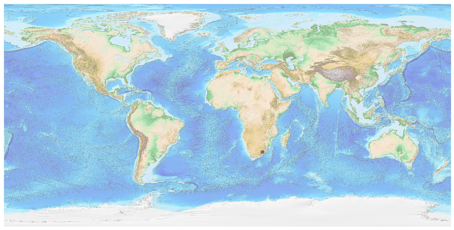
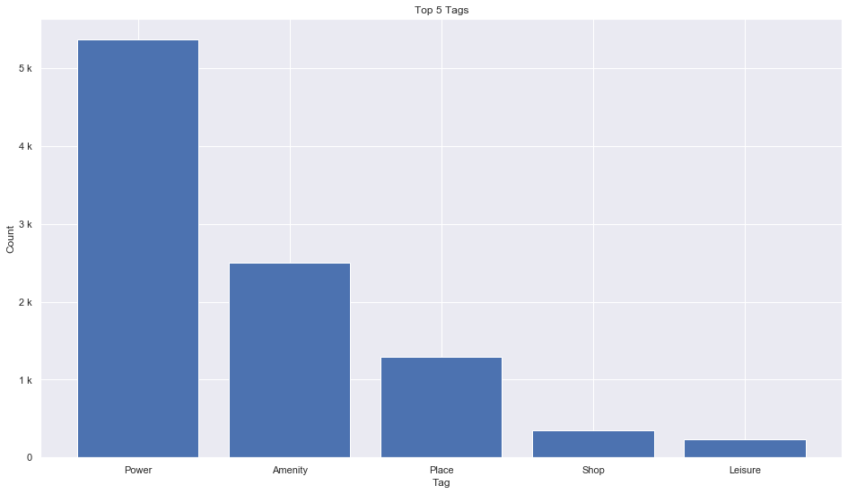
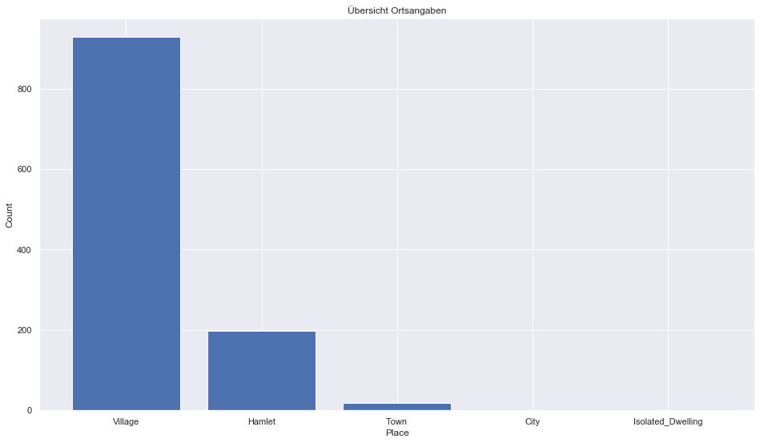
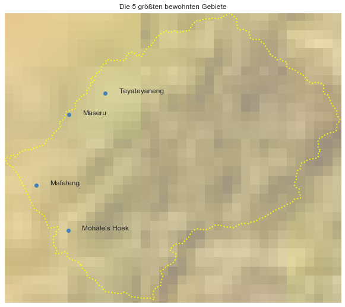

## Lesotho [&#10159;](lesotho.sqlite)

### Allgemeine Informationen

|Eigenschaft|Wert|
|-|-:|
Dateiname|[lesotho.sqlite](lesotho.sqlite)|
Zeitstempel|09.09.2019 18:49|
Dateigr&ouml;&szlig;e|484.00 Kb|
|||
Gesamtanzahl Nodes|9949|
|MinLat|-30.68144|
|MaxLat|-28.56213|
|MinLon|27.00561|
|MaxLon|29.46393|

### Top 5 Tags

|Tag|Count|
|-|-:|
|Power|5368|
|Amenity|2499|
|Place|1297|
|Shop|346|
|Leisure|234|

### &Uuml;bersicht Ortsangaben

|Place|Count|
|-|-:|
|Village|928|
|Hamlet|197|
|Town|18|
|City|1|
|Isolated_Dwelling|1|

### Die 5 gr&ouml;&szlig;ten bewohnte Gebiete

|Name|Lat|Lon|Type|Population|
|----|--:|--:|:--:|---------:|
|Maseru|-29.310054|27.478222|City|227880|
|Teyateyaneng|-29.1519737|27.7427554|Town|75115|
|Mafeteng|-29.8224468|27.2388281|Town|57059|
|Mohale's Hoek|-30.151983|27.471376|Town|24992|
