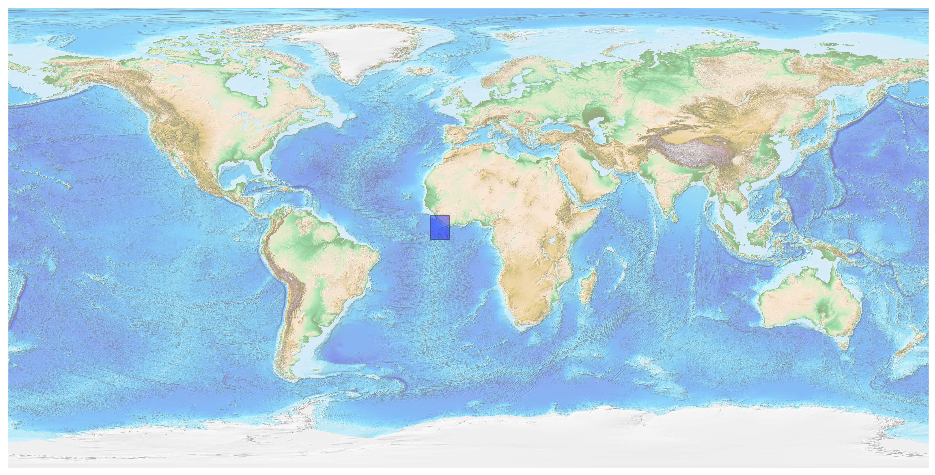
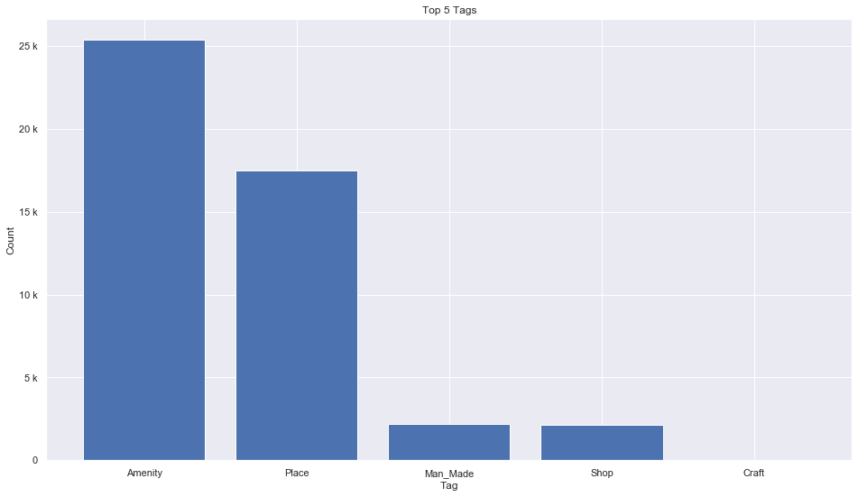
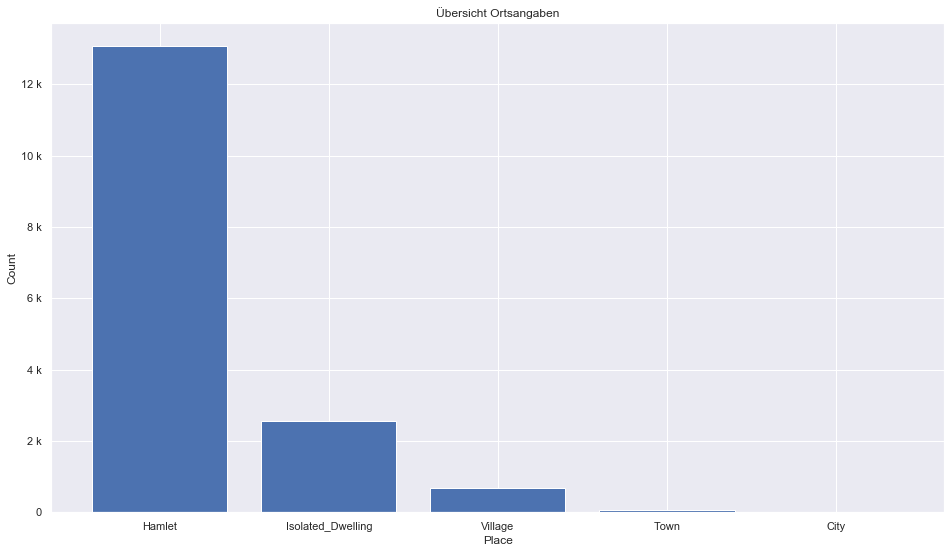
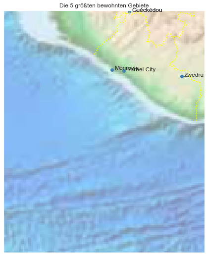

## Liberia [&#10159;](liberia.sqlite)

### Allgemeine Informationen

|Eigenschaft|Wert|
|-|-:|
Dateiname|[liberia.sqlite](liberia.sqlite)|
Zeitstempel|09.09.2019 18:51|
Dateigr&ouml;&szlig;e|2.52 Mb|
|||
Gesamtanzahl Nodes|47276|
|MinLat|-0.681003|
|MaxLat|8.60446|
|MinLon|-14.95454|
|MaxLon|-7.24572|

### Top 5 Tags

|Tag|Count|
|-|-:|
|Amenity|25380|
|Place|17472|
|Man_Made|2177|
|Shop|2158|
|Craft|33|

### &Uuml;bersicht Ortsangaben

|Place|Count|
|-|-:|
|Hamlet|13062|
|Isolated_Dwelling|2546|
|Village|673|
|Town|55|
|City|2|

### Die 5 gr&ouml;&szlig;ten bewohnte Gebiete

|Name|Lat|Lon|Type|Population|
|----|--:|--:|:--:|---------:|
|Monrovia|6.328034|-10.797788|City|1010970|
|Guéckédou|8.5616492|-10.1328278|Town|290611|
|Guéckédou|8.561649|-10.132821|City|221715|
|Harbel City|6.2767412|-10.3447395|Town|25000|
|Zwedru|6.068724|-8.1342735|Town|23903|
