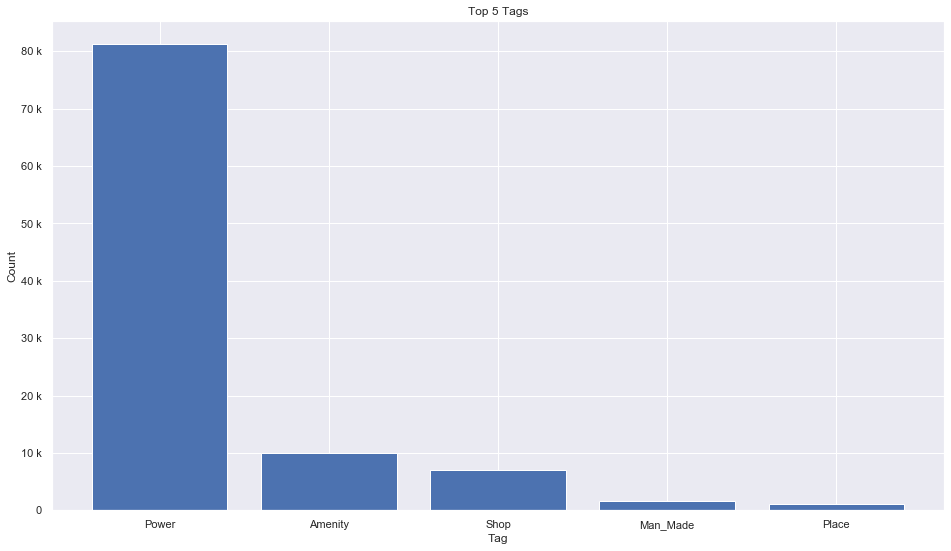
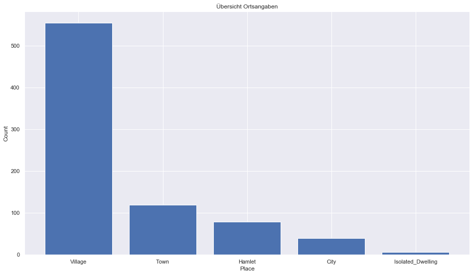
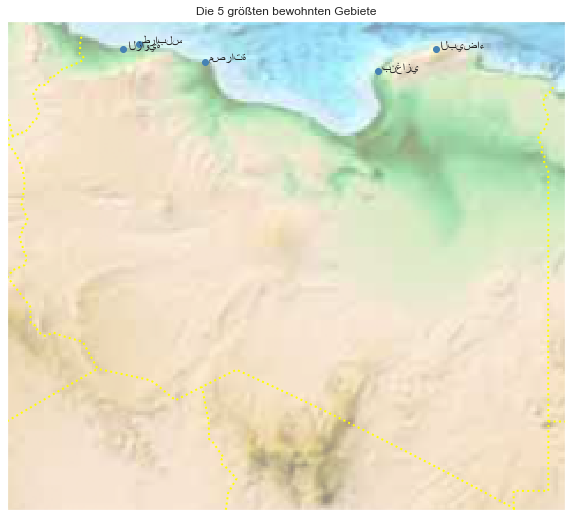

## Libya [&#10159;](libya.sqlite)

### Allgemeine Informationen

|Eigenschaft|Wert|
|-|-:|
Dateiname|[libya.sqlite](libya.sqlite)|
Zeitstempel|09.09.2019 18:52|
Dateigr&ouml;&szlig;e|4.96 Mb|
|||
Gesamtanzahl Nodes|101361|
|MinLat|19.45087|
|MaxLat|33.57972|
|MinLon|9.374405|
|MaxLon|25.48516|

### Top 5 Tags

|Tag|Count|
|-|-:|
|Power|81215|
|Amenity|9988|
|Shop|6979|
|Man_Made|1534|
|Place|1080|

### &Uuml;bersicht Ortsangaben

|Place|Count|
|-|-:|
|Village|554|
|Town|119|
|Hamlet|79|
|City|40|
|Isolated_Dwelling|6|

### Die 5 gr&ouml;&szlig;ten bewohnte Gebiete

|Name|Lat|Lon|Type|Population|
|----|--:|--:|:--:|---------:|
|طرابلس|32.896672|13.1777923|City|2127000|
|بنغازي|32.1288331|20.0817204|City|631555|
|الزاوية|32.7626409|12.7264789|City|318726|
|البيضاء|32.7609529|21.7577175|City|310329|
|مصراتة|32.3745318|15.0904886|City|281000|
