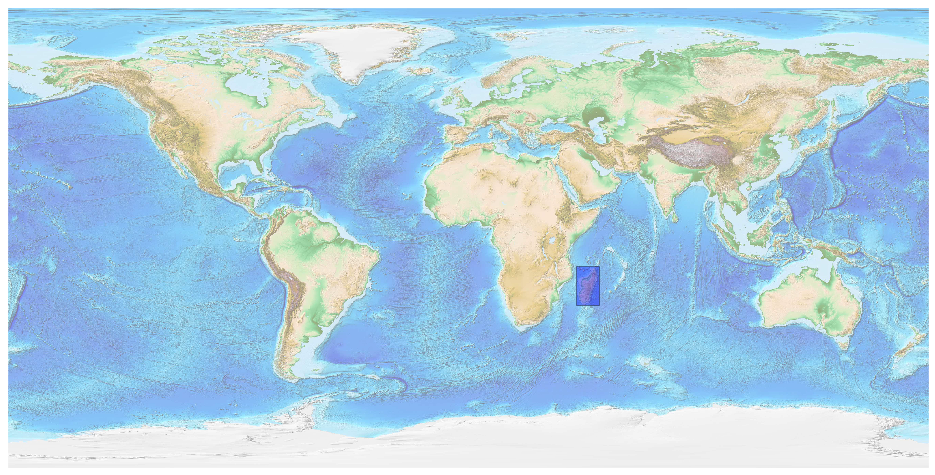
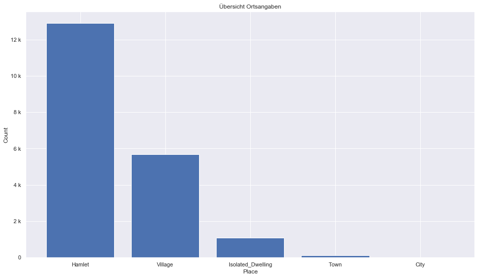

## Madagascar [&#10159;](madagascar.sqlite)

### Allgemeine Informationen

|Eigenschaft|Wert|
|-|-:|
Dateiname|[madagascar.sqlite](madagascar.sqlite)|
Zeitstempel|09.09.2019 18:53|
Dateigr&ouml;&szlig;e|1.61 Mb|
|||
Gesamtanzahl Nodes|31941|
|MinLat|-26.5823|
|MaxLat|-11.36225|
|MinLon|42.30124|
|MaxLon|51.14843|

### Top 5 Tags

|Tag|Count|
|-|-:|
|Place|20787|
|Amenity|6713|
|Shop|2313|
|Man_Made|1001|
|Power|837|

### &Uuml;bersicht Ortsangaben

|Place|Count|
|-|-:|
|Hamlet|12897|
|Village|5672|
|Isolated_Dwelling|1073|
|Town|105|
|City|8|

### Die 5 gr&ouml;&szlig;ten bewohnte Gebiete

|Name|Lat|Lon|Type|Population|
|----|--:|--:|:--:|---------:|
|Antananarivo|-18.9100122|47.5255809|City|2200000|
|Antsirabe|-19.871403|47.034667|City|307102|
|Toamasina|-18.1553985|49.4098352|City|300813|
|Mahajanga|-15.7181492|46.3172577|City|244279|
|Fianarantsoa|-21.456444|47.085149|City|200482|
