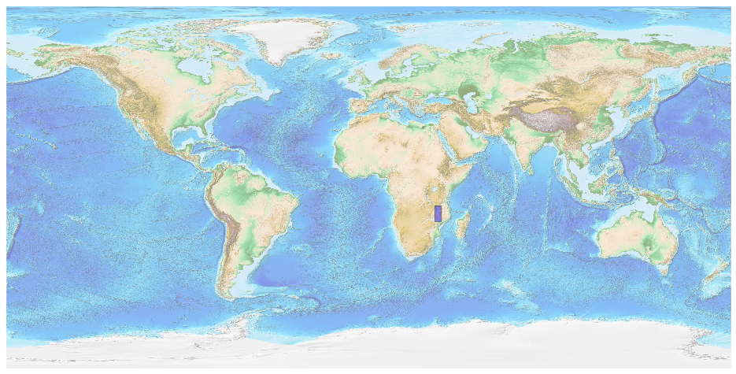
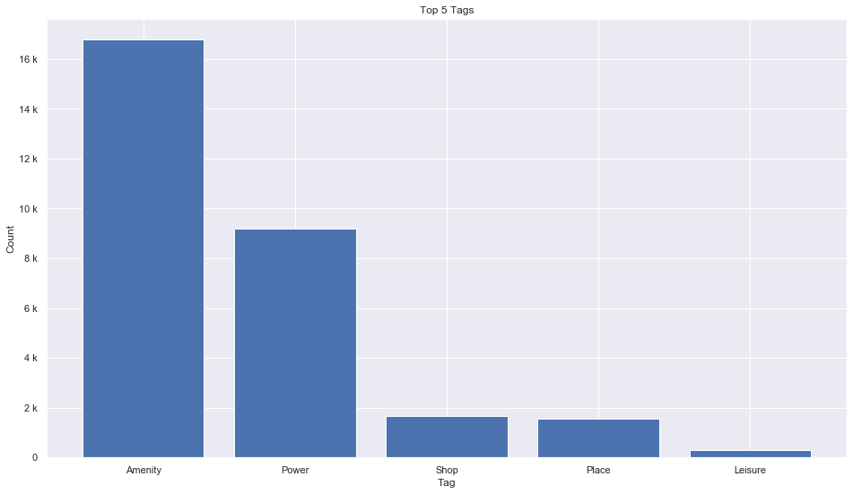
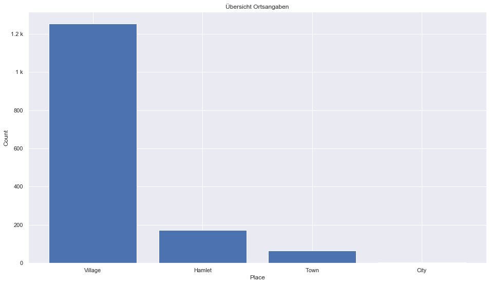
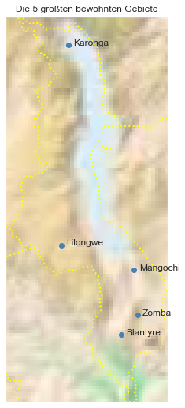

## Malawi [&#10159;](malawi.sqlite)

### Allgemeine Informationen

|Eigenschaft|Wert|
|-|-:|
Dateiname|[malawi.sqlite](malawi.sqlite)|
Zeitstempel|09.09.2019 18:55|
Dateigr&ouml;&szlig;e|1.41 Mb|
|||
Gesamtanzahl Nodes|29786|
|MinLat|-17.1455039|
|MaxLat|-9.353419|
|MinLon|32.659998|
|MaxLon|35.934239|

### Top 5 Tags

|Tag|Count|
|-|-:|
|Amenity|16775|
|Power|9181|
|Shop|1671|
|Place|1570|
|Leisure|291|

### &Uuml;bersicht Ortsangaben

|Place|Count|
|-|-:|
|Village|1252|
|Hamlet|172|
|Town|64|
|City|4|

### Die 5 gr&ouml;&szlig;ten bewohnte Gebiete

|Name|Lat|Lon|Type|Population|
|----|--:|--:|:--:|---------:|
|Blantyre|-15.7862543|35.0035694|City|994500|
|Lilongwe|-13.973456|33.7878122|City|781538|
|Zomba|-15.3863208|35.3268273|City|101140|
|Mangochi|-14.4805084|35.2606129|Town|51429|
|Karonga|-9.9393499|33.9271368|Town|42555|
