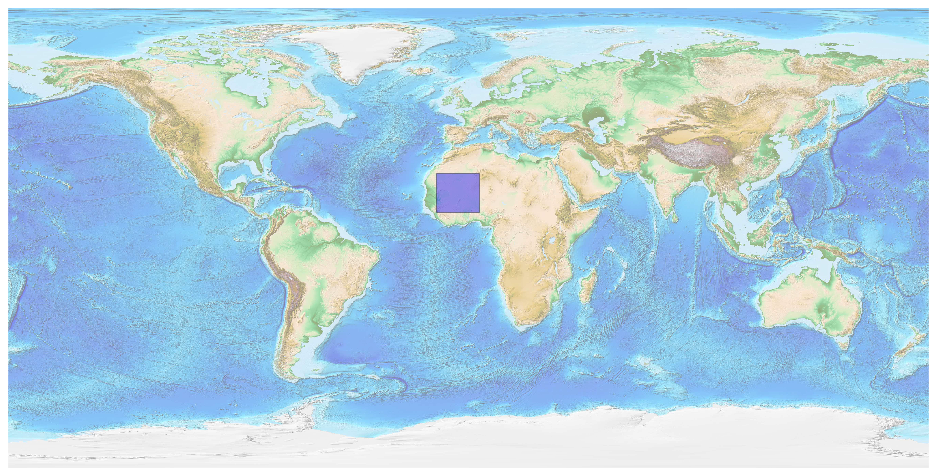
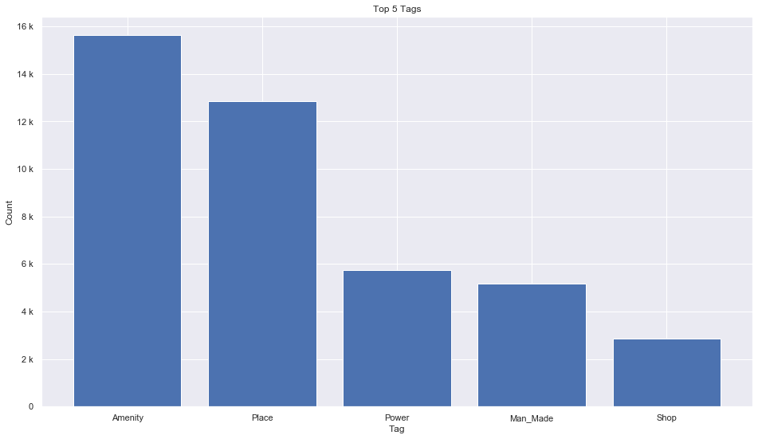
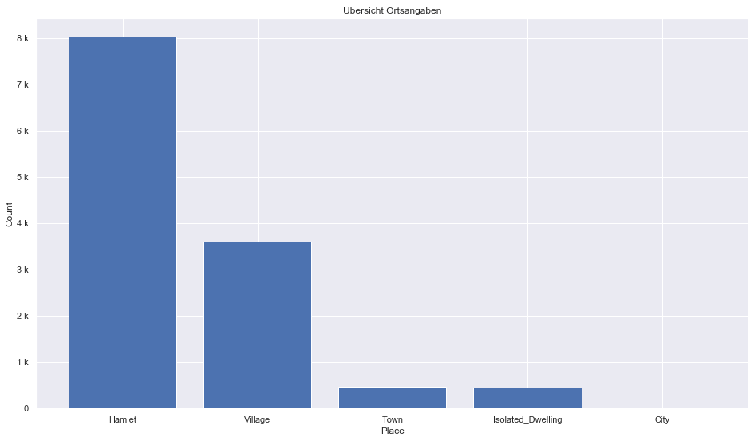
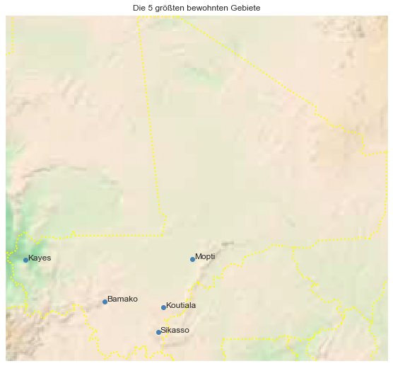

## Mali [&#10159;](mali.sqlite)

### Allgemeine Informationen

|Eigenschaft|Wert|
|-|-:|
Dateiname|[mali.sqlite](mali.sqlite)|
Zeitstempel|09.09.2019 18:56|
Dateigr&ouml;&szlig;e|2.23 Mb|
|||
Gesamtanzahl Nodes|42700|
|MinLat|10.05845|
|MaxLat|25.09499|
|MinLon|-12.3292|
|MaxLon|4.330257|

### Top 5 Tags

|Tag|Count|
|-|-:|
|Amenity|15623|
|Place|12866|
|Power|5749|
|Man_Made|5170|
|Shop|2862|

### &Uuml;bersicht Ortsangaben

|Place|Count|
|-|-:|
|Hamlet|8034|
|Village|3601|
|Town|478|
|Isolated_Dwelling|445|
|City|11|

### Die 5 gr&ouml;&szlig;ten bewohnte Gebiete

|Name|Lat|Lon|Type|Population|
|----|--:|--:|:--:|---------:|
|Bamako|12.649319|-8.000337|City|1809106|
|Sikasso|11.3164979|-5.6777499|City|226000|
|Kayes|14.443406|-11.437914|City|127368|
|Mopti|14.4879631|-4.1905986|City|114296|
|Koutiala|12.3869501|-5.4600937|City|99000|
