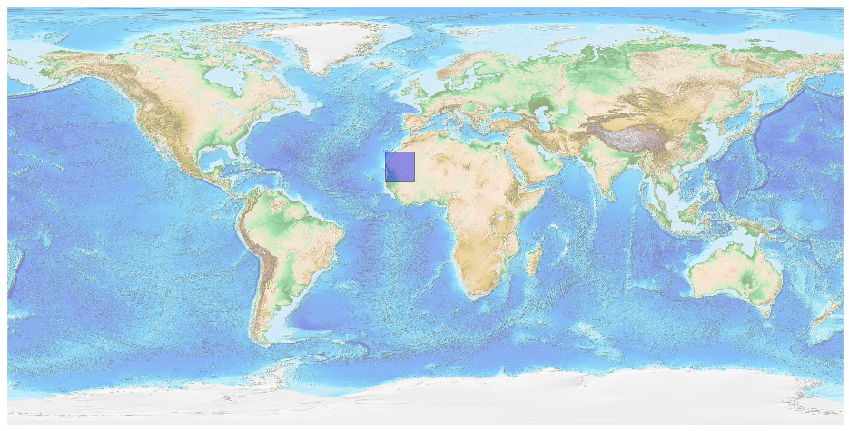
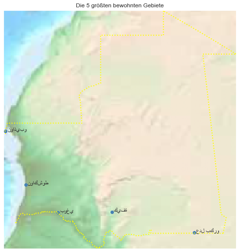

## Mauritania [&#10159;](mauritania.sqlite)

### Allgemeine Informationen

|Eigenschaft|Wert|
|-|-:|
Dateiname|[mauritania.sqlite](mauritania.sqlite)|
Zeitstempel|09.09.2019 18:56|
Dateigr&ouml;&szlig;e|676.00 Kb|
|||
Gesamtanzahl Nodes|13728|
|MinLat|14.694297|
|MaxLat|27.336135|
|MinLon|-17.15606|
|MaxLon|-4.816056|

### Top 5 Tags

|Tag|Count|
|-|-:|
|Power|5973|
|Amenity|3822|
|Place|2483|
|Man_Made|913|
|Shop|471|

### &Uuml;bersicht Ortsangaben

|Place|Count|
|-|-:|
|Village|937|
|Hamlet|834|
|Isolated_Dwelling|502|
|Town|84|
|City|8|

### Die 5 gr&ouml;&szlig;ten bewohnte Gebiete

|Name|Lat|Lon|Type|Population|
|----|--:|--:|:--:|---------:|
|نواكشوط|18.0792379|-15.9780071|City|760000|
|نواذيبو|20.9131304|-17.0501015|City|85953|
|كيفة|16.6161559|-11.4002038|City|60005|
|عدل بكرو|15.5337297|-7.028246|Town|58429|
|بوغي|16.5955353|-14.2603202|Town|49089|
