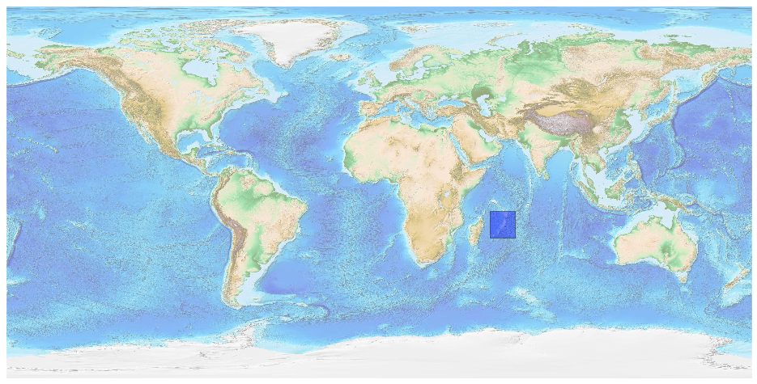
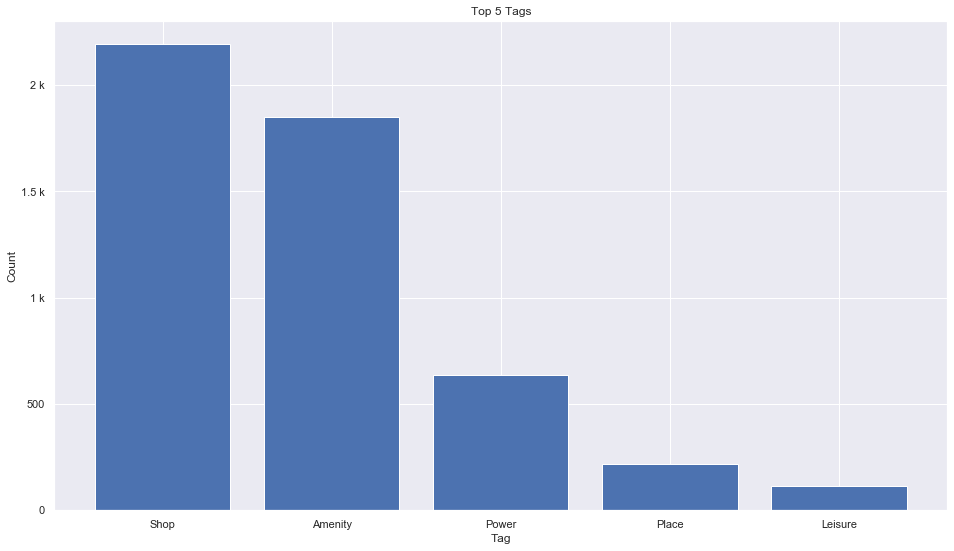
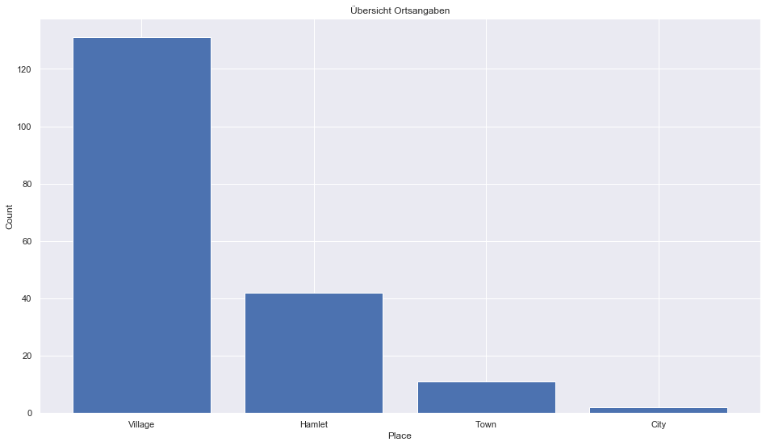
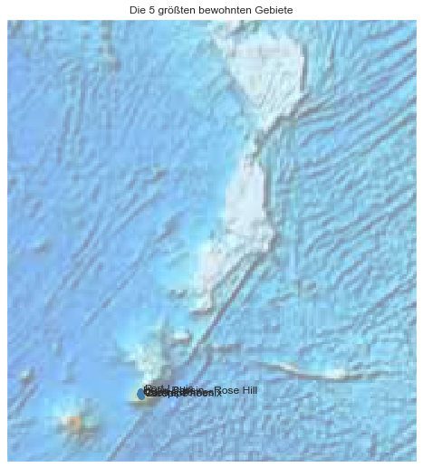

## Mauritius [&#10159;](mauritius.sqlite)

### Allgemeine Informationen

|Eigenschaft|Wert|
|-|-:|
Dateiname|[mauritius.sqlite](mauritius.sqlite)|
Zeitstempel|09.09.2019 18:56|
Dateigr&ouml;&szlig;e|300.00 Kb|
|||
Gesamtanzahl Nodes|5124|
|MinLat|-22.241095|
|MaxLat|-9.183617|
|MinLon|53.547275|
|MaxLon|65.639906|

### Top 5 Tags

|Tag|Count|
|-|-:|
|Shop|2192|
|Amenity|1849|
|Power|636|
|Place|218|
|Leisure|114|

### &Uuml;bersicht Ortsangaben

|Place|Count|
|-|-:|
|Village|131|
|Hamlet|42|
|Town|11|
|City|2|

### Die 5 gr&ouml;&szlig;ten bewohnte Gebiete

|Name|Lat|Lon|Type|Population|
|----|--:|--:|:--:|---------:|
|Port-Louis|-20.1637281|57.5045331|City|147688|
|Vacoas-Phoenix|-20.2988802|57.4927689|City|107678|
|Beau Bassin - Rose Hill|-20.234269|57.4693447|Town|96000|
|Quatre Bornes|-20.2643015|57.4800061|Town|81773|
|Curepipe|-20.3150516|57.5211497|Town|81600|
