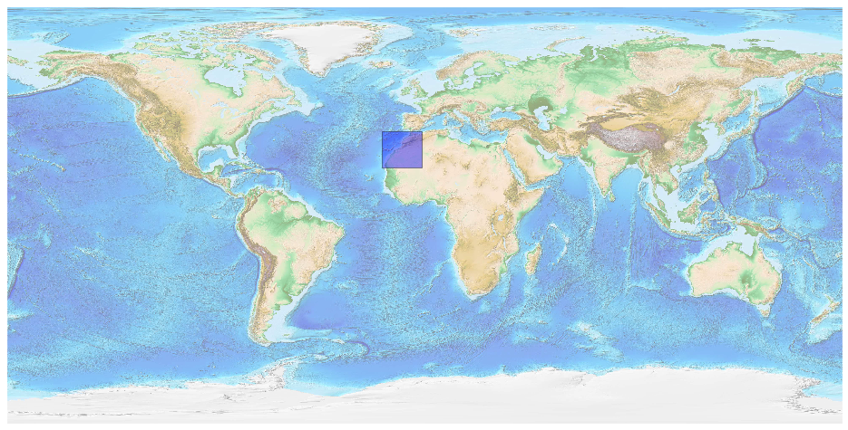
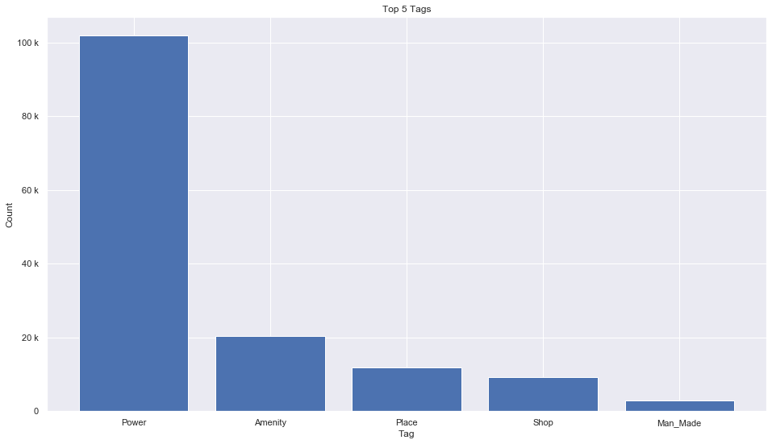
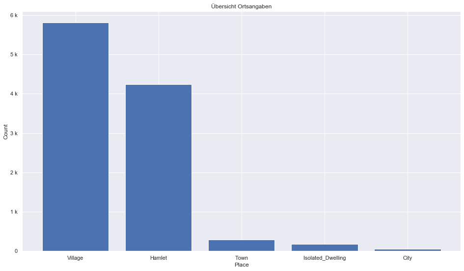
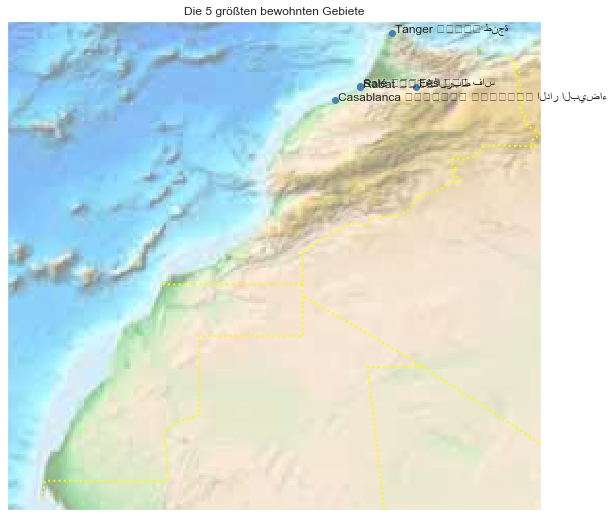

## Morocco [&#10159;](morocco.sqlite)

### Allgemeine Informationen

|Eigenschaft|Wert|
|-|-:|
Dateiname|[morocco.sqlite](morocco.sqlite)|
Zeitstempel|09.09.2019 19:01|
Dateigr&ouml;&szlig;e|6.92 Mb|
|||
Gesamtanzahl Nodes|147456|
|MinLat|20.40373|
|MaxLat|36.16199|
|MinLon|-18.183499|
|MaxLon|-0.997533|

### Top 5 Tags

|Tag|Count|
|-|-:|
|Power|101815|
|Amenity|20364|
|Place|11760|
|Shop|9249|
|Man_Made|2851|

### &Uuml;bersicht Ortsangaben

|Place|Count|
|-|-:|
|Village|5808|
|Hamlet|4247|
|Town|288|
|Isolated_Dwelling|179|
|City|52|

### Die 5 gr&ouml;&szlig;ten bewohnte Gebiete

|Name|Lat|Lon|Type|Population|
|----|--:|--:|:--:|---------:|
|Casablanca ⵜⴰⴷⴷⴰⵔⵜ ⵜⵓⵎⵍⵉⵍⵜ الدار البيضاء|33.5950627|-7.6187768|City|3359818|
|Rabat ⵔⴱⴰⵟ الرباط|34.022405|-6.834543|City|1650000|
|Fès ⴼⴰⵙ فاس|34.0346534|-5.0161926|City|1112072|
|Salé ⵙⵍⴰ سلا|34.044889|-6.814017|City|1000000|
|Tanger ⵟⴰⵏⵊⴰ طنجة|35.777103|-5.803792|City|947952|
