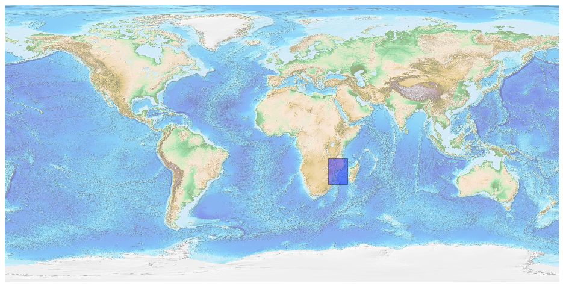
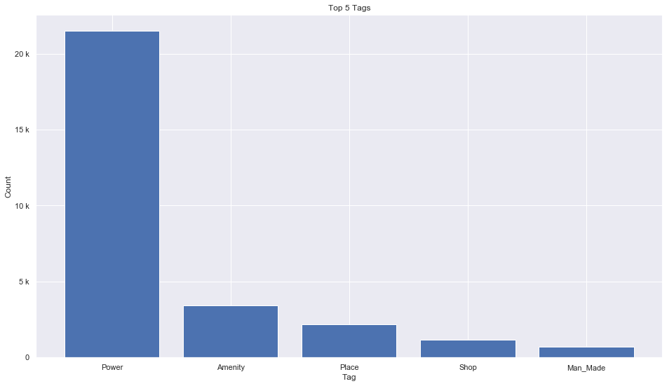
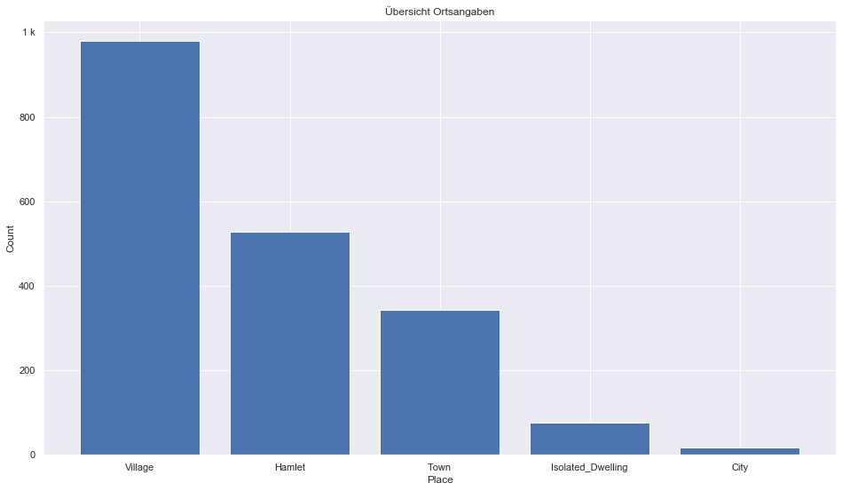
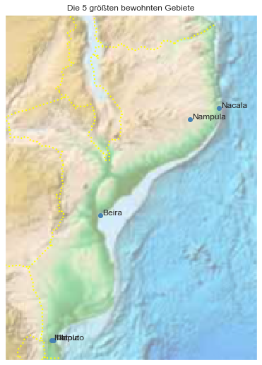

## Mozambique [&#10159;](mozambique.sqlite)

### Allgemeine Informationen

|Eigenschaft|Wert|
|-|-:|
Dateiname|[mozambique.sqlite](mozambique.sqlite)|
Zeitstempel|09.09.2019 19:00|
Dateigr&ouml;&szlig;e|1.34 Mb|
|||
Gesamtanzahl Nodes|29192|
|MinLat|-26.938372|
|MaxLat|-9.986206|
|MinLon|30.178227|
|MaxLon|42.534886|

### Top 5 Tags

|Tag|Count|
|-|-:|
|Power|21496|
|Amenity|3446|
|Place|2202|
|Shop|1178|
|Man_Made|682|

### &Uuml;bersicht Ortsangaben

|Place|Count|
|-|-:|
|Village|979|
|Hamlet|528|
|Town|343|
|Isolated_Dwelling|77|
|City|18|

### Die 5 gr&ouml;&szlig;ten bewohnte Gebiete

|Name|Lat|Lon|Type|Population|
|----|--:|--:|:--:|---------:|
|Maputo|-25.966213|32.56745|City|1244227|
|Matola|-25.966917|32.466956|City|675422|
|Nampula|-15.1194063|39.2615886|City|477900|
|Beira|-19.828707|34.841782|City|436240|
|Nacala|-14.5583059|40.6863816|City|389000|
