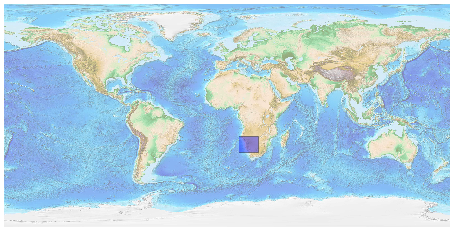
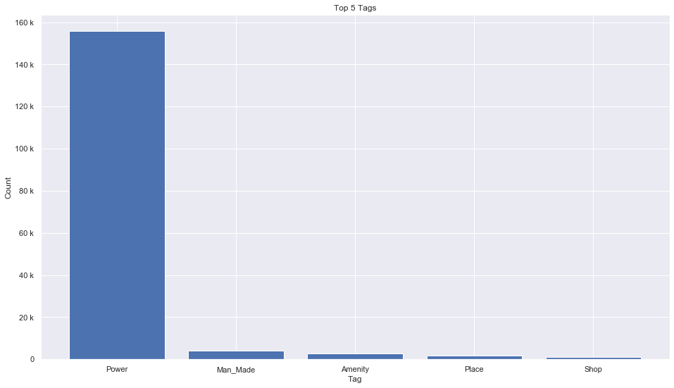

## Namibia [&#10159;](namibia.sqlite)

### Allgemeine Informationen

|Eigenschaft|Wert|
|-|-:|
Dateiname|[namibia.sqlite](namibia.sqlite)|
Zeitstempel|09.09.2019 19:02|
Dateigr&ouml;&szlig;e|7.22 Mb|
|||
Gesamtanzahl Nodes|165789|
|MinLat|-30.072362|
|MaxLat|-16.91682|
|MinLon|9.784615|
|MaxLon|25.29929|

### Top 5 Tags

|Tag|Count|
|-|-:|
|Power|155744|
|Man_Made|4053|
|Amenity|2644|
|Place|1779|
|Shop|1096|

### &Uuml;bersicht Ortsangaben

|Place|Count|
|-|-:|
|Hamlet|733|
|Village|463|
|Isolated_Dwelling|201|
|Town|41|
|City|11|

### Die 5 gr&ouml;&szlig;ten bewohnte Gebiete

|Name|Lat|Lon|Type|Population|
|----|--:|--:|:--:|---------:|
|Windhoek|-22.5743922|17.0790688|City|325858|
|Rundu|-17.9136037|19.7666849|City|63431|
|Walvis Bay|-22.9543269|14.50748|City|61300|
|Oshakati|-17.7834339|15.7002428|City|43000|
|Victoria Falls|-17.9349458|25.8252767|Town|33060|
