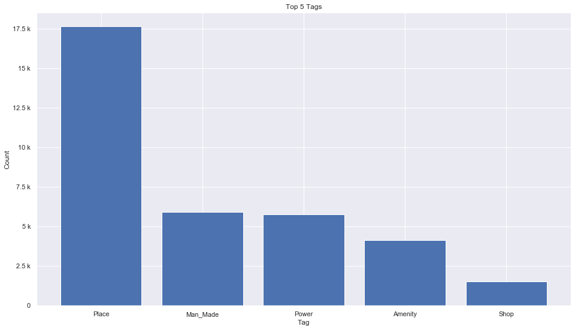
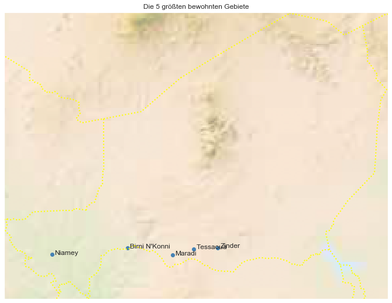

## Niger [&#10159;](niger.sqlite)

### Allgemeine Informationen

|Eigenschaft|Wert|
|-|-:|
Dateiname|[niger.sqlite](niger.sqlite)|
Zeitstempel|09.09.2019 19:01|
Dateigr&ouml;&szlig;e|1.84 Mb|
|||
Gesamtanzahl Nodes|35091|
|MinLat|11.686838|
|MaxLat|23.56864|
|MinLon|0.119721|
|MaxLon|16.0560499|

### Top 5 Tags

|Tag|Count|
|-|-:|
|Place|17627|
|Man_Made|5899|
|Power|5744|
|Amenity|4132|
|Shop|1517|

### &Uuml;bersicht Ortsangaben

|Place|Count|
|-|-:|
|Village|13068|
|Hamlet|4137|
|Town|133|
|Isolated_Dwelling|45|
|City|19|

### Die 5 gr&ouml;&szlig;ten bewohnte Gebiete

|Name|Lat|Lon|Type|Population|
|----|--:|--:|:--:|---------:|
|Niamey|13.524834|2.109823|City|1026848|
|Maradi|13.501206|7.102534|City|174485|
|Zinder|13.8063421|8.9891659|City|170574|
|Tessaoua|13.755513|7.990456|City|166682|
|Birni N'Konni|13.791612|5.24779|City|143530|
