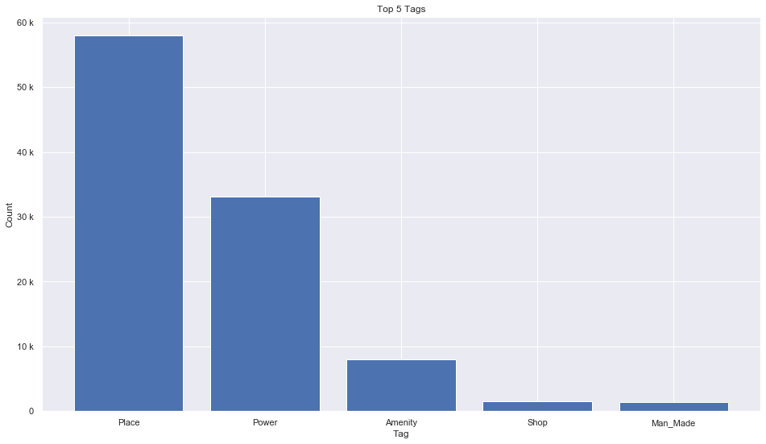
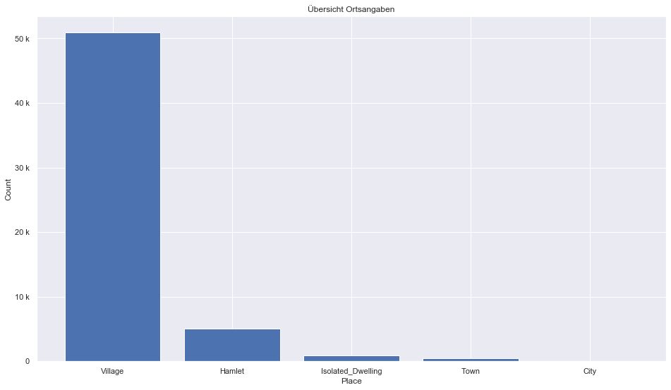
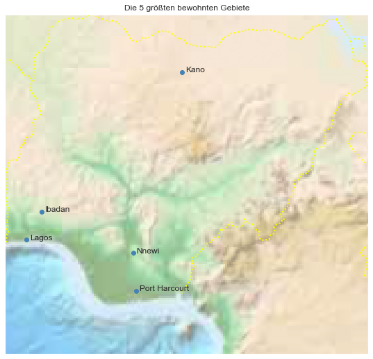

## Nigeria [&#10159;](nigeria.sqlite)

### Allgemeine Informationen

|Eigenschaft|Wert|
|-|-:|
Dateiname|[nigeria.sqlite](nigeria.sqlite)|
Zeitstempel|09.09.2019 19:07|
Dateigr&ouml;&szlig;e|5.15 Mb|
|||
Gesamtanzahl Nodes|102730|
|MinLat|2.674022|
|MaxLat|13.89545|
|MinLon|2.678891|
|MaxLon|14.67886|

### Top 5 Tags

|Tag|Count|
|-|-:|
|Place|57940|
|Power|33114|
|Amenity|7935|
|Shop|1516|
|Man_Made|1413|

### &Uuml;bersicht Ortsangaben

|Place|Count|
|-|-:|
|Village|50888|
|Hamlet|5096|
|Isolated_Dwelling|896|
|Town|483|
|City|61|

### Die 5 gr&ouml;&szlig;ten bewohnte Gebiete

|Name|Lat|Lon|Type|Population|
|----|--:|--:|:--:|---------:|
|Lagos|6.4550575|3.3941795|City|10404112|
|Ibadan|7.3777462|3.8972497|City|3034200|
|Nnewi|6.019531|6.917181|Town|2500000|
|Kano|11.9918671|8.5303654|City|2395375|
|Port Harcourt|4.7676576|7.0188527|City|1382592|
