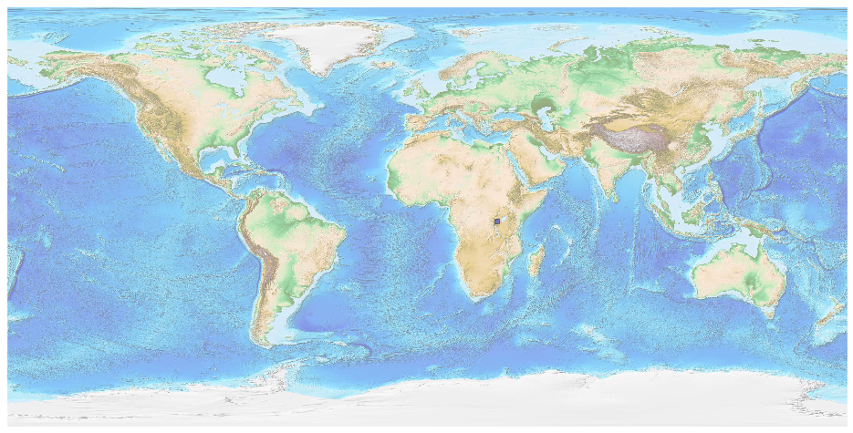

## Rwanda [&#10159;](rwanda.sqlite)

### Allgemeine Informationen

|Eigenschaft|Wert|
|-|-:|
Dateiname|[rwanda.sqlite](rwanda.sqlite)|
Zeitstempel|09.09.2019 19:03|
Dateigr&ouml;&szlig;e|272.00 Kb|
|||
Gesamtanzahl Nodes|5129|
|MinLat|-2.84741|
|MaxLat|-1.03831|
|MinLon|28.85246|
|MaxLon|30.908642|

### Top 5 Tags

|Tag|Count|
|-|-:|
|Power|2295|
|Amenity|1716|
|Shop|559|
|Place|445|
|Man_Made|83|

### &Uuml;bersicht Ortsangaben

|Place|Count|
|-|-:|
|Village|311|
|Town|87|
|Hamlet|8|
|City|5|

### Die 5 gr&ouml;&szlig;ten bewohnte Gebiete

|Name|Lat|Lon|Type|Population|
|----|--:|--:|:--:|---------:|
|Kigali|-1.950851|30.061507|City|1132686|
|Ngororero|-1.854725|29.632534|Town|34559|
|Kivumu|-2.0487624|29.8041467|Village|30000|
|Nyakiziba|-2.40028|30.75278|Village|9594|
|Gahuru|-1.3351521|29.736979|Village|816|
