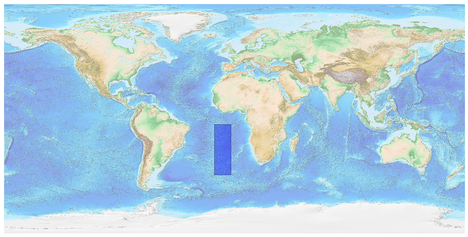
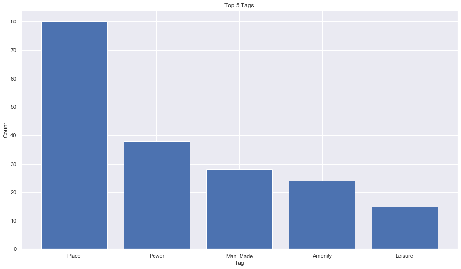
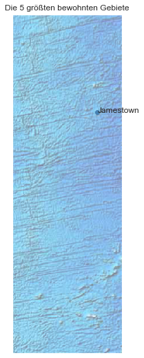

## Saint Helena Ascension And Tristan Da Cunha [&#10159;](saint-helena-ascension-and-tristan-da-cunha.sqlite)

### Allgemeine Informationen

|Eigenschaft|Wert|
|-|-:|
Dateiname|[saint-helena-ascension-and-tristan-da-cunha.sqlite](saint-helena-ascension-and-tristan-da-cunha.sqlite)|
Zeitstempel|09.09.2019 19:03|
Dateigr&ouml;&szlig;e|24.00 Kb|
|||
Gesamtanzahl Nodes|193|
|MinLat|-43.832453|
|MaxLat|-4.591221|
|MinLon|-15.570256|
|MaxLon|-2.781278|

### Top 5 Tags

|Tag|Count|
|-|-:|
|Place|80|
|Power|38|
|Man_Made|28|
|Amenity|24|
|Leisure|15|

### &Uuml;bersicht Ortsangaben

|Place|Count|
|-|-:|
|Village|6|
|Town|2|

### Die 5 gr&ouml;&szlig;ten bewohnte Gebiete

|Name|Lat|Lon|Type|Population|
|----|--:|--:|:--:|---------:|
|Jamestown|-15.9277296|-5.7160872|Town|629|
