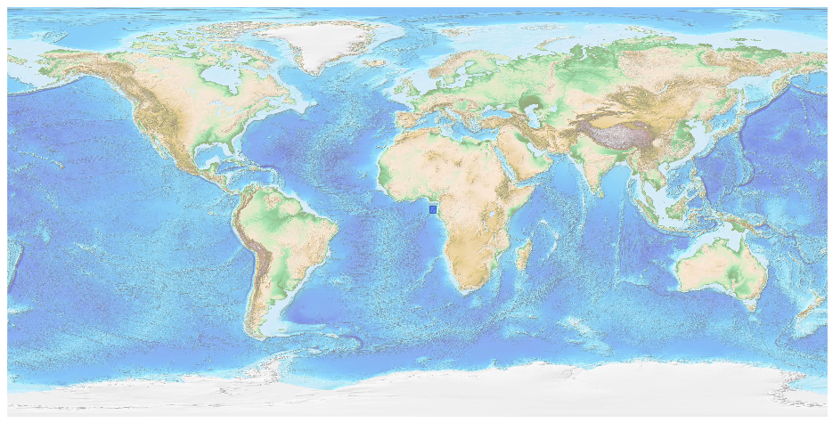

## Sao Tome And Principe [&#10159;](sao-tome-and-principe.sqlite)

### Allgemeine Informationen

|Eigenschaft|Wert|
|-|-:|
Dateiname|[sao-tome-and-principe.sqlite](sao-tome-and-principe.sqlite)|
Zeitstempel|09.09.2019 19:03|
Dateigr&ouml;&szlig;e|52.00 Kb|
|||
Gesamtanzahl Nodes|642|
|MinLat|-0.5255649|
|MaxLat|2.440286|
|MinLon|5.273916|
|MaxLon|8.3669949|

### Top 5 Tags

|Tag|Count|
|-|-:|
|Place|430|
|Amenity|152|
|Man_Made|26|
|Shop|26|
|Leisure|8|

### &Uuml;bersicht Ortsangaben

|Place|Count|
|-|-:|
|Hamlet|314|
|Village|68|
|Town|11|
|City|1|

### Die 5 gr&ouml;&szlig;ten bewohnte Gebiete

|Name|Lat|Lon|Type|Population|
|----|--:|--:|:--:|---------:|
|São Tomé|0.3389242|6.7313031|City|53300|
