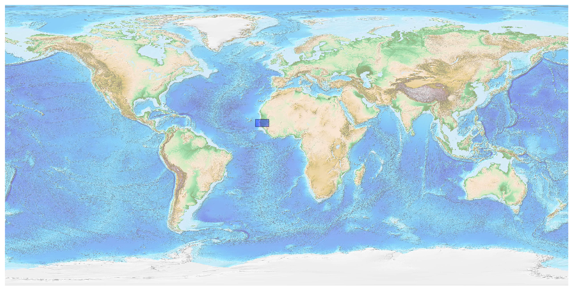
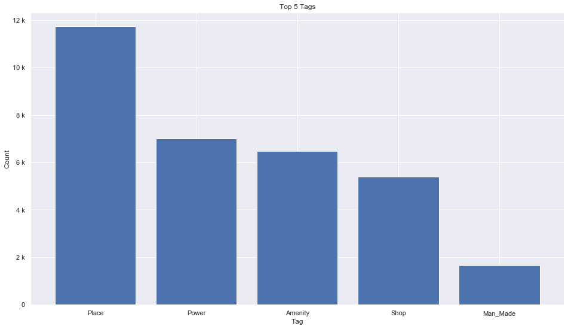
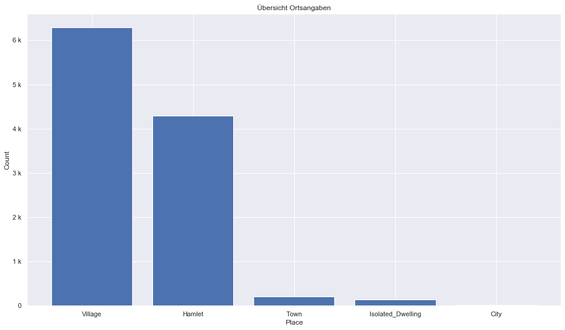
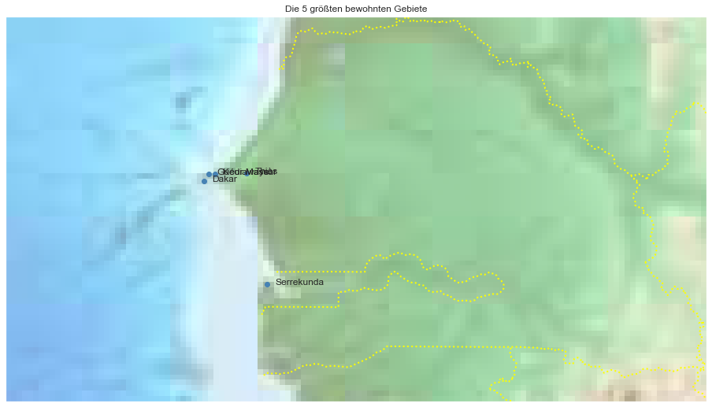

## Senegal And Gambia [&#10159;](senegal-and-gambia.sqlite)

### Allgemeine Informationen

|Eigenschaft|Wert|
|-|-:|
Dateiname|[senegal-and-gambia.sqlite](senegal-and-gambia.sqlite)|
Zeitstempel|09.09.2019 19:05|
Dateigr&ouml;&szlig;e|1.68 Mb|
|||
Gesamtanzahl Nodes|33380|
|MinLat|12.01511|
|MaxLat|16.70088|
|MinLon|-19.85623|
|MaxLon|-11.33595|

### Top 5 Tags

|Tag|Count|
|-|-:|
|Place|11732|
|Power|7003|
|Amenity|6486|
|Shop|5400|
|Man_Made|1676|

### &Uuml;bersicht Ortsangaben

|Place|Count|
|-|-:|
|Village|6284|
|Hamlet|4288|
|Town|199|
|Isolated_Dwelling|136|
|City|18|

### Die 5 gr&ouml;&szlig;ten bewohnte Gebiete

|Name|Lat|Lon|Type|Population|
|----|--:|--:|:--:|---------:|
|Dakar|14.693425|-17.447938|City|2396800|
|Serrekunda|13.438762|-16.674807|City|380000|
|Keur Massar|14.7825027|-17.3111773|Town|337611|
|Thiès|14.791461|-16.925605|City|320000|
|Guédiawaye|14.7771207|-17.390071|City|286989|
