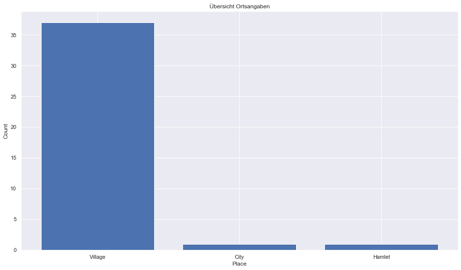

## Seychelles [&#10159;](seychelles.sqlite)

### Allgemeine Informationen

|Eigenschaft|Wert|
|-|-:|
Dateiname|[seychelles.sqlite](seychelles.sqlite)|
Zeitstempel|09.09.2019 19:05|
Dateigr&ouml;&szlig;e|68.00 Kb|
|||
Gesamtanzahl Nodes|945|
|MinLat|-12.55844|
|MaxLat|-3.17239|
|MinLon|45.684947|
|MaxLon|57.574329|

### Top 5 Tags

|Tag|Count|
|-|-:|
|Amenity|486|
|Shop|221|
|Place|99|
|Leisure|39|
|Power|35|

### &Uuml;bersicht Ortsangaben

|Place|Count|
|-|-:|
|Village|37|
|City|1|
|Hamlet|1|

### Die 5 gr&ouml;&szlig;ten bewohnte Gebiete

|Name|Lat|Lon|Type|Population|
|----|--:|--:|:--:|---------:|
|Victoria|-4.6232085|55.452359|City|26450|
|Poivre|-5.7467898|53.311817|Village|10|
