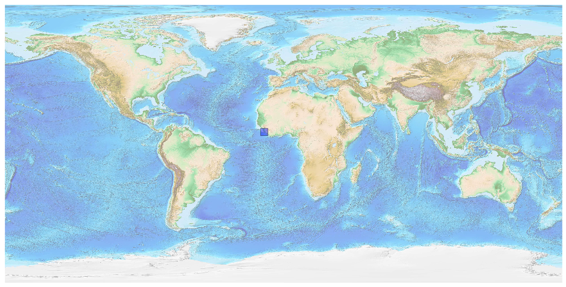
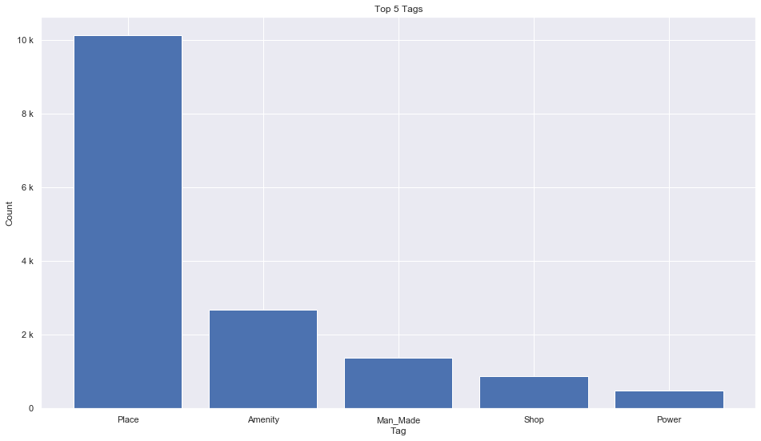
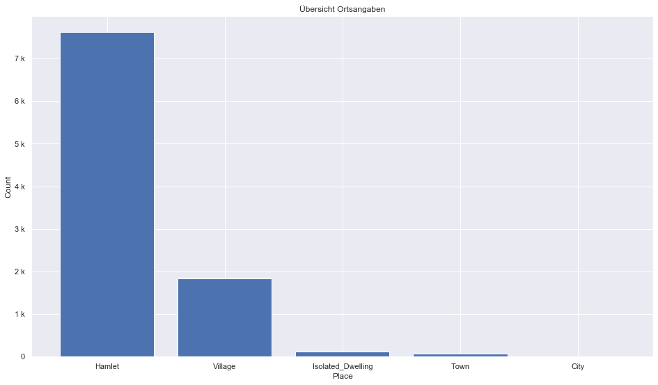
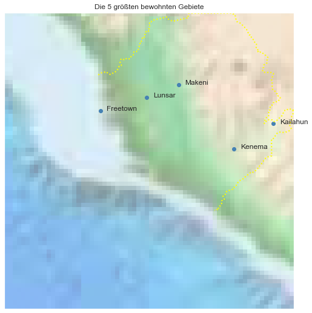

## Sierra Leone [&#10159;](sierra-leone.sqlite)

### Allgemeine Informationen

|Eigenschaft|Wert|
|-|-:|
Dateiname|[sierra-leone.sqlite](sierra-leone.sqlite)|
Zeitstempel|09.09.2019 19:07|
Dateigr&ouml;&szlig;e|860.00 Kb|
|||
Gesamtanzahl Nodes|15642|
|MinLat|5.391619|
|MaxLat|10.0096|
|MinLon|-14.76451|
|MaxLon|-10.2558|

### Top 5 Tags

|Tag|Count|
|-|-:|
|Place|10114|
|Amenity|2666|
|Man_Made|1364|
|Shop|879|
|Power|482|

### &Uuml;bersicht Ortsangaben

|Place|Count|
|-|-:|
|Hamlet|7619|
|Village|1839|
|Isolated_Dwelling|113|
|Town|63|
|City|7|

### Die 5 gr&ouml;&szlig;ten bewohnte Gebiete

|Name|Lat|Lon|Type|Population|
|----|--:|--:|:--:|---------:|
|Freetown|8.479004|-13.26795|City|951000|
|Kenema|7.885936|-11.18639|City|188463|
|Makeni|8.88474|-12.04912|City|112489|
|Lunsar|8.686834|-12.543584|Town|36108|
|Kailahun|8.277001|-10.573943|Town|30411|
