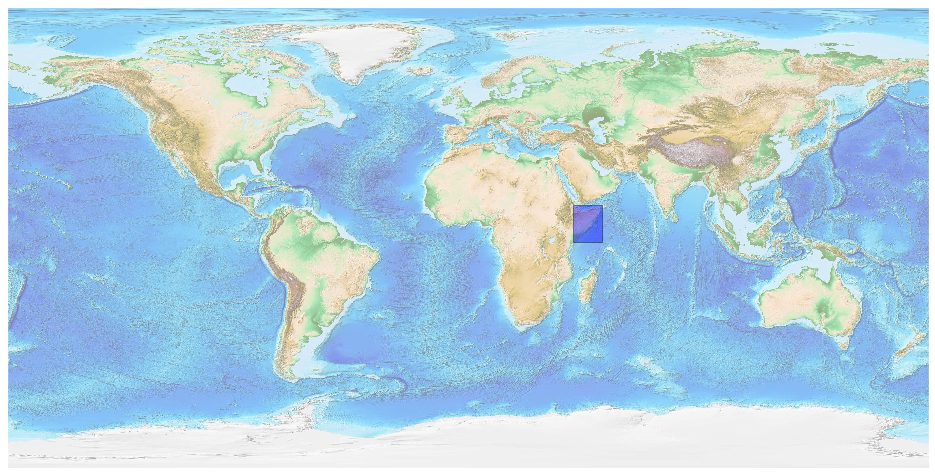
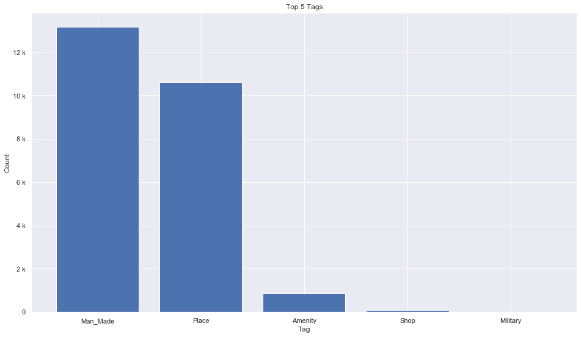
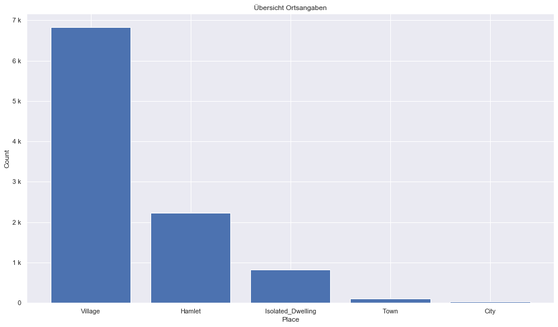
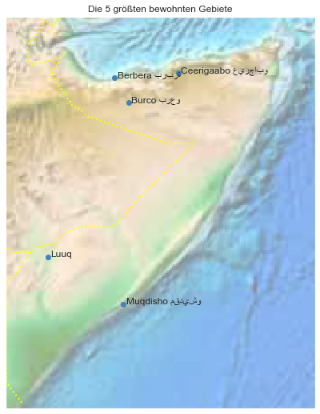

## Somalia [&#10159;](somalia.sqlite)

### Allgemeine Informationen

|Eigenschaft|Wert|
|-|-:|
Dateiname|[somalia.sqlite](somalia.sqlite)|
Zeitstempel|09.09.2019 19:08|
Dateigr&ouml;&szlig;e|1.27 Mb|
|||
Gesamtanzahl Nodes|24791|
|MinLat|-1.816753|
|MaxLat|12.710943|
|MinLon|40.97489|
|MaxLon|52.448708|

### Top 5 Tags

|Tag|Count|
|-|-:|
|Man_Made|13165|
|Place|10592|
|Amenity|867|
|Shop|106|
|Military|21|

### &Uuml;bersicht Ortsangaben

|Place|Count|
|-|-:|
|Village|6823|
|Hamlet|2223|
|Isolated_Dwelling|819|
|Town|101|
|City|29|

### Die 5 gr&ouml;&szlig;ten bewohnte Gebiete

|Name|Lat|Lon|Type|Population|
|----|--:|--:|:--:|---------:|
|Muqdisho مقديشو|2.042778|45.338564|City|1700000|
|Berbera بربرة|10.4386215|45.0134007|City|263000|
|Ceerigaabo عيرجابو|10.61806|47.37|City|190000|
|Burco برعو|9.52749|45.537472|City|65000|
|Luuq|3.7995708|42.5450627|Village|34000|
