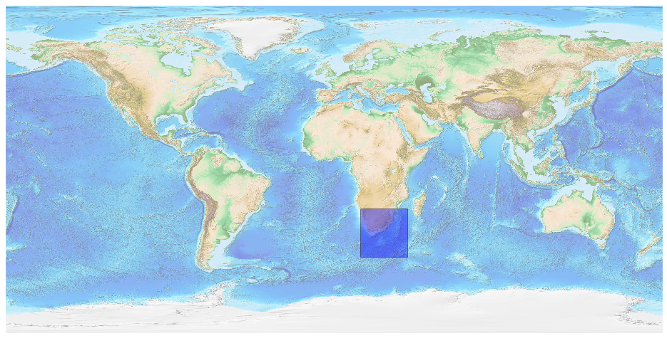
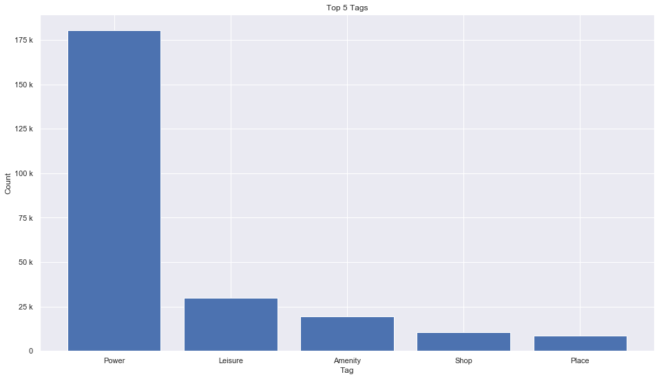
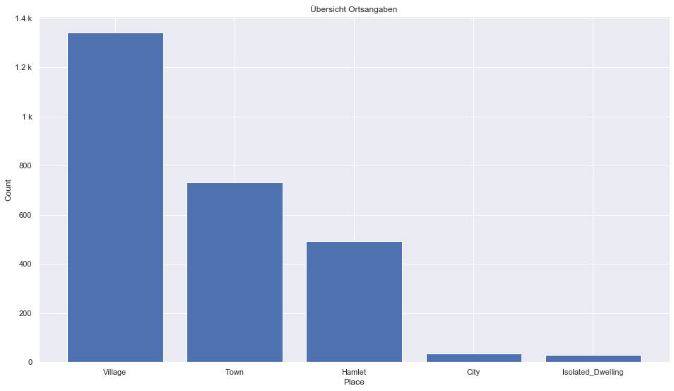
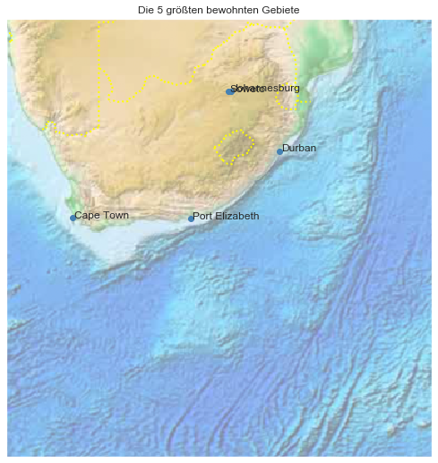

## South Africa [&#10159;](south-africa.sqlite)

### Allgemeine Informationen

|Eigenschaft|Wert|
|-|-:|
Dateiname|[south-africa.sqlite](south-africa.sqlite)|
Zeitstempel|09.09.2019 19:14|
Dateigr&ouml;&szlig;e|11.87 Mb|
|||
Gesamtanzahl Nodes|254959|
|MinLat|-48.464971|
|MaxLat|-21.775433|
|MinLon|14.373284|
|MaxLon|40.2702|

### Top 5 Tags

|Tag|Count|
|-|-:|
|Power|180264|
|Leisure|29751|
|Amenity|19584|
|Shop|10636|
|Place|8600|

### &Uuml;bersicht Ortsangaben

|Place|Count|
|-|-:|
|Village|1341|
|Town|731|
|Hamlet|493|
|City|34|
|Isolated_Dwelling|30|

### Die 5 gr&ouml;&szlig;ten bewohnte Gebiete

|Name|Lat|Lon|Type|Population|
|----|--:|--:|:--:|---------:|
|Johannesburg|-26.205|28.049722|City|4435000|
|Cape Town|-33.928992|18.417396|City|3500000|
|Durban|-29.861825|31.009909|City|3460000|
|Soweto|-26.2227778|27.89|City|1270000|
|Port Elizabeth|-33.9617051|25.6207519|City|1050000|
