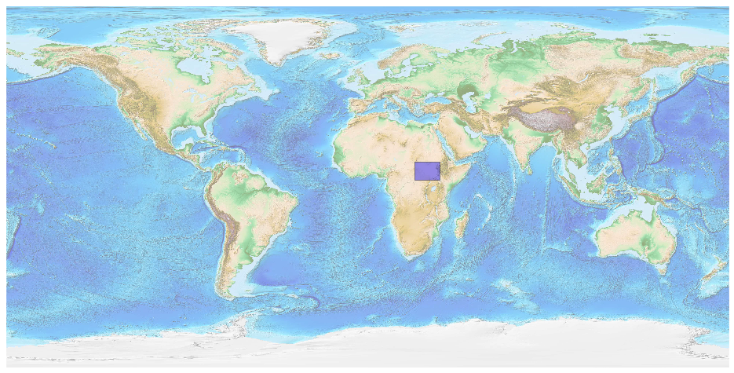
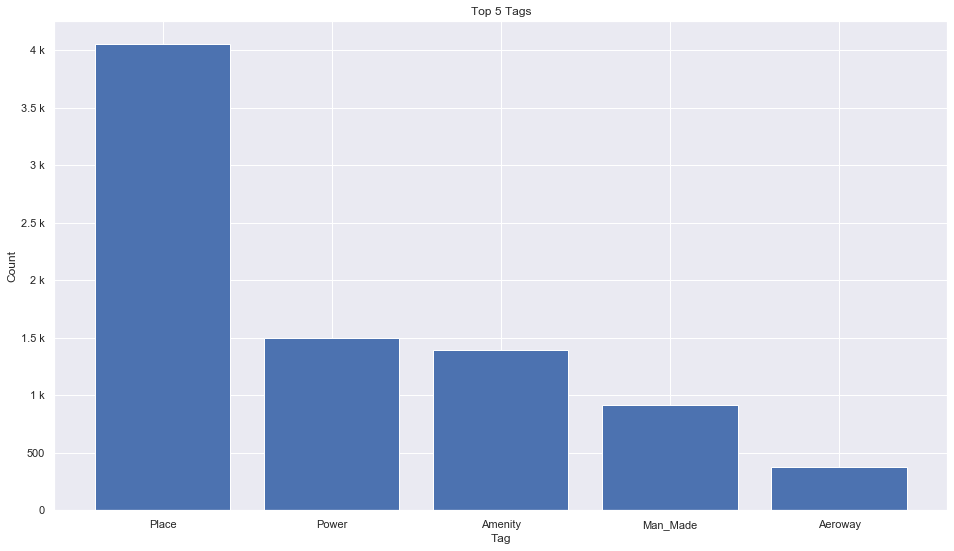
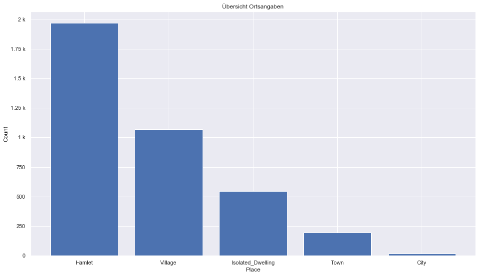
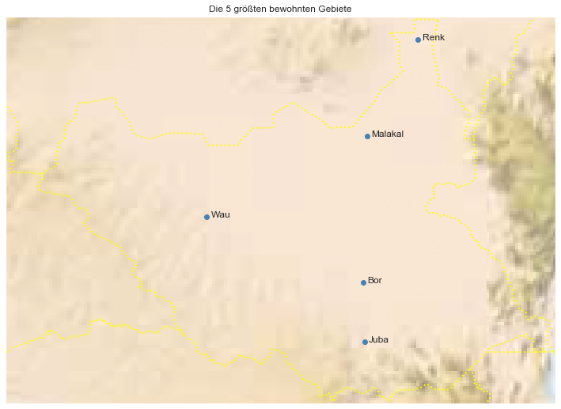

## South Sudan [&#10159;](south-sudan.sqlite)

### Allgemeine Informationen

|Eigenschaft|Wert|
|-|-:|
Dateiname|[south-sudan.sqlite](south-sudan.sqlite)|
Zeitstempel|09.09.2019 19:10|
Dateigr&ouml;&szlig;e|452.00 Kb|
|||
Gesamtanzahl Nodes|8699|
|MinLat|3.44237|
|MaxLat|12.282153|
|MinLon|23.403722|
|MaxLon|35.962977|

### Top 5 Tags

|Tag|Count|
|-|-:|
|Place|4050|
|Power|1500|
|Amenity|1394|
|Man_Made|917|
|Aeroway|379|

### &Uuml;bersicht Ortsangaben

|Place|Count|
|-|-:|
|Hamlet|1967|
|Village|1071|
|Isolated_Dwelling|544|
|Town|197|
|City|18|

### Die 5 gr&ouml;&szlig;ten bewohnte Gebiete

|Name|Lat|Lon|Type|Population|
|----|--:|--:|:--:|---------:|
|Juba|4.8472017|31.5951655|City|372410|
|Bor|6.2039927|31.5587285|City|315351|
|Renk|11.748914|32.816359|City|176020|
|Malakal|9.5410608|31.6504255|City|147450|
|Wau|7.6999269|27.9910035|City|136179|
