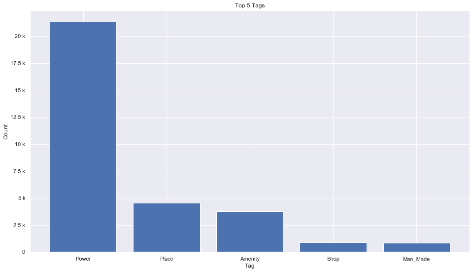

## Sudan [&#10159;](sudan.sqlite)

### Allgemeine Informationen

|Eigenschaft|Wert|
|-|-:|
Dateiname|[sudan.sqlite](sudan.sqlite)|
Zeitstempel|09.09.2019 19:10|
Dateigr&ouml;&szlig;e|1.50 Mb|
|||
Gesamtanzahl Nodes|31541|
|MinLat|8.653747|
|MaxLat|22.48111|
|MinLon|21.780999|
|MaxLon|39.627812|

### Top 5 Tags

|Tag|Count|
|-|-:|
|Power|21324|
|Place|4553|
|Amenity|3757|
|Shop|864|
|Man_Made|853|

### &Uuml;bersicht Ortsangaben

|Place|Count|
|-|-:|
|Village|2523|
|Hamlet|1318|
|Town|282|
|Isolated_Dwelling|111|
|City|69|

### Die 5 gr&ouml;&szlig;ten bewohnte Gebiete

|Name|Lat|Lon|Type|Population|
|----|--:|--:|:--:|---------:|
|الخرطوم|15.593325|32.53565|City|2682431|
|أم درمان|15.6445536|32.4777311|City|2395159|
|نيالا|12.0505098|24.8795115|City|566000|
|بورتسودان|19.619217|37.211709|City|489000|
|كسلا|15.4521163|36.3771099|City|436000|
