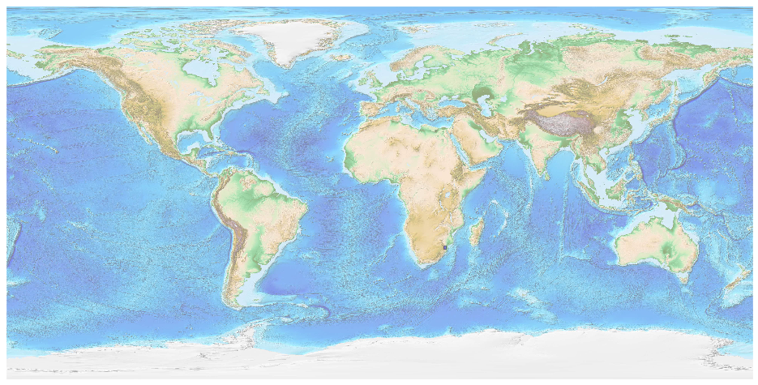

## Swaziland [&#10159;](swaziland.sqlite)

### Allgemeine Informationen

|Eigenschaft|Wert|
|-|-:|
Dateiname|[swaziland.sqlite](swaziland.sqlite)|
Zeitstempel|09.09.2019 19:11|
Dateigr&ouml;&szlig;e|116.00 Kb|
|||
Gesamtanzahl Nodes|2142|
|MinLat|-27.318256|
|MaxLat|-25.717811|
|MinLon|30.786367|
|MaxLon|32.135992|

### Top 5 Tags

|Tag|Count|
|-|-:|
|Power|1536|
|Amenity|313|
|Shop|153|
|Place|73|
|Man_Made|40|

### &Uuml;bersicht Ortsangaben

|Place|Count|
|-|-:|
|Town|16|
|Village|14|
|Hamlet|13|
|City|2|

### Die 5 gr&ouml;&szlig;ten bewohnte Gebiete

|Name|Lat|Lon|Type|Population|
|----|--:|--:|:--:|---------:|
|Manzini|-26.4958706|31.3695887|City|110508|
|Mbabane|-26.325745|31.144663|City|94874|
|Tjaneni|-25.9994572|31.7542997|Village|1899|
