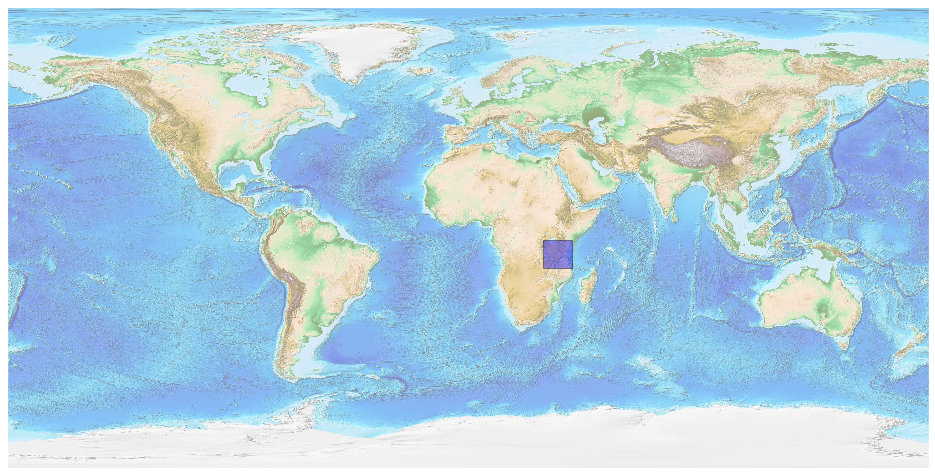
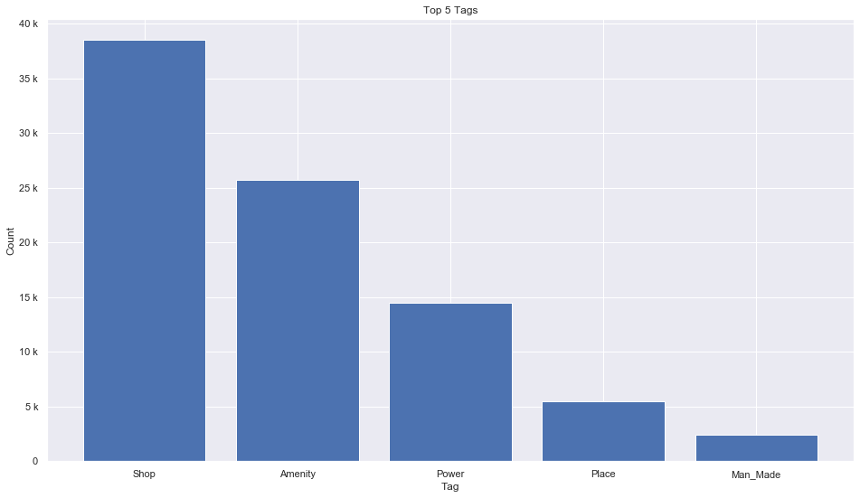
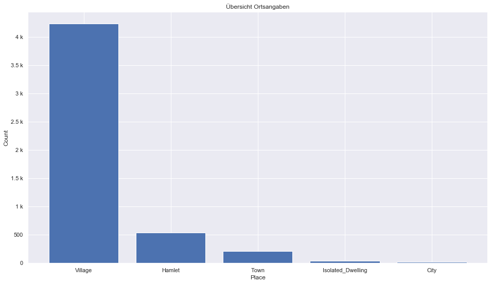
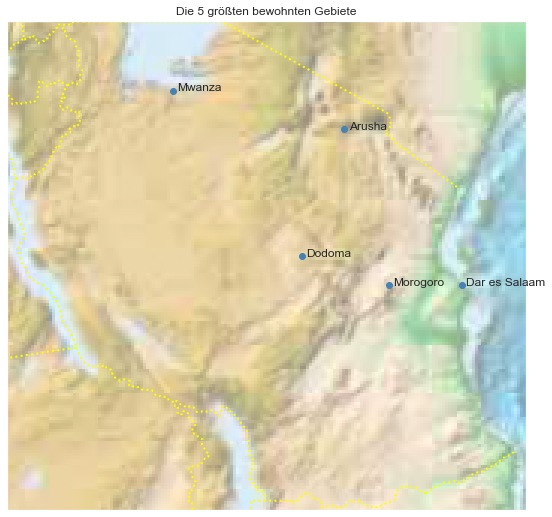

## Tanzania [&#10159;](tanzania.sqlite)

### Allgemeine Informationen

|Eigenschaft|Wert|
|-|-:|
Dateiname|[tanzania.sqlite](tanzania.sqlite)|
Zeitstempel|09.09.2019 19:22|
Dateigr&ouml;&szlig;e|4.63 Mb|
|||
Gesamtanzahl Nodes|87629|
|MinLat|-11.775945|
|MaxLat|-0.974988|
|MinLon|29.24395|
|MaxLon|40.69487|

### Top 5 Tags

|Tag|Count|
|-|-:|
|Shop|38498|
|Amenity|25715|
|Power|14494|
|Place|5447|
|Man_Made|2430|

### &Uuml;bersicht Ortsangaben

|Place|Count|
|-|-:|
|Village|4236|
|Hamlet|540|
|Town|215|
|Isolated_Dwelling|35|
|City|18|

### Die 5 gr&ouml;&szlig;ten bewohnte Gebiete

|Name|Lat|Lon|Type|Population|
|----|--:|--:|:--:|---------:|
|Dar es Salaam|-6.8160837|39.2803583|City|4364541|
|Arusha|-3.3696827|36.6880794|City|416442|
|Dodoma|-6.1791181|35.7468174|City|410956|
|Mwanza|-2.5196915|32.9014417|City|385810|
|Morogoro|-6.8161626|37.6693891|City|315866|
