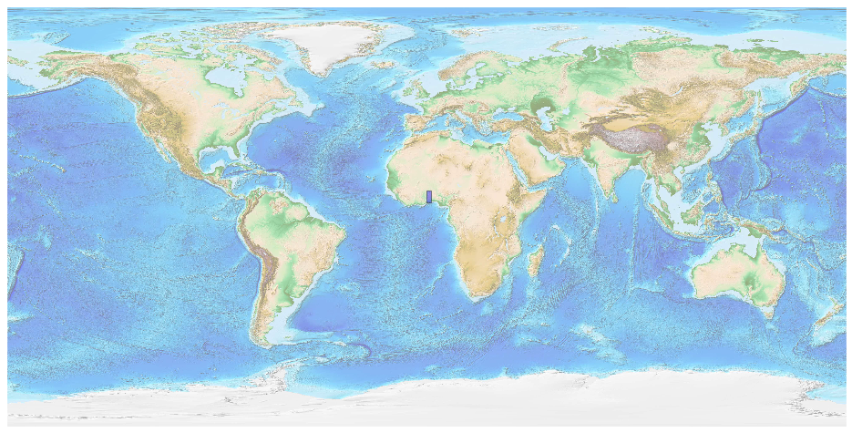
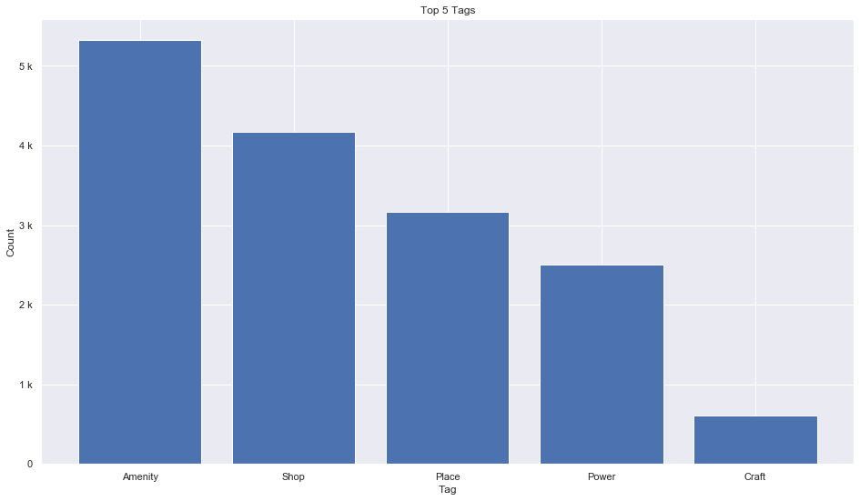
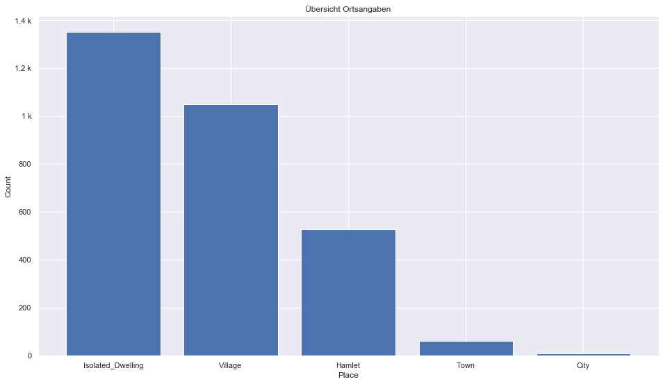
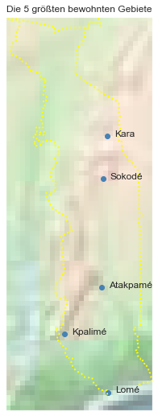

## Togo [&#10159;](togo.sqlite)

### Allgemeine Informationen

|Eigenschaft|Wert|
|-|-:|
Dateiname|[togo.sqlite](togo.sqlite)|
Zeitstempel|09.09.2019 19:16|
Dateigr&ouml;&szlig;e|888.00 Kb|
|||
Gesamtanzahl Nodes|16418|
|MinLat|5.892541|
|MaxLat|11.14395|
|MinLon|-0.148338|
|MaxLon|1.803016|

### Top 5 Tags

|Tag|Count|
|-|-:|
|Amenity|5321|
|Shop|4170|
|Place|3165|
|Power|2509|
|Craft|611|

### &Uuml;bersicht Ortsangaben

|Place|Count|
|-|-:|
|Isolated_Dwelling|1351|
|Village|1051|
|Hamlet|529|
|Town|61|
|City|8|

### Die 5 gr&ouml;&szlig;ten bewohnte Gebiete

|Name|Lat|Lon|Type|Population|
|----|--:|--:|:--:|---------:|
|Lomé|6.130419|1.215829|City|837437|
|Sokodé|8.9833194|1.1438149|City|120000|
|Kara|9.548767|1.1980859|City|110000|
|Atakpamé|7.5320603|1.1219479|City|87000|
|Kpalimé|6.9105873|0.63202|City|75000|
